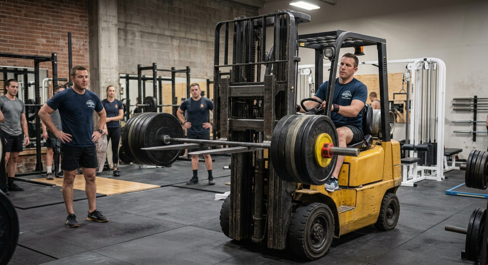
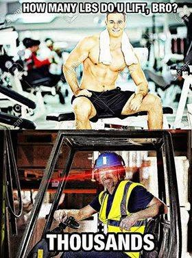
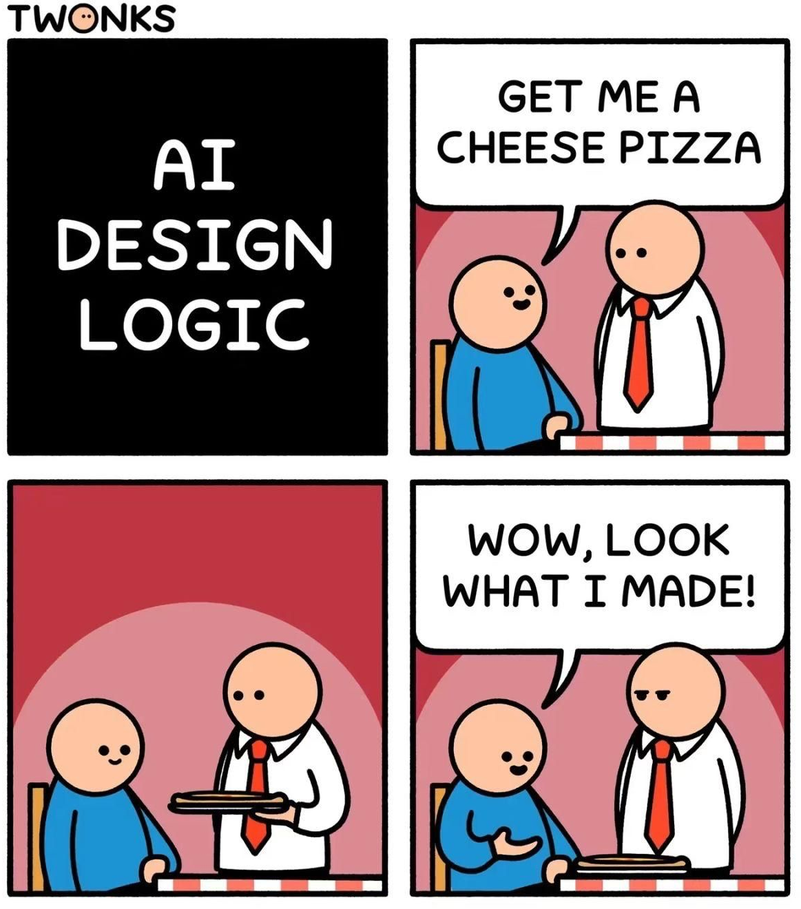

# Data Science Profiles 

Not ready yet. 

## What is Data Science????

https://x.com/kareem_carr/status/2092630820640976999?s=20

https://x.com/kareem_carr/status/2093730567443402774?s=20 

## Use conversational AI in class?

::: {.incremental}
- Conversational AI is great for learning
  - Explain concepts even simpler
  - Explain concepts from different perspective
  - Go deeper with follow up questions
  - Explain code
- ... and it is bad for learning! 
  - Cognitive offloading
  - Would you bring a forklift to the gym? 
:::

::: {.absolute .fragment width=472px height=73px left=600px top=89px }

Source: Gemini prompted by me (several iterations and restarts)
:::

::: {.absolute .fragment width=302.1px height=331.9px left=725px top=60px}

Source: Facebook
:::

::: {.fragment}
- Can you claim work done by AI as yours?
:::

::: {.absolute .fragment width=385.4px height=69.8px left=650px top=60px}

Source: [Twonks](https://www.instagram.com/twonks/p/Dau0d2ktC4F/)
:::

## Cognitive offloading

::: {.incremental}
- Using a calculator you do not learn better mental arithmetic skills
  - Do you learn when you use AI to do your homework
- Do you need mental arithmetic skills? (Answer for yourself)
:::

Research shows, that cognitive offloading massively prevents learning!  

. . .

::: {.ref}
@StrombergEtAl2026GenerativeAILearning
:::

## Learning with AI

- Learn how to use AI in a way that you also learn yourself
- How can you assess that it is happening? Some indicators:
  - You feel your questions become more competent
  - You can explain what AI did in every step
  - You question AIs answers when you find implausible things
  - You write a summary of your understanding back to AI and understand the response

. . .

::: {.ref}
@CashEtAl2026AIMakingUs
:::