<!-- Presentation notes:
Get through Visualization and beginning of ggplot in Session 1
Session 2: ggplot pragmatics, Data Formats, Tidy Data, Pipe is tough (15-20 min each)
Reconsider the stucture. 
Pipe is duplicated in W03
Relate tidy data to visualization
 -->




# Data Visualization

Definition: Creating images that convey salient information about [**underlying data**]{.text-red} and processes.

## Visualization in the Data Science Process

::: {.absolute .fragment}
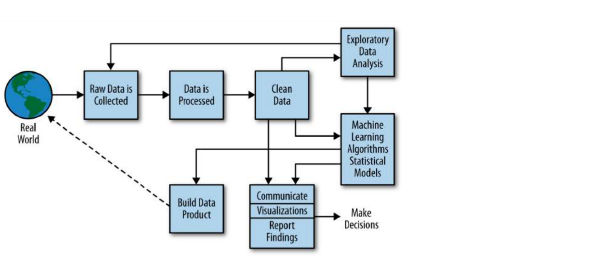
:::
::: {.absolute .fragment}
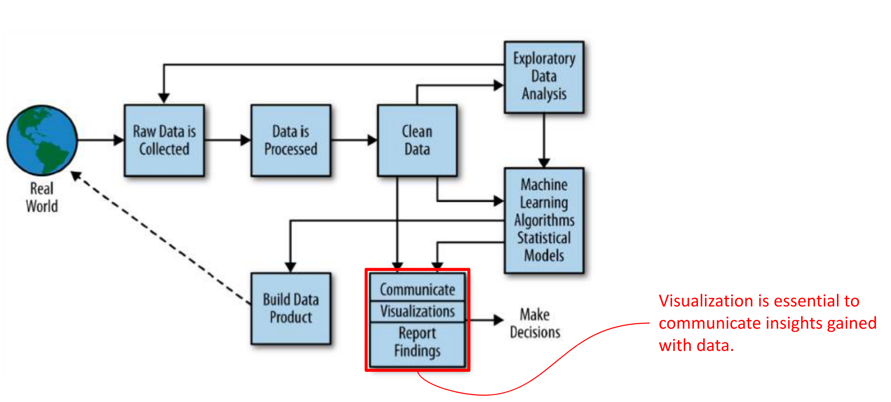
:::
::: {.absolute .fragment}
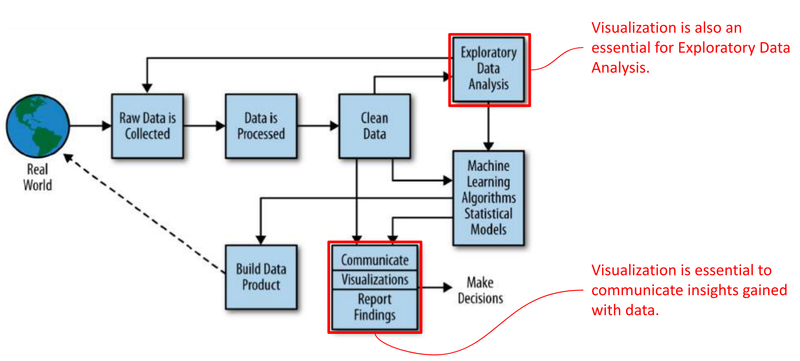
:::

## Visualization for exploring data

::: {.columns}
::: {.column}
**Exploring =**   
**Transforming + [Visualizing]{.text-red}** Data   
(we omit Modeling for now.)

Packages: `dplyr` + `ggplot`
:::
::: {.column}

:::
:::

. . . 

::: {.columns}
::: {.column}
**Wrangling = **    
**Import + Tidying + Transforming**

`readr` + `tidyr` + `dplyr`
:::
::: {.column}

:::
:::

. . .

Before *Data Exploration* comes *Data Wrangling*, but we focus on exploring first!

# A short tour through examples of data visualization

Extra [Presentation](https://docs.google.com/presentation/d/e/2PACX-1vSpRGv3OkrWRX7C7X6b3M3B-yp0MvwdaOsfwvyG-y8v_MOKod46Vt5Fzo7r8C2C-VPYuVQkJCjXi4aF/pub?start=false&loop=false&delayms=3000)

# Grammar of Graphics

Our way to think about, talk about, and produce data visualizations

## The Grammar of Graphics

**Leland Wilkinson's** wrote the Grammar of Graphics: A general scheme for data visualization which breaks up graphs into semantic components such as scales and layers.

. . . 

::: {.columns}

::: {.column width=70%}
Inspired **Hadley Wickham** to develop the R-package [`ggplot`](https://ggplot2.tidyverse.org/reference/ggplot.html) (Grammar of Graphics Plot).
:::
::: {.column width=30%}

:::
:::

. . .

::: {.slide-source}
Wilkinson, L. (2005). [The Grammar of Graphics](https://doi.org/10.1007/0-387-28695-0). Springer-Verlag.     
Wickham, H. (2010). [A Layered Grammar of Graphics](https://doi.org/10.1198/jcgs.2009.07098). Journal of Computational and Graphical Statistics, 19(1), 3–28. 
:::

## Grammar of Graphics: Basics

::: {.columns}
::: {.column}
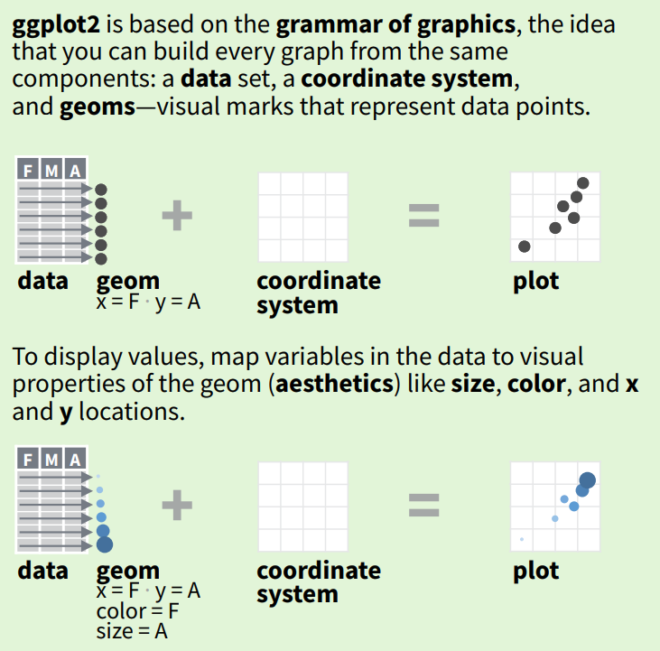
:::
::: {.column .fragment}
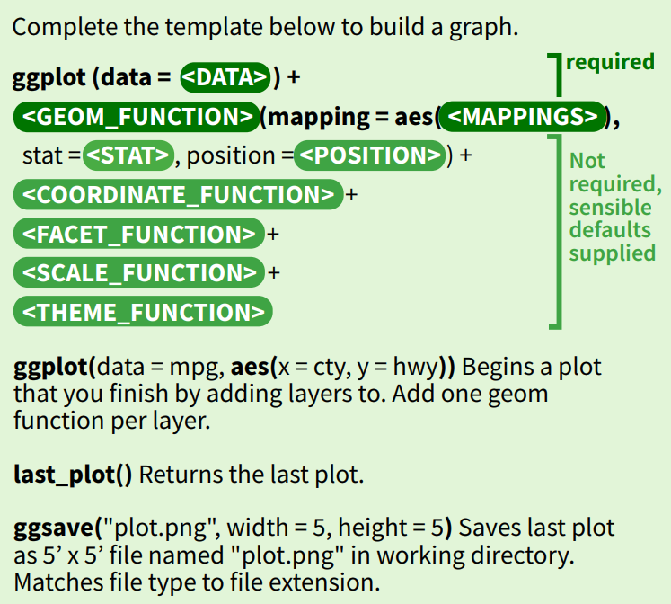
:::
:::

::: {.slide-source}
From the ggplot Cheatsheet <https://rstudio.github.io/cheatsheets/data-visualization.pdf>
:::

## Aesthetics in gglot

Definition **Aesthetic**: Visual property of plot elements that can be mapped to variables in the dataset. 

. . .

The main 8 aesthetics in ggplot:

::: {.incremental}
1. `x`: The x-axis position.
2. `y`: The y-axis position.
3. `color` (or `colour`): The color of points, lines, or borders around shapes.
4. `fill`: The fill color of shapes (like bars in a bar plot).
5. `size`: The size of points or thickness of lines.
6. `shape`: The shape of points.
7. `linetype`: The type of line (solid, dashed, dotted, etc.).
8. `alpha`: The transparency level of points or shapes.
:::

## geom = Geometric object

Definition: A **geom** defines the type of visual elements used to represent data in a plot, like points, lines, bars, or boxes. Geoms dictate how variable values mapped to aesthetics are displayed

. . .

::: {.columns}
::: {.column}
3 Core geoms

1. `geom_point()` uses aesthetics like x, y, color, and size to create a scatter plot.
2. `geom_line()` connects data points using lines, with aesthetics like x, y, and linetype.
3. `geom_col()` creates bar charts using aesthetics like x, y, and fill.
:::
::: {.column .fragment}
Some geoms also aggregate data

- `geom_bar()` first counts observations and uses the counts for x or y before making a bar chart. 
- `geom_histogram()` groups numbers in equally sized bins and counts values in bins before making a bar chart. 
- `geom_smooth()` creates a line through a scattered set of data points in the x-y plane.
:::
:::


# `ggplot` workflow

## Let us walk through the workflow

We need the tidyverse packages

```{r}
#| echo: true
#| message: false
library(tidyverse)
```

We use the `mpg` dataset which is in the ggplot library. Let's take a look:

```{r}
#| echo: true
glimpse(mpg)
```

## Use `?mpg` for more information about `mpg` dataset

```R
?mpg
```

```
mpg                  package:ggplot2                   R Documentation

Fuel economy data from 1999 to 2008 for 38 popular models of cars

Description:

     This dataset contains a subset of the fuel economy data that the
     EPA makes available on <https://fueleconomy.gov/>. It contains
     only models which had a new release every year between 1999 and
     2008 - this was used as a proxy for the popularity of the car.

Usage:

     mpg
     
Format:

     A data frame with 234 rows and 11 variables:

     manufacturer manufacturer name

     model model name

     displ engine displacement, in litres

     year year of manufacture

     cyl number of cylinders

     trans type of transmission

     drv the type of drive train, where f = front-wheel drive, r = rear
          wheel drive, 4 = 4wd

     cty city miles per gallon

     hwy highway miles per gallon

     fl fuel type

     class "type" of car
```


::: aside
For best learning, go through these slides and test the code!
:::

## First plot in a basic specification

We take `cty` = "city miles per gallon" as `x` and `hwy` = "highway miles per gallon" as `y`

```{r}
#| echo: true
ggplot(data = mpg) + geom_point(mapping = aes(x = cty, y = hwy))
```

Compare to "The complete template" from the [cheat sheet](https://raw.githubusercontent.com/rstudio/cheatsheets/main/data-visualization.pdf)

It has all the required elements: We specify the data in the ggplot command, and the aesthetics (what variable is x and what variable is y) as mapping in the geom-function. 


## `data` and `mapping` where?

Looking at [`?ggplot`](https://ggplot2.tidyverse.org/reference/ggplot.html) and [`?geom_point`](https://ggplot2.tidyverse.org/reference/geom_point.html) we find that both need to specify `data` and `mapping`. 

Why do we have it only once here?

```R
ggplot(data = mpg) + geom_point(mapping = aes(x = cty, y = hwy))
```
. . . 

- The "+" in ggplot specifies that specifications will be taken from the object defined before the +.
- Technically `ggplot()` creates an ggplot object (the graphic) and `+geom_point()` adds more information to it.
- So, `data` was taken from the `ggplot` call, and `mapping` from `geom_point`


## It also works this way

```{r}
#| echo: true
ggplot() + geom_point(data = mpg, mapping = aes(x = cty, y = hwy)) # Same output as before ...
```

- In principle, we can specify new data and aesthetics in each geom-function in the same ggplot! Usually, we only have one dataset and one specification of aesthetics


## And also this way

```{r}
#| echo: true
ggplot(data = mpg, mapping = aes(x = cty, y = hwy)) + geom_point() # Same output as before ...
```

::: aside
This is arguably the most common way. 
:::

## Even shorter

As common practice we can shorten the code and remove the `data = ` and the `mapping = ` because the first argument will be taken as data (if not specified otherwise) and the second
as mapping (if not specified otherwise). See function documentation [?ggplot](https://ggplot2.tidyverse.org/reference/ggplot)

```{r}
#| echo: true
ggplot(mpg, aes(x = cty, y = hwy)) + geom_point() # Same output as before ...
```


## The shortest

We can even remove the "x = " and "y = " if we look at the specification of `aes()` in [`?aes`](https://ggplot2.tidyverse.org/reference/aes)

```{r}
#| echo: true
ggplot(mpg, aes(cty, hwy)) + geom_point() # Same output as before ...
```


## TESTING: Do the following lines work? 

If not, why not? If yes, why?

```R
ggplot(aes(x = cty, y = hwy), mpg) + geom_point()
ggplot(aes(x = cty, y = hwy), data = mpg) + geom_point()
ggplot(mapping = aes(x = cty, y = hwy)) + geom_point(mpg)
ggplot(aes(x = cty, y = hwy)) + geom_point(data = mpg)
ggplot(mpg,aes(hwy, x = cty)) + geom_point() 
ggplot(mapping = aes(y = hwy, x = cty)) + geom_point(mpg) 
```

```{webr}

```


. . .

Solutions:  
1 No, data must be first   
2 Yes, with named argument `data = ` works also as second argument  
3 No, data is missing   
4 No, `aes()` is take wrongly as data in `ggplot`  
5 Yes, x is specified with named argument, so the unnamed first argument is take as the second default argument  
6 No, in `geom_point` the first argument is `mapping`, so it must be `aes()`


## More aesthetics

color, shape, size, fill ... 

These need to be specified by name and cannot be left out.   
Let us color the manufacturer, and make size by cylinders

```{r}
#| echo: true
ggplot(mpg, aes(cty, hwy, color = manufacturer, size = cyl)) + geom_point()
```

## Do you like the plot?

Some critique: 

1. Too many colors
2. Looks like several points are in the same place but we do not see it.
3. Sizes look "unproportional" (4 is too small)

```{r}
ggplot(mpg, aes(cty, hwy, color = manufacturer, size = cyl)) + geom_point()
```

## Effective visualization is your task! 

- The three problems are not technical problems of ggplot.  
- The grammar of graphics works fine. 
- Finding effective visualization is a core skill for a data scientist. 
- It develops naturally with practice.
- It needs programming skills, but the essence of it is not programming!

## Work with `scale_...` to modify aesthetic's look

Example: Scale the size differently

```{r}
#| echo: true
ggplot(mpg, aes(cty, hwy, color = manufacturer, size = cyl)) +
  geom_point() +
  scale_size_area()
```

## Check overplotting with a *jitter*

```{r}
#| echo: true
ggplot(mpg, aes(cty, hwy)) + geom_point() + geom_jitter(color = "green")
```

Here, we do two new things:

1. We added another geom-function to an existing one. That is a core idea of the grammar of graphics.
(However, for a final version, we would probably not do geom_point together with geom_jitter.)
2. We specify the color by a word. Important: This is not within an `aes()` command!


## Another example for two geoms

Add a smooth line as summary statistic

```{r}
#| echo: true
ggplot(mpg, aes(cty, hwy)) + geom_point() + geom_smooth()
```


## PUZZLE

What happens here? Why does green become red???

```{r}
#| echo: true
ggplot(mpg, aes(cty, hwy, color = "green")) + geom_point() # Shows dots supposed to be "green" in red?
```

. . . 

This is because "green" is taken here as a variable (with only one value for all data points).   
So, "green" is not a color but a string and ggplot chooses color automatically.

. . . 

This makes green points: 

```r
ggplot(mpg, aes(cty, hwy), color = "green") + geom_point()
```

## ggplot-Objects 

```{r}
#| echo: true
our_plot <- ggplot(mpg, aes(cty, hwy)) + geom_point(aes(color = manufacturer))
```

This creates no output!   
The graphic information is stored in the object `our_plot`.

## Call the object

As with other objects, when we write it in the console as such it provides an answer. In the case of 
ggplot-objects the answer is not some printed text in the console but a graphic output. 

```{r}
#| echo: true
our_plot
```

## ggplot-Objects altered by more "+..."

Example

```{r}
#| echo: true
our_plot + geom_smooth()
```


## Coordinate system specification

Example

```{r}
#| echo: true
our_plot + coord_flip() # flip x and y
```


## Coordinate system specification

Example

```{r}
#| echo: true
our_plot + coord_polar() # weird here but useful for some things
```

## Faceting based on another variable

Example

```{r}
#| echo: true
our_plot + facet_wrap("manufacturer")
```

## Faceting based on two other variables

Example

```{r}
#| echo: true
our_plot + facet_grid(cyl ~ fl) # fl is the fuel type
```

## Scaling 

Example

```{r}
#| echo: true
our_plot +
  scale_x_log10() +
  scale_y_reverse() +
  scale_colour_hue(l = 70, c = 30)
```


## Axis limits and labels

Example

```{r}
#| echo: true
our_plot +
  xlim(c(0, 40)) +
  xlab("City miles per gallon") +
  ylab("Highway miles per gallon")
```


## Themes

Example

```{r}
#| echo: true
our_plot + theme_bw()
```

## Themes

Example

```{r}
#| echo: true
our_plot + theme_void()
```

## Themes

Example

```{r}
#| echo: true
our_plot + theme_dark()
```


# Data Types

## Tabular Data

For analysis we need **well structured data**. Often [**tabular form**]{.text-red}. Like a spreadsheet:

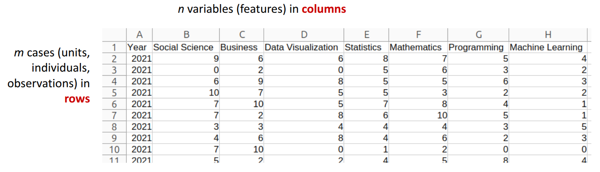

Dimension of a table: Always count the rows first! [**m-by-n table**]{.text-red}   
Example: cell **(4,3)** is in **row 4** and **column 3**.

Warning: Spreadsheet cell labelling differs. Columns have letter-labels and go first.   
**Cell (4,3) is C4**

## Basic Data types in R, atomic vectors

[**character:**]{.text-red} `"a"`, `"swc"`  
[**double:**]{.text-red} `2`, `15.5` (double precision floating point numbers)   
**integer:** `2L` (L tells R to store as integer)   
[**logical:**]{.text-red} `TRUE`, `FALSE`   
**complex:** `1+4i` (complex number with real and imaginary parts)   
These exist in similar ways in other programming languages.

[**Atomic vectors**]{.text-red} are ***ordered*** *collections* of values of the same data type.   
**Construction in R:** `c(2,3,4)` or `c(TRUE, FALSE)` or `c("A","B")`    
**Properties:** `typeof()` and `length()`

::: aside
For historic reasons, *double* and *integer* are both of the R class ***numeric***. Another rare data type *raw* which stores bytes. Check the type of an object `x` with `typeof(x)`.
:::

## Type Coercion

**What happens when values of different data type are combined?**  
(in R and python or other *dynamically typed* programming languages)

Combined could mean for example for `x` and `y`

- Put together in a vector `c(x,y)`
- Added (e.g. with `x + y`)
- Compared (e.g. with `x == y`)

. . . 

[**Coercion!**]{.tex-red}

logical and integer -> integer (TRUE is 1, FALSE is 0)  
integer and double -> double  
double and character -> character  


## Let us test coercion

```{r}
#| echo: true
x <- TRUE
y <- 2L
z <- 3
a <- "4"
```

```{r}
#| echo: true
#| output-location: column-fragment
c(x, y)
```

```{r}
#| echo: true
#| output-location: column-fragment
c(y, z) |> typeof()
```

```{r}
#| echo: true
#| output-location: column-fragment
c(z, a)
```

```{r}
#| echo: true
#| output-location: column-fragment
c(x, a)
```
```{r}
#| echo: true
#| output-location: column-fragment
c(c(x, y), a)
```
```{r}
#| echo: true
#| output-location: column-fragment
x + y
```
```{r}
#| echo: true
#| output-location: column-fragment
as.numeric(a)
```
```{r}
#| echo: true
#| output-location: column-fragment
x == 1
```
```{r}
#| echo: true
#| output-location: column-fragment
as.character(y)
```

What about 
```r
z + a
```

. . .

Not possible, because stings cannot be added. 

```{webr}
x <- TRUE
y <- 2L
z <- 3
a <- "4"
```


## Danger! Floating point numbers

We define `a` and `b` such that their are both 0.1 mathematically.

```{r}
#| echo: true
a <- 0.1 + 0.2 - 0.2
a
```

```{r}
#| echo: true
b <- 0.1
b
```

But why is this false?

```{r}
#| echo: true
(a - b) == 0
```

. . . 

```{r}
#| echo: true
a - b
```

Aha, the difference is about $2.8 \times 10^{-17}$ (The `e` stands for [scientific notation](https://en.wikipedia.org/wiki/Scientific_notation), learn to read it!)
Such problems can happen when subtracting and comparing floating point numbers!

## Lists, Dataframes (=Tibbles)

::: {.columns}

::: {.column}

[**List**]{.text-red} `list()`

- act as container
- contents of a list are not restricted to a single type
- lists can contain further lists (and so on …)
- the basic data type for building and storing complex data structures
- in R syntax the “$” is important for constructing and accessing


:::

::: {.column .fragment}

[**Dataframe**]{.text-red} 

- the way to store tabular data
- it can be seen as a **list of atomic vectors which all have the same length**

[**Tibble**]{.text-red}

- An advanced type of data frame invented in the tidyverse
- Behaves a bit nicer in daily routines
- Largely identical in behavior and easy to convert 


:::

:::

## tibble and data.

```{webr}
mpg
as_tibble(mpg)
```

## Data Types Summary


::: {.columns}

::: {.column}

The most important basic data types: 

- character
- logical
- double

These can be combined to atomic vectors: an indexed list of n values

- character vector
- logical vector
- double vector


:::

::: {.column}

**Lists** are similar to vectors (and indexed list of n values) but every element can be anything, an atomic vector of any type and length or even another list. 

**Dataframes** (and **Tibbles**) are a special type of lists: A list of atomic vectors (the columns) of the same length. Additional to the numerical index 1 to n, the list elements also have names (the variable names). 

:::

:::


# Tidy Data

## Definition of tidy

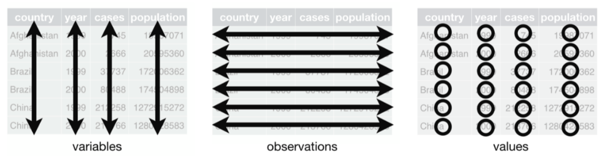

There are three interrelated rules which make a dataset tidy:

- Each variable must have its own column.
- Each observation must have its own row.
- Each value must have its own cell.

::: aside
The name of the concept *tidy data* is promoted in the tidyverse (who could have guessed…)
:::

## Example Tidy Data

Which data is tidy?

::: {.absolute .fragment}
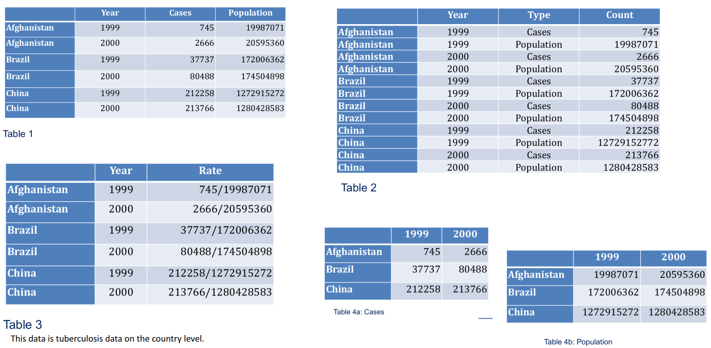
:::
::: {.absolute .fragment}
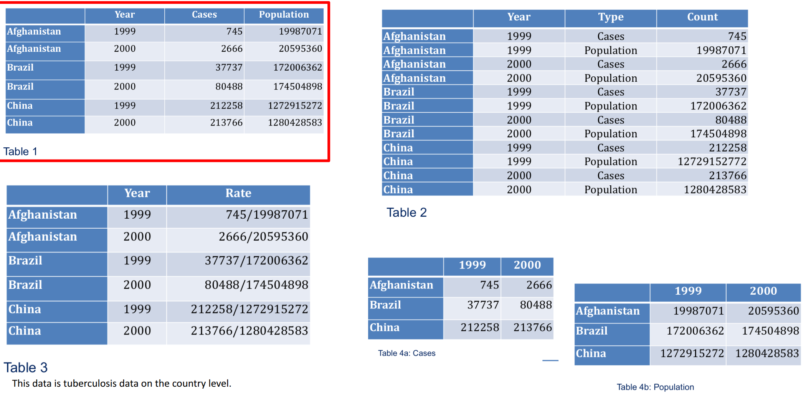
:::
::: {.absolute .fragment}
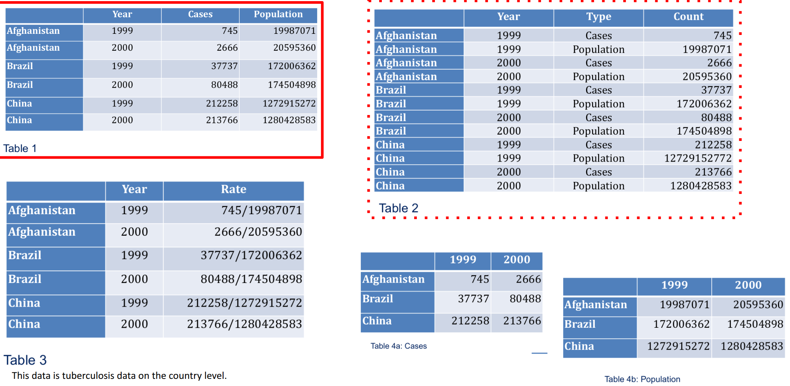
:::


## Characteristics of tidy data

**Tidy data**

- Each column is a meaningful variable
- Each row is a meaningful observation

Additionally

- Each type of observational unit forms another table (see the nycflights13 data for a collection of connected tables)

. . .

**Untidy data**

. . .

... can be anything


## Pivoting

Functions from the `tidyverse` package `tidyr`


::: {.columns}

::: {.column}

The most important functions are 

**`pivot_longer()`**  
`pivot_wider()`

Pivoting to longer means that we collect variable names in
a new variable


:::

::: {.column}

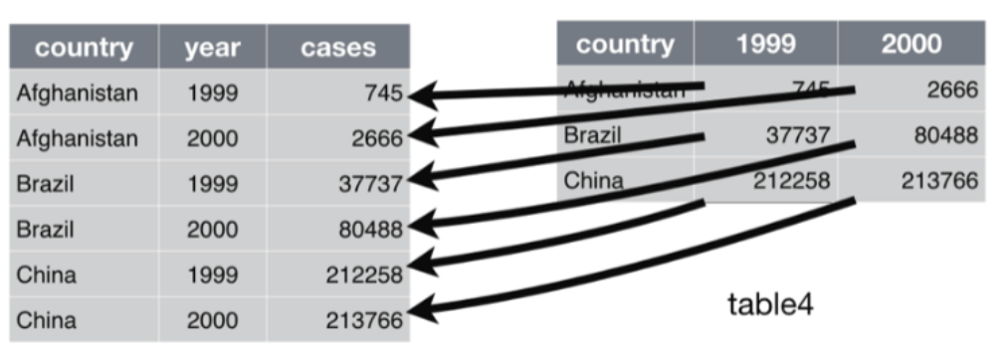

:::

:::


## Pivoting to wider


::: {.columns}

::: {.column}

When observation is scattered across multiple rows. Typically you have

- A key-variable which makes the new column names
- A value-variable which makes the values in the cells of the new variables


:::

::: {.column}

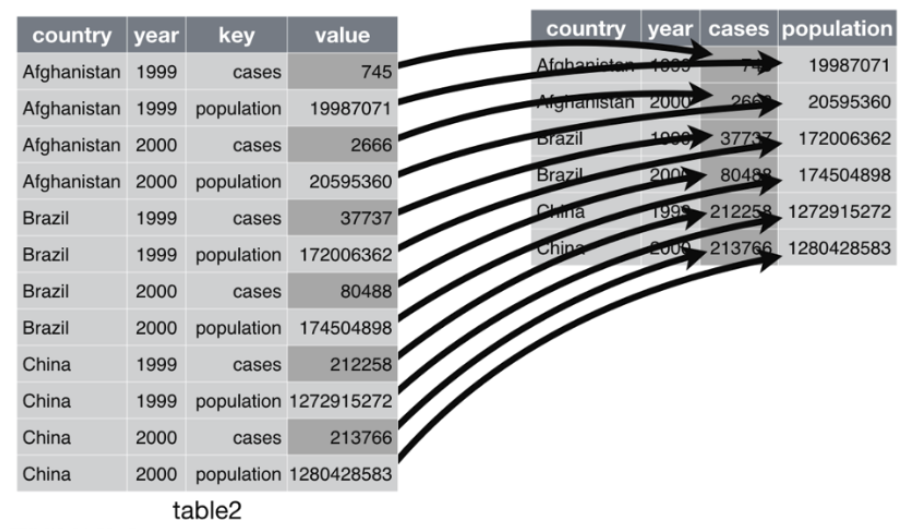

:::

:::


## `pivot_longer`

```{r}
#| echo: true
data_wide <- tibble(
  id = 1:3,
  height_2023 = c(150, 160, 170),
  height_2024 = c(152, 162, 172)
)
data_wide
```

```{r}
#| echo: true
data_longer <- pivot_longer(
  data = data_wide,
  cols = c(height_2023, height_2024),
  names_to = "year",
  values_to = "height"
)
data_longer
```

# The pipe `|>`

## `|>`

In data wrangling it is common to do various data manipulations one after the other.  
A common tool is to use the pipe to give it an ordered structure in the writing. 

The basic idea is:   
**Put what is before the pipe `|>` as the first argument of the function coming after.** 

When `do_this` is a function and `to_this` is an object like a dataframe then 

```R
do_this(to_this)
```

is the same as 

```R
to_this |> do_this()
```

. . .

It also works for longer nested functions:

```R
function3(function2(function1(data)))
```

is the same as 
```R
data |> function1() |> function2() |> function3()
```


## With the pipe

```{r}
data_longer <- data_wide |>
  pivot_longer(
    cols = c(height_2023, height_2024),
    names_to = "year",
    values_to = "height"
  )
data_longer
```

. . .

`year` does not look good! We want numbers.

. . .

Let's do a string mutate:

```{r}
#| echo: true
data_longer <- data_longer |>
  mutate(year = str_remove(year, "height_"))
data_longer
```

. . . 


## But `year` still a character variable!

We mutate further:

```{r}
#| echo: true
data_longer <- data_longer |>
  mutate(year = as.numeric(year))
data_longer
```

That is fine. 

## Back to wide: `pivot_wider`

```{r}
#| echo: true
data_longer |>
  pivot_wider(names_from = year, values_from = height)
```

. . .

OK, but now we have just numbers as variable names. Can we get `height_` prefix back?

. . .

```{r}
#| echo: true
data_longer |>
  pivot_wider(names_from = year, values_from = height, names_prefix = "height_")
```

## Summary piping and tidying

A small data science task often boils down to one line of code using pipes like

```R
data |> wrangling_functions(*specifications*) |> tidying(*to_bring_in_shape*) |> ggpplot()
```

(For R it is one line, but we may break it into several for a better overview.)

- Piping is a natural way of thinking in data science, so we also program that way.
- Tidying (for example `pivot_longer`) is often needed directly before a ggplot command. 
- Tidying often require some string manipulations making new variables and variable names nice. 

. . .

How can I learn all this? [[Practice, practice, practice, ...]{style="color:red;"}]{.fragment}  
Do I need to learn it again for python?? [[Yes, but it is easier knowing the concept!]{style="color:red;"}]{.fragment}

. . . 

**When learning, learn the concept not just get the code done!**