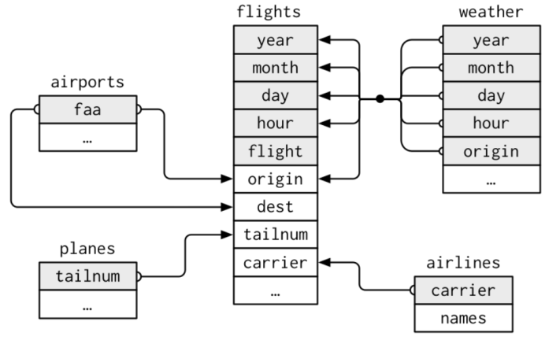
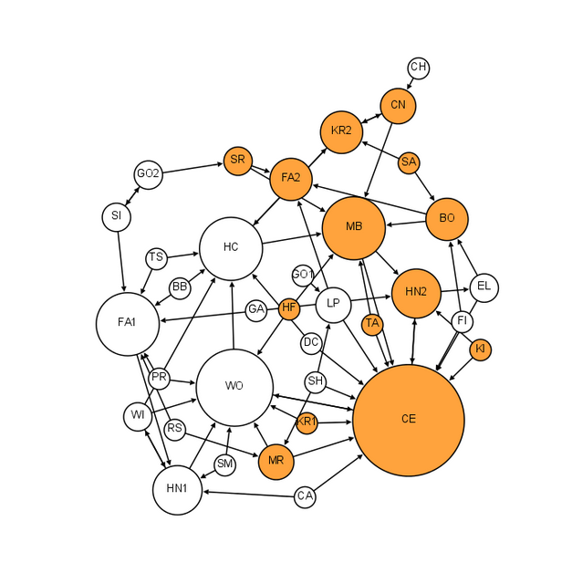
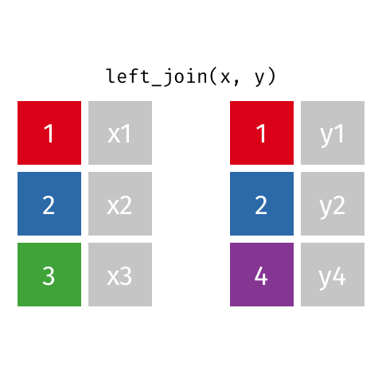
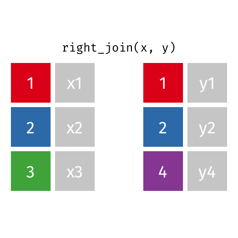
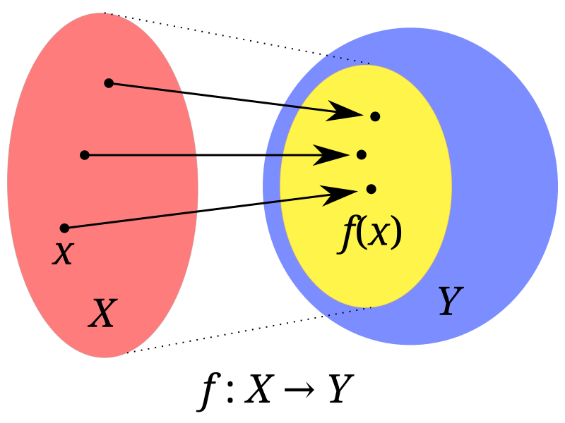

## Preliminaries {.smaller}

In this lectures we will use these packages. 

```{r}
#| echo: true
#| output: false
library(nycflights13)
library(tidyverse)
```

The datasets used can be downloaded from:   
<https://github.com//Website/tree/main/lectures>


# Strings and Special Values

## String modification {.smaller}

We modify strings with the [`stringr`](https://stringr.tidyverse.org/) package from the tidyverse core. 
All functions from `stringr` start with `str_`. 

A few examples:

```{r}
#| echo: true
c("x", "y")
str_c("x", "y")
```

. . . 

```{r}
#| echo: true
str_c("x", "y", "z", sep = ",")
```

. . .

```{r}
#| echo: true
length(c("x", "y", "z"))
str_length(c("x", "y", "z"))
str_length(c("This is a string.", "z"))
```


## String wrangling with variable names {.smaller}

This is a typical use case. We have data like this:

```{r}
#| echo: true
#| output-location: column-fragment
data <- tibble(
  Name = c("A", "B", "C"),
  Age_2020 = c(20, 30, 40),
  Age_2021 = c(21, 31, 41),
  Age_2022 = c(22, 32, 42)
)
data
```

We tidy that data set by creating a year variable.

. . .

```{r}
#| echo: true
#| output-location: column-fragment
data |>
  pivot_longer(
    c("Age_2020", "Age_2021", "Age_2022"),
    names_to = "Year",
    values_to = "Age"
  )
```

. . . 

OK, but the year variable is a string but we want numbers.

## Use `word` {.smaller}

`word` extracts words from a sentence. (One `stringr` function *not* starting with `str_`!)

- You can specify the words from  `start` to `end`. Use numbers. (Negative numbers to count from the last word.) 
- The word separator need not be `" "` but can be any character.

```{r}
#| echo: true
#| output-location: column-fragment
word("This is a string.", start = 2, end = -2)
```

```{r}
#| echo: true
#| output-location: column-fragment
word("Age_2022", start = 2, sep = "_")
```

. . .

It also works vectorized. 

```{r}
#| echo: true
#| output-location: column-fragment
data |>
  pivot_longer(
    c("Age_2020", "Age_2021", "Age_2022"),
    names_to = "Year",
    values_to = "Age"
  ) |>
  mutate(
    Year = word(Year, start = 2, sep = "_") |>
      as.numeric()
  )
```


## String Detection / Regular Expressions {.smaller}

Many `stringr` function follow the structure `(string, pattern)`.  
`string` is  in our data, `pattern` is a string interpreted as a [**Regular Expression**](https://en.wikipedia.org/wiki/Regular_expression)

A few examples show its power:

```{r}
#| echo: true
fruits <- c("apple", "pineapple", "Pear", "orange", "peach", "banana")
```
```{r}
#| echo: true
#| output-location: column-fragment
str_detect(fruits, "apple")
```
```{r}
#| echo: true
#| output-location: column-fragment
str_extract(fruits, "apple")
```
```{r}
#| echo: true
#| output-location: column-fragment
str_extract(fruits, "[Pp][a-z]")
```
```{r}
#| echo: true
#| output-location: column-fragment
str_extract(fruits, "^[Pp][a-z]")
```
```{r}
#| echo: true
#| output-location: column-fragment
str_extract(fruits, "^[Pp][a-z]{3}")
```
```{r}
#| echo: true
#| output-location: column-fragment
str_extract(fruits, "^[Pp][a-z]+")
```

Test other words, like `str_extract("Pizza Napoli","^[Pp][a-z]+")`: 

```{webr-r}

```

## Regular Expressions {.smaller}

**Regular expressions** (*regexp* or *regex*): Character-Sequences specifying *match patterns*. 

- Useful when strings contain unstructured or semi-structured data. 

- When you first look at a regexp, you'll think a cat walked across your keyboard, but as your understanding improves they will start to make sense. (Or you ask an AI chatbot to give you what you need 🙂)

**Guess what this regexp's are to match?**

``"^[a-zA-Z0-9_.+-]+@[a-zA-Z0-9-]+\\.[a-zA-Z0-9-.]+$"``  
``"^[\\w-\\.]+@([\\w-]+\\.)+[\\w-]{2,4}$"``  
``"^[[:alnum:].-_]+@[[:alnum:].-]+$"``

```{webr-r}

```

. . . 

Email addresses! However, this is not the perfect solution. Dig deeper: Read the discussion and see the example in [How can I validate an email address using a regular expression?](https://stackoverflow.com/questions/201323/how-can-i-validate-an-email-address-using-a-regular-expression) at stackoverflow. 


# Special Values for "No Data"

## Special values  {.smaller}

You should know the differences of these *special values*: 

- `NA`: Not available (string, number, or whatever vector entry)
- `NULL`: Null object, the undefined object, e.g. an empty list or an empty list element
- `NaN`: For numbers: Meaning "Not a Number" (when math cannot solve what you want)
- `Inf`: For numbers: Positive infinity 
- `-Inf`: For numbers: Negative infinity

Check some math:

```{r}
#| echo: true
#| output-location: column-fragment
1 / 0
```

```{r}
#| echo: true
#| output-location: column-fragment
-1 / 0
```

```{r}
#| echo: true
#| output-location: column-fragment
0 / 0
```

```{r}
#| echo: true
#| output-location: column-fragment
1 / 0 + 1 / 0
```

```{r}
#| echo: true
#| output-location: column-fragment
1 / 0 - 1 / 0
```

## `NA`s  {.smaller}

`NaN` is "not a number", but `NA` stands for genuinely unknown values.   
It can also appear in vectors of `character` and `logical` data types.

```{r}
#| echo: true
x <- c(1, 2, 3, 4, NA)
mean(x)
mean(x, na.rm = TRUE)
summary(x)
```

. . .

The type of `NA` is logical. 

```{r}
#| echo: true
typeof(NA)
typeof(NaN)
```

Does it make sense? Let us look at `NA`'s in logical operations. 

## `NA`s in logical operations

`NA` can be TRUE or FALSE. 

Usually operations including `NA` results again in `NA`, but some not!

```{r}
#| echo: true
#| output-location: column-fragment
NA & TRUE
```

```{r}
#| echo: true
#| output-location: column-fragment
NA | TRUE
```

```{r}
#| echo: true
#| output-location: column-fragment
NA & FALSE
```

```{r}
#| echo: true
#| output-location: column-fragment
NA | FALSE
```

Understanding logical operations is important!


## `NULL` is the null object {.smaller}

- used to represent lists with zero length

```{r}
#| echo: true
x <- 1:10
attributes(x)
```

- used as a placeholder for missing values in lists and dataframes

```{r}
#| echo: true
L <- list(a = 1)
L[[3]] <- 5
L
```

## Missing values {background-color="khaki"}

Many datasets from the real world have *some* or *many* `NA`s in *some* or *many* of the variables. These are called **missing values**.

What to do with missing values? 

. . . 

- Usually, there is no perfect solution for this!
- The relevant question is: **Why is the data missing?** \
    - You can not answer it purely by analyzing the data. You need to think about the **data-generating process**. 
- Three ways: 
    - **Impute** values. There are many concepts, but all rely on assumptions and have consequences which you have to be aware of.
    - **Drop** the **cases** with `NA`s. (e.g. `na.omit()`)
    - **Drop** the variables with `NA`s. 


# Relational Data

## Working with more dataframes {.smaller background-color="khaki"}

- Data can be distributed in several dataframes which have relations which each other. 
- For example, they share variables as the five dataframes in `nycflights13`.

{height=300}

:::{.aside}
Often variables in different dataframe have the same name, but that need not be the case! See the variable `faa` in `airports` matches `origin` and `dest` in `flights`.
:::

## Networks: Special relational data {background-color="khaki"}


::: {.columns}
::: {.column}
- Most datasets describe **attributes** (variables) between **individual units**. 
- Network data *additionally* describes **relations** between individual units. 
- In the example we have individual *pupils* and relations explaining a wish to sit besides another pupil.

Dealing with Network Data and Models is a whole scientifi field: Network Science.   
:::
::: {.column}

:::
:::

::: aside
Visualization from <http://www.martingrandjean.ch/social-network-analysis-visualization-morenos-sociograms-revisited/>
:::

# Joining data to dataframes

## Data: Women in science {.smaller}

10 women in science who changed the world: 

`r read_csv("professions.csv") |> pull(name) |> paste(collapse=", ")`


::: {.panel-tabset}

#### Professions

```{r}
#| echo: true
professions <- read_csv("professions.csv")
professions
```

#### Dates

```{r}
#| echo: true
dates <- read_csv("dates.csv")
dates
```

#### Works

```{r}
#| echo: true
works <- read_csv("works.csv")
works
```

:::


:::{.aside}
Source: [Discover Magazine](https://www.discovermagazine.com/the-sciences/meet-10-women-in-science-who-changed-the-world). The data can be downloaded: [professions.csv](https://raw.githubusercontent.com/rstudio-education/datascience-box/main/course-materials/_slides/u2-d08-multi-df/data/scientists/professions.csv), [dates.csv](https://raw.githubusercontent.com/rstudio-education/datascience-box/main/course-materials/_slides/u2-d08-multi-df/data/scientists/dates.csv), 
[works.csv](https://raw.githubusercontent.com/rstudio-education/datascience-box/main/course-materials/_slides/u2-d08-multi-df/data/scientists/works.csv)
:::

## We want this dataframe {.smaller}

```{r}
professions |> left_join(dates) |> left_join(works)
```

## Joining dataframes {.smaller}

`something_join(x, y)`^[The notion *join* comes from SQL database. In other data manipulation frameworks joining is called *merging*.] for dataframes `x` and `y` which have a *relation*

- `left_join()`: all rows from x must remain
- `right_join()`: all rows from y must remain
- `full_join()`: all rows from both x and y must remain
- `inner_join()`: all rows from x where there are matching values in y remain
- ... (more exist see [`dplyr` cheatsheet](https://rstudio.github.io/cheatsheets/data-transformation.pdf))


## Simple setup for `x` and `y` {.smaller}

```{r}
#| echo: true
x <- tibble(
  id = c(1, 2, 3),
  value_x = c("x1", "x2", "x3")
)
y <- tibble(
  id = c(1, 2, 4),
  value_y = c("y1", "y2", "y4")
)
x
y
```

## `left_join()`

:::{.columns}

:::{.column width=50%}



:::

:::{.column}
```{r}
#| echo: true
left_join(x, y)
```

:::

:::

## `right_join()`

:::{.columns}

:::{.column width=50%}



:::

:::{.column}

```{r}
#| echo: true
right_join(x, y)
```

:::

:::


## `full_join()`

:::{.columns}

:::{.column width=50%}


:::

:::{.column}
```{r}
#| echo: true
full_join(x, y)
```

:::

:::


## `inner_join()`

:::{.columns}

:::{.column width=50%}


:::

:::{.column}

```{r}
#| echo: true
inner_join(x, y)
```

:::

:::

## Women in science {.smaller}

:::{.panel-tabset}

#### `left_join()`

```{r}
#| echo: true
professions |> left_join(works)
```

#### `right_join`

```{r}
#| echo: true
professions |> right_join(works)
```

#### `full_join`

```{r}
#| echo: true
dates |> full_join(works)
```

#### `inner_join`

```{r}
#| echo: true
dates |> inner_join(works)
```


#### Final

```{r}
#| echo: true
professions |> left_join(dates) |> left_join(works)
```

:::

## Keys {.smaller}

- A **key** is a variable or a set of variables which uniquely identifies observations
- What was the key in the dataframe of women in science? [`name`]{.fragment}

. . . 

Switching back to `nycflights13` as example

- In simple cases, a single variable is sufficient to identify an observation, e.g. each plane in `planes` is identified by `tailnum`.
- Sometimes, multiple variables are needed; e.g. to identify an observation in
`weather` you need five variables: `year`, `month`, `day`, `hour`, and `origin`

## How to check if a variable is a key? {.smaller .scrollable}

Counting observation and filter those more than one

```{webr-r}
planes |> count(tailnum)
```

```{r}
#| echo: true
planes |> count(tailnum) |> filter(n > 1)
```

. . . 

```{r}
#| echo: true
weather |> count(year, month, day, hour, origin) |> filter(n > 1)
```

OK, here 3 observations are twice, one for each airport. Probably this is related to [Daylight saving time](https://en.wikipedia.org/wiki/Daylight_saving_time) in the US. In Fall clocks are turned back 1 hour. So this hour appears twice. 

. . . 

Example: Without hour it is not a key

```{r}
#| echo: true
weather |> count(year, month, day, origin) |> filter(n > 1)
```

Why do we have only 22 and 23 on day 1 of month 1? No idea. Dig deeper yourself!

## Primary and foreign keys  {.smaller}

- A **primary key** uniquely identifies an observation in its own table. E.g,
`planes$tailnum` in `planes`. 
- A **foreign key** uniquely identifies an observation in another dataframe E.g.
`flights$tailnum` is a foreign key in `flights` because it matches each flight to a unique plane in `planes`.

- A primary key and a foreign key form a relation. 
    - Often a *1-to-many* relation. Each plane has many flights. 
        - Implication: Joining `flights` with `planes` duplicates the rows of `planes` for each flight of that plane.
- Relations can also be many-to-many. Airlines can fly to many airports; airport can host many airplanes.


## Joining when key names differ? {.smaller .scrollable}

We have to specify the key relation with a named vector in the `by` argument. 

```{r}
#| echo: true
dim(flights)
flights |> left_join(airports, by = c("dest" = "faa"))
```

The alternative (new default) version is to use the `join_by` function using the comparison sign `==`. 

```{r}
#| echo: true
flights |> left_join(airports, join_by("dest" == "faa"))
```

**Why does the number of rows stays the same after joining?**

. . .

`faa` is a primary key in `airports`. It is matched with `dest` as the foreign key in `flights`. 


# Math: Sets and vectors

## Definition: Sets and vectors {background-color="aquamarine"}

A **set** is mathematical model for the *unordered* collection of *different* things (**elements**).

Examples

- $\{3, \text{Hi}, 😀, 🖖 \}$
- $\{1,3,5\}$
- The natural numbers $\mathbb{N} = \{1, 2, 3, \dots\}$ (infinite!)
- $\{\mathtt{"EWR"}, \mathtt{"LGA"}, \mathtt{"JFK"}\}$   
these are `origin` airports in `flights`


## Math: Sets and vectors {background-color="aquamarine"}

A **vector** is an ordered collection of things (**components**) of the same type. 

In a set, each thing can only be once and the order does not matter!

. . .

$\{1,3,5\} = \{3,5,1\} = \{1,1,1,3,5,5\}$

For vectors:

$[1\ 3\ 5] \neq [3\ 5\ 1]$ because we compare component-wise, so we cannot even compare with those with the vector $[1\ 1\ 1\ 3\ 5\ 5]$

## Math: Set operations  {background-color="aquamarine"}

Sets $A = \{🐺, 🦊, 🐶\}$ and $B = \{🐶, 🐷, 🐹\}$, $C = \{🐶, 🐷\}$:

::: {.incremental}
- Set **union** $A \cup B$ = \{🐺, 🦊, 🐶, 🐷, 🐹\}    
  $x \in A \cup B$ when $x \in A$ `|` (or) $x\in B$
- Set **intersection** $A \cap B$ = \{🐶\}    
  $x \in A \cap B$ when $x \in A$ `&` (and) $x\in B$
- Set **difference** $A \setminus B = \{🐺, 🦊\}$, $B \setminus A$ = \{🐷, 🐹\}
- **Subset**: $C \subset B$ but $C \not\subset A$
:::

. . . 

See the analogy of set operations and logical operations. 

## Set operations in R {.smaller}

`unique` shows the set of elements in a vector

```{r}
#| echo: true
unique(flights$origin)
```

. . . 

`setequal` tests for set equality

```{r}
#| echo: true
setequal(c("EWR", "LGA", "JFK"), c("EWR", "EWR", "LGA", "JFK"))
```

. . . 

`union`, `intersect`, `setdiff` treat vectors as sets and operate as expected

```{r}
#| echo: true
union(1:5, 3:7)
intersect(1:5, 3:7)
setdiff(1:5, 3:7)
```

Relations to `joins`: `full_join()` is like the *union*, `inner_join()` is like the *intersection*.

## Sets: Take-away

- Set operations are not a daily business in data science
- However, they are useful for data exploration!
- Knowing set operations is key to understand **probability**:
    - A *sample space* is the *set of all atomic events*. 
    - An *event* is a *subset of the sample space* 
    - A *probability function* assigns probabilities to all events. 


# Math: Functions

## Functions mathematically  {background-color="aquamarine"}

Consider two sets: The *domain* $X$ and the *codomain* $Y$. 

A *function* $f$ assigns each element of $X$ to exactly one element of $Y$.

:::{.columns}
:::{.column width="50%"}
We write $f : X \to  Y$  
["$f$ maps from $X$ to $Y$"]{style="color:blue;"}

and $x \mapsto f(x)$   
["$x$ maps to $f(x)$"]{style="color:blue;"}

The yellow set is called the *image* of $f$.
:::
:::{.column }

:::
:::

:::{.aside}
Picture from wikipedia. 
:::

## Conventions in mathematical text  {.smaller background-color="aquamarine"}

- Sets are denoted with capital letters. 
- Their elements with (corresponding) small letters. 
- Functions are often called $f$, $g$, or $h$. 
- Other terminology can be used! 

. . . 

**Important in math**

- When you read math:     
  *Keep track of what objects are! What are functions, what are sets, what are numbers, ...*^[Watch: How to read math <https://www.youtube.com/watch?v=Kp2bYWRQylk>] 
- When you write math: *Define what objects are.*


## Is this a mathematical function? {.smaller}

{height=200} $\ \mapsto\ $ {height=200} 

*Input* from $X = \{\text{A picture where a face can be recognized}\}$. 

*Function:* Upload input at <https://funny.pho.to/lion/> and download output.

*Output* from $Y = \{\text{Set of pictures with a specific format.}\}$ 

. . . 

Yes, it is a function. **Important: Output is the same for the same input!**


## Is this a mathematical function? {.smaller}

*Input* a text snippet. *Function:* Enter text at <https://www.craiyon.com>. *Output* a picture.

:::{.columns}
:::{.column width="50%"}
{height=430} 
:::
:::{.column }
Other examples:

- "Nuclear explosion broccoli"
- "The Eye of Sauron reading a newspaper"
- "The legendary attack of Hamster Godzilla wearing a tiny Sombrero"

{height=150}
{height=150} 
{height=150} 
:::
:::

. . .

No, it is not a function. It has nine outcomes and these change when run again. Same for answers of LLMs to the same prompt. 


## Graphs of functions {.smaller background-color="aquamarine"}

- A function is characterized by the set all possible pairs $(x,f(x))$. 
- This is called its *graph*. 
- When domain and codomain are real numbers then the graph can be shown in a *Cartesian coordinate system*. Example $f(x) = x^3 - x^2$

```{r}
#| echo: true
#| code-fold: true
ggplot() +
  geom_function(fun = function(x) x^3 - x^2) +
  xlim(c(-0.5, 1.5)) +
  xlab("x") +
  theme_minimal(base_size = 20)
```


# Important Functions

... and how to explore them using `ggplot`


## Some functions $f: \mathbb{R} \to \mathbb{R}$ {.smaller background-color="aquamarine"}

:::{.columns}
:::{.column width="50%"}
$f(x) = x$ *identity function*   
[$f(x) = x^2$ *square function*]{style="color:orange;"}  
[$f(x) = \sqrt{x}$ *square root function*]{style="color:blue;"}   
[$f(x) = e^x$ *exponential function*]{style="color:red;"}   
[$f(x) = \log(x)$ *natural logarithm*]{style="color:green;"}

- Square and square root function are *inverse* of each other. Exponential and natural logarithm, too. 

$\sqrt[2]{x}^2 = \sqrt[2]{x^2} = x$, $\log(e^x) = e^{\log(x)} = x$

- Identity function graph as mirror axis. 
:::
:::{.column width="50%"}
```{r}
#| fig-height: 6
#| echo: true
#| code-fold: true
ggplot() +
  geom_function(fun = function(x) x) +
  geom_function(fun = function(x) exp(x), color = "red") +
  geom_function(fun = function(x) log(x), color = "green") +
  geom_function(fun = function(x) x^2, color = "orange") +
  geom_function(fun = function(x) sqrt(x), color = "blue") +
  coord_fixed() +
  xlim(c(-3, 3)) +
  ylim(c(-3, 3)) +
  xlab("x") +
  theme_minimal(base_size = 20)
```

:::
:::

:::{.aside}
$e$ is *Euler's number* $2.71828\dots$. The natural logarithm is also often called $\ln$. The square root function is $\mathbb{R}_{\geq 0} \to \mathbb{R}$, the logarithm $\mathbb{R}_{>0} \to \mathbb{R}$.   
:::


## Shifts and scales {.smaller background-color="aquamarine" .scrollable}

How can we shift, stretch, or shrink a graph vertically and horizontally?

. . . 

:::{.panel-tabset}

### $y$-shift
:::{.columns}
:::{.column width="50%"}
Add a constant to the function. 

$f(x) = x^3 - x^2 \leadsto$

$\quad f(x) = x^3 - x^2 + a$

For $a =$ [-2]{style="color:red;"}, [-0.5]{style="color:darkred;"}, [0.5]{style="color:darkblue;"}, [2]{style="color:blue;"}
::: 
:::{.column}

```{r}
#| echo: true
#| fig-height: 8.5
#| code-fold: true
a <- c(1, 0.5, 2, -0.5, -2)
ggplot() +
  geom_function(fun = function(x) x^3 - x^2, size = 2, alpha = 0.5) +
  geom_function(fun = function(x) x^3 - x^2 + a[2], color = "blue4", size = 2) +
  geom_function(fun = function(x) x^3 - x^2 + a[3], color = "blue", size = 2) +
  geom_function(fun = function(x) x^3 - x^2 + a[4], color = "red4") +
  geom_function(fun = function(x) x^3 - x^2 + a[5], color = "red") +
  coord_fixed() +
  xlim(c(-3, 3)) +
  ylim(c(-3, 3)) +
  xlab("x") +
  theme_minimal(base_size = 24)
```

:::
:::

### $x$-shift
:::{.columns}
:::{.column width="50%"}
**Subtract** a constant from all $x$ within the function definition.

$f(x) = x^3 - x^2 \leadsto$

$\quad f(x) = (x - a)^3 - (x - a)^2$

For $a =$ [-2]{style="color:red;"}, [-0.5]{style="color:darkred;"}, [0.5]{style="color:darkblue;"}, [2]{style="color:blue;"}

**Attention:**  
Shifting $a$ units to the right needs subtracting $a$!   
You can think of the *coordinate system being shifted* in direction $a$ while the graph stays.
::: 
:::{.column}

```{r}
#| fig-height: 8.5
#| echo: true
#| code-fold: true
a <- c(1, 0.5, 2, -0.5, -2)
ggplot() +
  geom_function(fun = function(x) x^3 - x^2, size = 2, alpha = 0.5) +
  geom_function(
    fun = function(x) (x - a[2])^3 - (x - a[2])^2,
    color = "blue4",
    size = 2
  ) +
  geom_function(
    fun = function(x) (x - a[3])^3 - (x - a[3])^2,
    color = "blue",
    size = 2
  ) +
  geom_function(fun = function(x) (x - a[4])^3 - (x - a[4])^2, color = "red4") +
  geom_function(fun = function(x) (x - a[5])^3 - (x - a[5])^2, color = "red") +
  coord_fixed() +
  xlim(c(-3, 3)) +
  ylim(c(-3, 3)) +
  xlab("x") +
  theme_minimal(base_size = 24)
```

:::
:::

### $y$-scale
:::{.columns}
:::{.column width="50%"}
**Multiply** a constant to all $x$ within the function definition.

$f(x) = x^3 - x^2 \leadsto$

$\quad f(x) = a(x^3 - x^2)$

For $a =$ [-2]{style="color:red;"}, [-0.5]{style="color:darkred;"}, [0.5]{style="color:darkblue;"}, [2]{style="color:blue;"}

Negative numbers flip the graph around the $x$-axis. 
::: 
:::{.column}

```{r}
#| fig-height: 8.5
#| echo: true
#| code-fold: true
a <- c(1, 0.5, 2, -0.5, -2)
ggplot() +
  geom_function(fun = function(x) x^3 - x^2, size = 2, alpha = 0.5) +
  geom_function(
    fun = function(x) a[2] * ((x)^3 - (x)^2),
    color = "blue4",
    size = 2
  ) +
  geom_function(
    fun = function(x) a[3] * ((x)^3 - (x)^2),
    color = "blue",
    size = 2
  ) +
  geom_function(fun = function(x) a[4] * ((x)^3 - (x)^2), color = "red4") +
  geom_function(fun = function(x) a[5] * ((x)^3 - (x)^2), color = "red") +
  coord_fixed() +
  xlim(c(-3, 3)) +
  ylim(c(-3, 3)) +
  xlab("x") +
  theme_minimal(base_size = 24)
```

:::
:::

### $x$-scale
:::{.columns}
:::{.column width="50%"}
**Divide** all $x$ within the function definition by a constant.

$f(x) = x^3 - x^2 \leadsto$

$\quad f(x) = (x/a)^3 - (x/a)^2$

For $a =$ [-2]{style="color:red;"}, [-0.5]{style="color:darkred;"}, [0.5]{style="color:darkblue;"}, [2]{style="color:blue;"}

Negative numbers flip the graph around the $y$-axis. 

**Attention:**
Stretching needs a division by $a$!   
You can think of the *coordinate system being stretched* multiplicatively by $a$ while the graph stays.

::: 
:::{.column}

```{r}
#| fig-height: 8.5
#| echo: true
#| code-fold: true
a <- c(1, 0.5, 2, -0.5, -2)
ggplot() +
  geom_function(fun = function(x) x^3 - x^2, size = 2, alpha = 0.5) +
  geom_function(
    fun = function(x) (x / a[2])^3 - (x / a[2])^2,
    color = "blue4",
    size = 2
  ) +
  geom_function(
    fun = function(x) (x / a[3])^3 - (x / a[3])^2,
    color = "blue",
    size = 2
  ) +
  geom_function(fun = function(x) (x / a[4])^3 - (x / a[4])^2, color = "red4") +
  geom_function(fun = function(x) (x / a[5])^3 - (x / a[5])^2, color = "red") +
  coord_fixed() +
  xlim(c(-3, 3)) +
  ylim(c(-3, 3)) +
  xlab("x") +
  theme_minimal(base_size = 24)
```

:::
:::

::: 

## Math: Polynomials and exponentials {.smaller background-color="aquamarine"}

A *polynomial* is a function which is composed of (many) addends of the form $ax^n$ for different values of $a$ and $n$. 

In an *exponential* the $x$ appears in the exponent. $f(x) = x^2$ vs. [$f(x) = 2^x$]{style="color:red;"}

::: {.columns}
::: {.column}

```{r}
#| echo: true
#| code-fold: true

ggplot() +
  geom_function(fun = function(x) x^2) +
  geom_function(fun = function(x) 2^x - 1, color = "red") +
  xlim(c(0, 1.5)) +
  xlab("x") +
  theme_minimal(base_size = 24)
```

[Note: We use [$f(x) = 2^x - 1$]{style="color:red;"} to have both functions start at (0,0).]{style="font-size: 65%;"}

:::
::: {.column .fragment}
Same graph but for a larger range of $x$:

```{r}
#| echo: true
#| code-fold: true
ggplot() +
  geom_function(fun = function(x) x^2) +
  geom_function(fun = function(x) 2^x - 1, color = "red") +
  xlim(c(0, 5)) +
  xlab("x") +
  theme_minimal(base_size = 24)
```

:::
:::

. . .

**For $x\to\infty$, any exponential will finally "overtake" any polynomial.**

## $\max$ and $\operatorname{argmax}$ {background-color="aquamarine"}


::: {.columns}

::: {.column}

$f(x) = -x^4 + x^2 + 0.05x$

```{r}
#| echo: true
#| code-fold: true

fun <- function(x) -x^4 + x^2 + 0.05 * x
df <- tibble(x = seq(-1, 1, by = 0.05), y = fun(x))
df |>
  ggplot(aes(x, y)) +
  geom_line() +
  geom_hline(yintercept = max(df$y), color = "red") +
  geom_vline(xintercept = df$x[which.max(df$y)], color = "blue") +
  theme_minimal(base_size = 24)
```
:::

::: {.column .fragment}

The domain of $x$ is the interval $[-1,+1]$.

[$\max$]{.math-red} reports the maximum of $f(x)$ given the values in the domain of $x$

$\max\limits_{x\in[-1,+1]} f(x) = `r max(df$y)`$

[$\operatorname*{argmax}$]{.math-blue} reports the value of $x$ from its domain where $f(x)$ achieves its maximal value

$\operatorname*{argmax}\limits_{x\in[-1,1]} f(x) = `r df$x[which.max(df$y)]`$

:::

:::

. . . 

- Analog concepts for the minimum $\min$
- Warning: The result for $\operatorname*{argmax}$ is not mathematically precise because computationally we only have $x$-values in steps of 0.05, in this computation. 

## Computational realization

Recall vector creation functions

```{r}
#| echo: true
#| output-location: fragment
1:10
```

```{r}
#| echo: true
#| output-location: fragment
seq(from = -0.5, to = 1.5, by = 0.1)
```

```{r}
#| echo: true
#| output-location: fragment
seq(from = 0, to = 1, length.out = 10)
```

```{r}
#| echo: true
#| output-location: fragment
rep(1:3, times = 3)
```

```{r}
#| echo: true
#| output-location: fragment
rep(1:3, each = 3)
```

## Computational realization {.scrollable}

Back to our example

```{r}
#| echo: true
x <- seq(-1, 1, by = 0.05)
x
y <- -x^4 + x^2 + 0.05 * x
y
```

. . . 

```{r}
#| echo: true
max(y)
```

. . . 

Logical vector and `which` (gives us the index of `TRUE` in the logical vector)

```{r}
#| echo: true
y == max(y)
which(y == max(y))
which.max(y)
```

. . . 

We find $\operatorname*{argmax}\limits_{x\in[-1,1]} f(x)$ by logical indexing in $x$ 

```{r}
#| echo: true
x[y == max(y)]
```

In this form it is never mathematically precise, because we use a "grid" of $x$-values nor every possible $x$ (these would be infinitely many). 


## Optimization

- The field of [**mathematical optimization**]{.text-red} boils down to [$\operatorname*{argmax}$**-ing an objective function**]{.text-red}. 
    - The **objective function** specifies what we want to have. 
        - In Business, it can be *profit*. Input variables would specify how we could to allocate our resources. Often it is accompanied by **constraints**, like a limit for the total resources.
        - An analog concepts is a *cost function* which shall then be minimized. 

. . .

- **Machine learning** and **training AI** is based on *approximate optimization* with an objective function
    - Often called *loss function* (to be as low as possible)   


## Softmax {.scrollable}

A core concept of *approximate optimization* is using a **Softmax**-function 

$f: \mathbb{R}^K \to [0,1]^K$ 

which maps $K$ real numbers to $K$ numbers between 0 and 1.

. . . 

With $\mathbf{x} = [x_1, \dots, x_K]$ it is for the $j$-th outcome number

$$\sigma(\mathbf{x})_j = \frac{e^{\beta x_j}}{e^{\beta x_1} + e^{\beta x_2} + \dots + e^{\beta x_K}} = \frac{e^{\beta x_j}}{\sum_{k=1}^K  e^{\beta x_k}}$$

where $\beta$ is a parameters specifying how *approximate* (or noisy) the optimization is. 

. . .

Let us look at our example in code: 

```{r}
#| echo: true
y <- -x^4 + x^2 + 0.05 * x
y
beta <- 1
exp(beta * y) / sum(exp(beta * y))
```

. . .

The outcome softmax vector sums up to one by construction.

```{r}
#| echo: true
sum(exp(beta * y) / sum(exp(beta * y)))
```

So, we can interprete it as a **probability distribution**. We look at it again later. 


# Functions in Programming and Programming Functions

## Input $\to$ output {.smaller} 


- Metaphorically, a function is a *machine* or a *blackbox* that for each input yields an output. 
- The inputs of a function are also called **arguments**. 

. . . 

Difference to math terminolgy:   
**The output need not be the same for the same input.**

:::{.aside}
Picture from wikipedia. 
:::


## Function as objects in R {.scrollable .smaller}
 
`function` is a class of an object in R

```{r}
#| echo: true
class(c)
class(ggplot2::ggplot)
```

. . .

Calling the function without brackets writes its code or some information. 
```{r}
#| echo: true
sd # This function is written in R, and we see its code
```

. . . 

```{r}
#| echo: true
c # This function is not written in R but is a R primitive
```
. . . 

```{r}
#| echo: true
ggplot2::ggplot # This function is not written solely in R
```

## Define your own functions! (in R) {.smaller}

```{r}
#| echo: true
add_one <- function(x) {
  x + 1
}
# Test it
add_one(10)
```

. . . 

The skeleton for a function definition is

```R
function_name <- function(input){
  # do something with the input(s)
  # return something as output
}
```

- `function_name` should be a short but evocative verb. 
- The `input` can be empty or one or more `name` or `name=expression` terms as arguments.
- The last evaluated expression is returned as output. 
- When the body or the function is only one line `{}` can be omitted. For example   
`add_one <- function(x) x + 1`


## Flexibility of inputs and outputs {.smaller}

- Arguments can be specified by `name=expression` or just `expression` (then they are taken as the next argument)
- Default values for arguments can be provided. Useful when an argument is a parameter. 

```{r}
#| echo: true
#| output-location: column-fragment
mymult <- function(x = 2, y = 3) x * (y - 1)
mymult(3, 4)
```


```{r}
#| echo: true
#| output-location: column-fragment
mymult()
```

```{r}
#| echo: true
#| output-location: column-fragment
mymult(y = 3, x = 6)
```

```{r}
#| echo: true
#| output-location: column-fragment
mymult(5)
```
 
```{r}
#| echo: true
#| output-location: column-fragment
mymult(y = 2)
```

. . . 

For complex output use a list

```{r}
#| echo: true
#| output-location: column-fragment
mymult <- function(x = 2, y = 3) {
  list(out1 = x * (y - 1), out2 = x * (y - 2))
}
mymult()
```

# Think and program vectorized!

## Vectorized functions {.smaller}

Mathematical functions in programming are often "vectorized": 

- Operations on a single value are applied to each component of the vector. 
- Operations on two values are applied "component-wise" (for vectors of the same length)

```{r}
#| echo: true
#| output-location: fragment
log10(c(1, 10, 100, 1000, 10000))
```

```{r}
#| echo: true
#| output-location: fragment
c(1, 1, 2) + c(3, 1, 0)
```

```{r}
#| echo: true
#| output-location: fragment
(0:5)^2
```


## Plotting and transformation {.smaller}

**Vector creation and vectorized functions** are key for plotting and transformation. 

```{r}
#| echo: true
func <- function(x) x^3 - x^2 # Create a vectorized function
data <- tibble(x = seq(-0.5, 1.5, by = 0.01)) |> # Vector creation
  mutate(y = func(x)) # Vectorized transformation using the function
data |> ggplot(aes(x, y)) + geom_line() + theme_minimal(base_size = 20)
```

## Conveniently `ggplot`ing functions

```{r}
#| echo: true
#| fig.width: 5
#| fig.height: 3
ggplot() +
  geom_function(fun = log) +
  geom_function(fun = function(x) 3 * x - 4, color = "red") +
  theme_minimal(base_size = 20)
```


Code line 3 shows another important concept: **anonymous functions**. The function `function(x) 3*x - 4` is defined *on the fly* without a name.


## Softmax example

Increasing $\beta$ from black to red

```{r}
#| echo: true
#| code-fold: true

f <- function(x) -x^4 + x^2 + 0.05 * x
softmax <- function(x, beta = 1) exp(beta * x) / sum(exp(beta * x))
ggplot() +
  geom_function(fun = function(x) softmax(f(x))) +
  geom_function(fun = function(x) softmax(f(x), beta = 5), color = "blue") +
  geom_function(fun = function(x) softmax(f(x), beta = 10), color = "purple") +
  geom_function(fun = function(x) softmax(f(x), beta = 30), color = "red") +
  xlim(c(-1, 1)) +
  theme_minimal(base_size = 20)
```

- The peak around the strict $\operatorname{argmax}$ becomes more and more pronounced the larger $\beta$ is!
- *Softmax* means that we select the $\operatorname{argmax}$ more likely but not for sure. $\beta$ controls how close we become to select it for sure. 


# Conditional Statements (`if`) and Iteration (`map`)

## Conditional statements  {.smaller}

- `if` executes a code block if a condition is `TRUE`
- `else` executes a code block if the condition is `FALSE`

Skeleton

```R
if (condition) {
  # code block
} else {
  # code block
}
```

Example: A piece-wise defined function

:::: {.columns}

::: {.column width='50%'}

```{r}
#| echo: true

piecewise <- function(x) {
  if (x < 2) {
    0.5 * x
  } else {
    x - 1
  }
}
```

:::

::: {.column width='50%'}

```{r}
#| echo: true
piecewise(1)
piecewise(2)
piecewise(3)
```

:::

::::

. . . 

Problem: `piecewise` is not vectorized. `piecewise(c(1,2,3))` does not work!

## Vectorized operations with `map` {.smaller}

- `map` functions apply a function to each element of a vector.^[In `tidyverse` they are provided in the package `purrr`]
- `map(.x, .f, ...)` applies the function `.f` to each element of the vector of `.x` and returns a *list*.
- `map_dbl` returns a double *vector* (other variants exist)

:::: {.columns}

::: {.column width='50%'}
```{r}
#| echo: true

map(c(1, 2, 3), piecewise)
map_dbl(c(1, 2, 3), piecewise)

piecewise_vectorized <-
  function(x) map_dbl(x, piecewise)
```

:::

::: {.column width='50%'}

```{r}
#| echo: true
piecewise_vectorized(seq(0, 3, by = 0.5))
tibble(x = seq(0, 3, by = 0.5)) |>
  mutate(y = piecewise_vectorized(x)) |>
  ggplot(aes(x, y)) +
  geom_line() +
  theme_minimal(base_size = 20)
```

:::

::::

## `reduce` {.smaller}

Instead of a list or a vector `reduce` returns a single value.   
To that end it needs a function with two arguments. It applies it to the first two elements of the vector, then to the result and the third element, then the result and the fourth element, and so on.

```{r}
#| echo: true
1:10 |> reduce(\(x, y) x + y)
```

Note: `\(x)` is a short way to write an **anonymous function** as `function(x)`. 

. . . 

Example: Reading multiple files

:::: {.columns}

::: {.column width='50%'}
Instead of 

```R
a <-read_csv("a.csv")
b <-read_csv("b.csv")
c <-read_csv("c.csv")
d <-read_csv("d.csv")
e <-read_csv("e.csv")
f <-read_csv("f.csv")
g <-read_csv("g.csv")

bind_rows(a,b,c,d,e,f,g)
```

:::

::: {.column width='50%'}
Write

```R
letter[1:7] |> 
 map(\(x) read_csv(paste0(x,".csv"))) |> 
 reduce(bind_rows)
```

That is the map-reduce idea! It is a recurring pattern in distributed big data computing.

:::

::::

## `map` and `reduce` {.smaller}

- `map` applies a function to each element of a vector (or list) and returns a list (or vector if `map_dbl` or other vaeriants are used)
    - The output has the same `length` as the input
- `reduce` applies a function taking two arguments and then summarizes the list by applying them two element 1 and 2 and then again the result with element 3 and then the result with element 4, ...
    - The output is one object
    
- Remark: The problem of vectorizing a function which has an `if` and `else` statement (see the example `piecewise_vectorized`) can also be solved using the vectorized version of it:    
`if_else(condition = *condition*, true = *value-if_TRUE*, false = *value-if_FALSE*)`    
Here every argument can be a vector!


## Function programming: Take away

- Functions are the most important building blocks of programming.
- Functions can and often should be vectorized.
- Vectorized functions are the basis for plotting and transformation.
- `map` functions are powerful tools for iterative tasks!    
    *Expect to not get the idea first but to love them later.*


# Summary R tools

With this lecture we finish introducing the concepts behind the basic data science tools using R.  

## Master core `tidyverse` packages

- `ggplot` you can do basic data visualization and improve towards the ability to produce great graphics
- `readr` you can load data properly from text files
- `tidyr` you can reshape a data frame into the form you need
- `dplyr` you can wrangle data: select, filter and slice dataframes; summarize variables and create new variables using grouping; join different dataframes; ...
- `stringr` you can manipulate character variables to produce what you need
- `lubridate` you learn how to properly work with date and time variables
- `purrr` you learn using map, reduce, and other function to automate tasks
- `forcats` you can handle categorical variables nicely for plotting using factors in R  