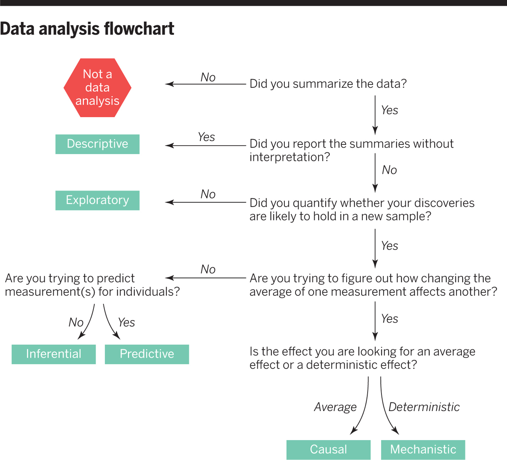
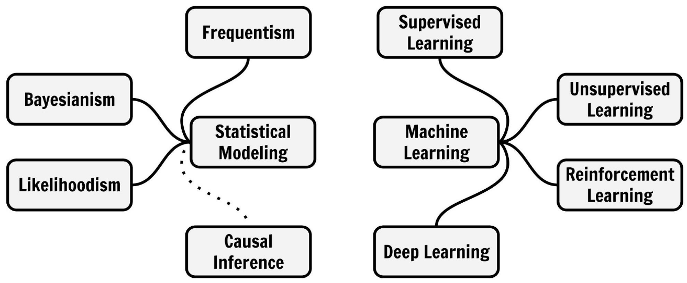

## Preliminaries

```{r}
#| echo: true
library(tidyverse)
library(tidymodels)
library(palmerpenguins)
```


# Models in Science

## What is a model? {.smaller background-color="khaki"}

- A model is an informative representation of an object, person or system. 

{height=200}
{height=200}
{height=200} 

- A model is a [**simplified**]{style='color:blue;'} representation of the real world focusing on the essential parts for its [**purpose**]{style='color:blue;'}.

::: aside
Source: <https://en.wikipedia.org/wiki/Model>
:::

## Scientific Modeling {.smaller background-color="khaki"}

:::: {.columns}

::: {.column width='50%'}
**Scientific modeling** is an activity that produces models representing empirical objects, phenomena, and physical processes, to make a particular part or feature of the world easier to 

- understand, 
- define, 
- quantify, 
- visualize, or 
- simulate.
:::

::: {.column width='50%'}


#### Famous wisdom 

> [All models are wrong, but some are useful.](https://en.wikipedia.org/wiki/All_models_are_wrong)
:::

::::

::: aside
Source: <https://en.wikipedia.org/wiki/Scientific_modelling>
:::


## Model Purposes and Data Analysis {.smaller background-color="khaki"}

:::: {.columns}

::: {.column width='60%'}
- **Agent-based models** and **differential equations**
    - are used to **explain** the **dynamics** of one or more variables (typically) over time. They are used to answer [*mechanistic questions*]{style='color:blue;'}.
- [**Variable-based models**]{style='color:blue;'} 
    - are used to specify relations between variables
    - to **explain** relations and make **predictions**.
    - Used to answer [*inferential*]{style='color:blue;'} and [*predictive questions*]{style='color:blue;'}.   
    - (With experimental and theoretical effort also for [*causal questions*]{style='color:blue;'}.)

:::

::: {.column width='40%'}

:::

::::

. . . 

The most basic variable-based model is the [**linear model**]{style='color:blue;'}.


## Models to Learn from Data {.smaller background-color="khaki"}

In much of the following we use a *narrower* definition of **model**:

A **mathematical model** that consists of **variables** and **functions**. 

:::: {.columns}

::: {.column width='50%'}
Different names and roles of [**variables**]{style='color:blue;'}: 

- random variables
- covariates
- predictors
- latent variables
- features
- targets
- outcomes
:::

::: {.column width='50%'}
[**Functions**]{style='color:blue;'} relate variables to each other

- In a linear model we model one variable as a weighted sum of the other variables

Once a model (setup of variables and functions) is specified, modelers use [**Data**]{style='color:blue;'} to find the *best* function, called

- estimation
- training
- fitting
- learning


:::


::::


## Modeling Mindsets {.smaller background-color="khaki"}

Even within the setup of *Models to Learn from Data* there are many different [**Modeling Mindsets**]{style='color:blue;'}



::: aside
Molnar, C. (2022). [Modeling mindsets: The many cultures of learning from data.](https://books.google.de/books?id=qV-DzwEACAAJ) Christoph Molnar c/o Mucbook Clubhouse. 
:::


## Modeling Mindsets {.smaller background-color="khaki"}

Even within the setup of *Models to Learn from Data* there are many different [**Modeling Mindsets**]{style='color:blue;'}


::: aside
Molnar, C. (2022). [Modeling mindsets: The many cultures of learning from data.](https://books.google.de/books?id=qV-DzwEACAAJ) Christoph Molnar c/o Mucbook Clubhouse. 
:::


# Linear Model
The first work-horse model in data science


## Hello again penguins! {.scrollable .smaller}

We use the dataset [Palmer Penguins](https://allisonhorst.github.io/palmerpenguins/)

Chinstrap, Gentoo, and Adélie Penguins

{height=200}
{height=200}
{height=200}


```{r}
penguins
```

## Body mass in grams

```{r}
#| echo: true
penguins |>
  ggplot(aes(body_mass_g)) +
  geom_histogram()
```

## Flipper length in millimeters

```{r}
#| echo: true
penguins |>
  ggplot(aes(flipper_length_mm)) +
  geom_histogram()
```

## Model: Linear relation of variables {.smaller background-color="aquamarine"}

A **line** is a shift-scale transformation of the identity function usually written in the form 

$$f(x) = a\cdot x + b$$

where [$a$ is the *slope*]{style="color:red;"}, [$b$ is the *intercept*]{style="color:blue;"}.^[This a scale and a shift in the $y$ direction. Note: For lines there is always an analog transformations on the $x$ direction.]

```{r}
#| echo: true
#| output-location: column
a <- 0.5
b <- 1
func <- function(x) a * x + b
ggplot() +
  geom_function(fun = func, size = 2) +
  # Set axis limits and make axis equal
  xlim(c(-0.5, 2)) +
  ylim(c(0, 2)) +
  coord_fixed() +
  geom_line(
    # intercept line:
    data = tibble(x = c(0, 0), y = c(0, 1)),
    mapping = aes(x, y),
    color = "blue",
    size = 2
  ) +
  geom_line(
    # slope:
    data = tibble(x = c(1.5, 1.5), y = c(1.25, 1.75)),
    mapping = aes(x, y),
    color = "red",
    size = 2
  ) +
  geom_line(
    # x-interval of length one:
    data = tibble(x = c(0.5, 1.5), y = c(1.25, 1.25)),
    mapping = aes(x, y),
    color = "gray"
  ) +
  theme_classic(base_size = 24)
```

## Penguins: Linear model {.smaller}

**Flipper length** as a function of **body mass**.

```{r}
#| echo: true
#| output-location: column
#| fig-height: 9
penguins |>
  ggplot(aes(x = body_mass_g, y = flipper_length_mm)) +
  geom_point() +
  geom_smooth(method = "lm", se = FALSE) +
  theme_classic(base_size = 24)
```

## Penguins: A smooth curve {.smaller}

**Flipper length** as a function of **body mass** with `loess`^[loess = locally estimated scatterplot smoothing] smoothing. 

```{r}
#| echo: true
#| output-location: column
#| fig-height: 7
penguins |>
  ggplot(aes(x = body_mass_g, y = flipper_length_mm)) +
  geom_point() +
  geom_smooth(method = "loess") +
  theme_classic(base_size = 24)
```

This is a less theory-driven and more data-driven model. Why?    
[We don't have a simple mathematical form of the function.]{.fragment}

## Terminology variable-based models {.smaller background-color="khaki"}

- **Response variable:**^[Also **dependent variable** in statistics or empirical social sciences.] Variable whose behavior or variation you are trying to understand, on the y-axis
- **Explanatory variable(s):**^[Also **independent variable(s)** in statistics or empirical social sciences.] Other variable(s) that you want to use to explain the variation in the response, on the x-axis
- **Predicted value:** Output of the model function. 
  - The model function gives the **(expected) average value** of the response variable conditioning on the explanatory variables
  - **Residual(s):** A measure of how far away a case is from its predicted value (based on the particular model)   
    Residual = Observed value minus Predicted value  
    The residual tells how far above/below the expected value each case is

## More explanatory variables {.smaller}

How does the relation between flipper length and body mass change with different species?

```{r}
#| echo: true
#| output-location: column
#| fig-height: 7
penguins |>
  ggplot(aes(x = body_mass_g, y = flipper_length_mm, color = species)) +
  geom_point() +
  geom_smooth(method = "lm", se = FALSE) +
  theme_classic(base_size = 24)
```

## ggplot-hint: How to color penguins but keep one model? {.smaller}

Put the mapping of the color aesthetic into the `geom_point` command. 

```{r}
#| echo: true
#| output-location: column
#| fig-height: 6
penguins |>
  ggplot(aes(x = body_mass_g, y = flipper_length_mm)) +
  geom_point(aes(color = species)) +
  geom_smooth(method = "lm", se = FALSE) +
  theme_classic(base_size = 24)
```

## Beware of Simpson's paradox {.smaller background-color="aquamarine"} 

Slopes for all groups can be in the opposite direction of the main effect's slope!

{height=400}

::: aside
Source: <https://en.wikipedia.org/wiki/Simpson%27s_paradox>
:::


## The paradox is real! {.smaller}

How does the relation between bill length and body mass change with different species?

```{r}
#| echo: true
#| output-location: column
#| fig-height: 7
penguins |>
  ggplot(aes(x = bill_length_mm, y = bill_depth_mm)) +
  geom_point(aes(color = species)) +
  geom_smooth(mapping = aes(color = species), method = "lm", se = FALSE) +
  geom_smooth(method = "lm", se = FALSE) +
  theme_classic(base_size = 24)
```


## Models - upsides and downsides {.smaller background-color="khaki"}

- Models can reveal patterns that are not evident in a graph of the data. This is an advantage of modeling over simple visual inspection of data.
  - How would you visualize dependencies of more than two variables?
- The risk is that a model is imposing structure that is not really there in the real world data. 
  - People imagined animal shapes in the stars. This is maybe a good model to detect and memorize shapes, but it has nothing to do with these animals.
  - Every model is a simplification of the real world, but there are good and bad models (for particular purposes). 
  - A skeptical (but constructive) approach to a model is always advisable. 
  
  
## Variation around a model {.smaller background-color="khaki"}

... is as interesting and important as the model!

*[**Statistics**]{style='color:blue;'} is the explanation of uncertainty of variation in the context of what remains unexplained.*

- The scattered data of flipper length and body mass suggests that there maybe other factors that account for some parts of the variability. 
- Or is it randomness?
- Adding more explanatory variables can help (but need not)

## *All models are wrong ...* {.smaller background-color="khaki"}

*... but some are useful.* (George Box)


Extending the range of the model: 

```{r}
#| echo: true
#| output-location: column
#| fig-height: 5.5
penguins |>
  ggplot(aes(x = body_mass_g, y = flipper_length_mm)) +
  geom_point() +
  geom_smooth(
    method = "lm",
    se = FALSE,
    fullrange = TRUE
  ) +
  xlim(c(0, 7000)) +
  ylim(c(0, 230)) +
  theme_classic(base_size = 24)
```

- The model predicts that penguins with zero weight still have flippers of about 140 mm on average.
- Is the model useless? [Yes, around zero body mass.   
However, it works OK in the range of the body mass data.]{.fragment}

## Two model purposes {.smaller background-color="khaki"}

Linear models can be used for:

- **Explanation:** Understand the relationship of variables in a quantitative way.   
*For the linear model, interpret slope and intercept.*
    - In other words: We make **inference** about relations in any sample of penguins.
    - Warning: We use the word "explain" because it is an established statistical term for describing relations. However, **beware a relation is not causation!**  
    When discussing causation, much more is needed than a statistical relation.   
    In substantive discussion about model output we speak about the not-necessarily causal *relation* or *association* of variables.  
- **Prediction:** Plug in new values for the explanatory variable(s) and receive the expected response value.   
*For the linear model, predict the flipper length of new penguins by their body mass.*

# Fitting Models

Today: The linear model. 

## In R: `tidymodels`


:::{.aside}
From <https://datasciencebox.org>
:::

## Our goal

Predict flipper length from body mass

average `flipper_length_mm` $= \beta_0 + \beta_1\cdot$ `body_mass_g`


## Step 1: Specify model

```{r}
#| echo: true
library(tidymodels)
linear_reg()
```

## Step 2: Set the model fitting *engine*

```{r}
#| echo: true
linear_reg() |>
  set_engine("lm")
```

## Step 3: Fit model and estimate parameters {.smaller}

Only now, the data and the variable selection comes in. 

Use of **formula syntax**

```{r}
#| echo: true
linear_reg() |>
  set_engine("lm") |>
  fit(flipper_length_mm ~ body_mass_g, data = penguins)
```

[`parsnip`](http://parsnip.tidymodels.org) is package in `tidymodels` which is to provide a tidy, unified interface to models that can be used to try a range of models. 

:::{.aside}
Note: The fit command does not follow the tidyverse principle the data comes first. Instead, the formula comes first. This is to relate to existing traditions of a much older established way of modeling in base R. 
:::

## What does the output say? {.smaller}

```{r}
#| echo: true
linear_reg() |>
  set_engine("lm") |>
  fit(flipper_length_mm ~ body_mass_g, data = penguins)
```

. . .

average `flipper_length_mm` $= 136.72956 + 0.01528\cdot$ `body_mass_g`

. . .

**Interpretation:**   
The penguins have a flipper length of 138 mm plus 0.01528 mm for each gram of body mass (that is 15.28 mm per kg).
Penguins with zero mass have a flipper length of 138 mm. However, this is not in the range where the model was fitted.

## Show output in *tidy* form

```{r}
#| echo: true
linear_reg() |>
  set_engine("lm") |>
  fit(flipper_length_mm ~ body_mass_g, data = penguins) |>
  tidy()
```

## Parameter estimation {.smaller background-color="aquamarine"}

Notation from statistics: $\beta$'s for the population parameters and $\hat\beta$'s for the parameters estimated from the sample statistics. 

$$\hat y = \beta_0 + \beta_1 x$$

The population parameters $\beta_0$ and $\beta_1$ we cannot have. ($\hat y$ stands for *predicted value of $y$*. )
 
. . .

Instead, we estimate $\hat\beta_0$ and $\hat\beta_1$ in the model fitting process.

$$\hat y = \hat\beta_0 + \hat\beta_1 x$$

:::{style="background-color:khaki;padding:10px;"}
A typical follow-up data analysis question is what the fitted values $\hat\beta_0$ and $\hat\beta_1$ tell us about the (unknown) population-wide values $\beta_0$ and $\beta_1$? 

This is the typical [**inferential question**]{style='color:blue}.
::: 


## `parsnip` model objects {.smaller}

```{r}
#| echo: true
pengmod <- linear_reg() |>
  set_engine("lm") |>
  fit(flipper_length_mm ~ body_mass_g, data = penguins)
class(pengmod) # attributes
typeof(pengmod)
names(pengmod)
```

. . . 

Most interesting for us for now: `$fit`

```{r}
#| echo: true
pengmod$fit
```

. . . 

Notice: `parsnip model object` is now missing in the output.

## `$fit` is the object created by `lm` (base R) {.smaller .scrollable}

```{r}
#| echo: true
names(pengmod$fit)
pengmod$fit$call
pengmod$fit$coefficients
pengmod$fit$fitted.values
pengmod$fit$residuals
```

## Fitting method: Least squares regression {.smaller background-color="aquamarine"}

- The regression line shall minimize the sum of the squared residuals     
  (or, identically, their mean). 
- Mathematically: The residual for case $i$ is $e_i = \hat y_i - y_i$. 
- Now we want to minimize $\sum_{i=1}^n e_i^2$   
(or equivalently $\frac{1}{n}\sum_{i=1}^n e_i^2$ the *mean of squared errors*, which we will look at later). 

## Visualization of residuals {.smaller background-color="aquamarine" .scrollable}

The residuals are the gray lines between predicted values on the regression line and the actual values. 

```{r}
#| echo: true
#| code-fold: true
pengmod <-
  linear_reg() |>
  set_engine("lm") |>
  fit(flipper_length_mm ~ body_mass_g, data = penguins)
penguins |>
  bind_cols(predict(pengmod, penguins)) |>
  ggplot(aes(body_mass_g, flipper_length_mm)) +
  geom_segment(
    aes(
      x = body_mass_g,
      y = flipper_length_mm,
      xend = body_mass_g,
      yend = .pred
    ),
    color = "gray"
  ) +
  geom_point(alpha = 0.3) +
  geom_smooth(method = "lm") +
  geom_point(aes(y = .pred), color = "red", alpha = 0.3)
```

## Check: Fitted values and Residuals {.smaller background-color="aquamarine" .scrollable}

Recall: **Residual = Observed value - Predicted value**

The *Predicted values* are also called *Fitted values*. Hence: 

Residuals + Fitted values = Observed values

```{r}
#| echo: true
pengmod$fit$residuals + pengmod$fit$fitted.values
```

```{r}
#| echo: true
penguins$flipper_length_mm
```


# Nonlinear Models

## When a linear model is bad

Example: Total corona cases in Germany in the first wave 2020. 

```{r}
whofull <- read_csv("WHO-COVID-19-global-data.csv", show_col_types = FALSE) |>
  filter(Country == "Germany")
who <- whofull |>
  filter(Date_reported < "2020-03-20", Date_reported > "2020-02-25")
who |>
  ggplot(aes(Date_reported, Cumulative_cases)) +
  geom_line() +
  geom_point() +
  geom_smooth(method = "lm")
```

## $\log$ transformation {.smaller}

Instead of `Cumulative_cases` we look at $\log($`Cumulative_cases`$)$
```{r}
who |>
  ggplot(aes(Date_reported, log(Cumulative_cases))) +
  geom_line() +
  geom_point() +
  geom_smooth(method = "lm") +
  theme_minimal(base_size = 20)
```

Almost perfect fit of the linear model: $\log(y)=\log(\beta_0) + \beta_1\cdot x$   
($y=$ `Cumulative cases`, $x=$ Days)

. . . 

Exponentiation gives the model: $y=\beta_0 e^{\beta_1\cdot x}$    
(Check $e^{\log(\beta_0) + \beta_1\cdot x} = e^{\log(\beta_0)} e^{\beta_1\cdot x} = \beta_0 e^{\beta_1\cdot x}$)

## Exponential growth! {.smaller}

[$y=\beta_0 e^{\beta_1\cdot x}$]{style='color:red;'}  
For comparison: Logistic function [$y = \frac{N \beta_0 e^{\beta_1\cdot x}}{N + \beta_0 e^{\beta_1\cdot x}}$]{style='color:blue;'}   for $N=200000$

```{r}
wholm <- who |>
  lm(log(Cumulative_cases) ~ Date_reported, data = _)
who |>
  ggplot(aes(Date_reported, Cumulative_cases)) +
  geom_line() +
  geom_point() +
  geom_function(
    fun = function(x) exp(coef(wholm)[1] + coef(wholm)[2] * as.numeric(x)),
    color = "red"
  ) +
  geom_function(
    fun = function(x) {
      200000 *
        exp(coef(wholm)[1] + coef(wholm)[2] * as.numeric(x)) /
        (200000 + exp(coef(wholm)[1] + coef(wholm)[2] * as.numeric(x)))
    },
    color = "blue"
  ) +
  theme_minimal(base_size = 20)
```

Logistic growth (as in the SI model) mimicks exponential growth initially. 
 

## $\log$ transformation {.smaller}

```{r}
who |>
  ggplot(aes(Date_reported, log10(Cumulative_cases))) +
  geom_line() +
  geom_point() +
  geom_smooth(method = "lm")
```

An important difference of `log10(Cumulative_cases) ~ Date_Reported` to the penguin model `flipper_length_mm ~ body_mass_g`?
?

. . . 

- $x$ has an ordered structure and no duplicates

The fit looks so good. Why?

. . . 

Because there is a *mechanistic explanation* behind: The SI model. 

## However, it works only in a certain range {.smaller}

```{r}
who |>
  ggplot(aes(Date_reported, Cumulative_cases)) +
  geom_point() +
  geom_function(
    fun = function(x) exp(coef(wholm)[1] + coef(wholm)[2] * as.numeric(x)),
    color = "red"
  ) +
  geom_function(
    fun = function(x) {
      200000 *
        exp(coef(wholm)[1] + coef(wholm)[2] * as.numeric(x)) /
        (200000 + exp(coef(wholm)[1] + coef(wholm)[2] * as.numeric(x)))
    },
    color = "blue"
  ) +
  theme_minimal(base_size = 20) +
  geom_line(data = whofull |> filter(Date_reported < "2020-06-30")) +
  ylim(c(0, 300000))
```

## However, it works only in a certain range (log scale on y) {.smaller}

```{r}
who |>
  ggplot(aes(Date_reported, Cumulative_cases)) +
  geom_point() +
  geom_function(
    fun = function(x) exp(coef(wholm)[1] + coef(wholm)[2] * as.numeric(x)),
    color = "red"
  ) +
  geom_function(
    fun = function(x) {
      200000 *
        exp(coef(wholm)[1] + coef(wholm)[2] * as.numeric(x)) /
        (200000 + exp(coef(wholm)[1] + coef(wholm)[2] * as.numeric(x)))
    },
    color = "blue"
  ) +
  theme_minimal(base_size = 20) +
  geom_line(data = whofull |> filter(Date_reported < "2020-06-30")) +
  ylim(c(0, 300000)) +
  scale_y_log10()
```


