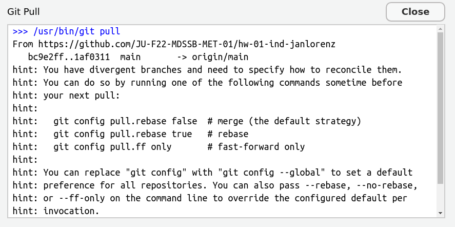
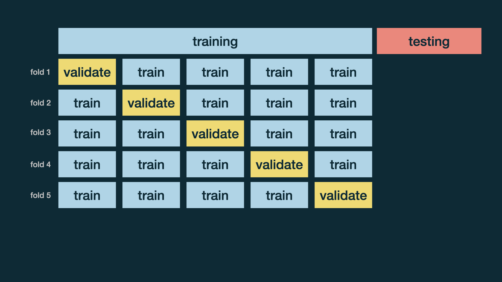
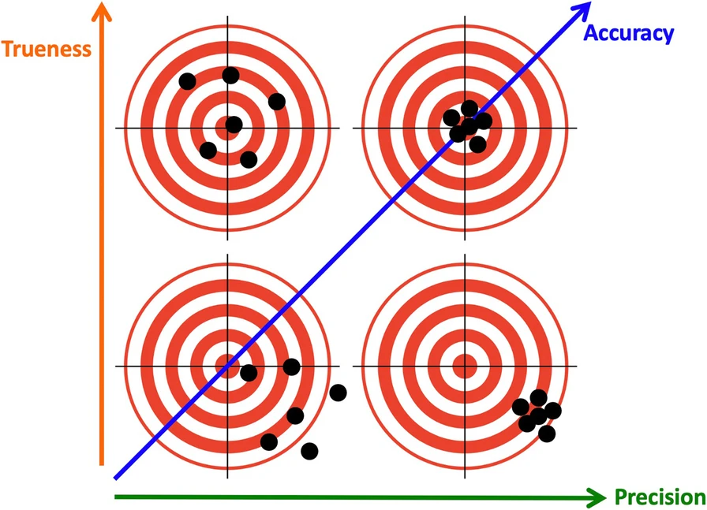

## Preliminary

```{r}
#| echo: true
library(tidyverse)
library(readxl)
library(tidymodels)
library(patchwork)
library(rpart)
library(ranger)
library(vip)
library(palmerpenguins)
library(openintro)
```

# Final Project {background-color=khaki}

## A project report in a nutshell  {background-color=khaki}

- You pick a dataset, 
- do some interesting question-driven data analysis with it, 
- write up a well structured and nicely formatted report about the analysis, and 
- present it at the end of the semester. 


## Six types of questions {background-color=khaki}

:::: {.columns}

::: {.column width='60%'}
1.  **Descriptive:** summarize a characteristic of  data
2.  **Exploratory:** analyze to see if there are patterns, trends, or relationships between variables (hypothesis generating)
3.  **Inferential:** analyze patterns, trends, or relationships in representative data from a population
4.  **Predictive:** make predictions for individuals or groups of individuals
5.  **Causal:** whether changing one factor will change another factor, on average, in a population
6.  **Mechanistic:** explore "how" as opposed to whether
:::

::: {.column width='40%'}

:::

::::

:::{.aside}
Leek, Jeffery T., and Roger D. Peng. 2015. “What Is the Question?” Science 347 (6228): 1314–15. <https://doi.org/10.1126/science.aaa6146>.
:::

## What are good questions? {background-color=khaki}

A good question

- is not too broad (= complicated to answer)
- is not too specific (= trivial to answer)
- can be answered or at least approached with data
- call for one of the different types of data analysis: 
    - descriptive
    - exploratory
    - inferential
    - predictive
    - (causal or mechanistic -- not the typical choices for a short term data analysis projects. They should not be central but may be touched.)


## Tools and advice for questions {background-color=khaki}

:::: {.columns}
::: {.column width='50%'}
[**Descriptive**]{style='color:blue;'}

::: {.fragment}
- What is an observation? [Answer this in any data analysis!]{style='color:red;'}
- What are the variables?
- Summary statistics and basic visualizations
- Category frequencies and numerical distributions
:::
:::

::: {.column width='50%'}
[**Exploratory**]{style='color:blue;'}

::: {.fragment}
- Questions specific to the topic
- Compute/summarize relevant variables: percentages, ratios, differences, ...)
- Scatter plots
- Correlations
- Cluster Analysis
- **Crafted computations and visualizations for your particular questions**
:::
:::

::::


## Tools and advice for questions {background-color=khaki}

:::: {.columns}

::: {.column width='50%'}
[**Inferential**]{style='color:blue;'}

::: {.fragment}
- Describe the population the data represents
- Can it be considered a random sample?
- Think theoretically about variable selection and data transformations
- Interpret coefficients of models
- Be careful interpreting coefficients when variables are highly correlated
- Are effects statistically significant?
- Hypothesis test: Describe null distribution
:::
:::

::: {.column width='50%'}
[**Predictive**]{style='color:blue;'}

:::{.fragment}
- Regression or classification?
- Do a train/test split to evaluate model performance (Optional, do crossvalidation) 
- Select sensible performance metrics for the problem (from confusion matrix or regression metrics)
- Maybe compare different models and tune hyperparameters
- Do feature selection and feature engineering to improve the performance!
:::
:::
::::


## Modeling Mindsets

{height=300}

Some methods:  
**Linear Model:** [Inferential]{style='color:red;' .fragment} [and Predictive!]{style='color:red;' .fragment}  
**Logistic Regression:** [Inferential]{style='color:red;' .fragment} [and Predictive!]{style='color:red;' .fragment}  
**k-means Clustering:** [Exploratory]{style='color:red;' .fragment}


# Collaborative Work: Git

Learning goal: First experiences with collaborative data science work with `git`. 

Follow these steps in your project teams.


## Step 1: git clone `FinalProject_*`

**You are to deliver your project reports in your repository.**

All team members do the following:

- Find your project repository 
- Copy the URL   
- Go to Positron
  - New Folder from Git... > Paste your URL
  - The project is created at the place you select


## Step 2: First Team member commits and pushes

**One team member does the following:**

- Open the file `report.qmd`
- Write your name in the first line at `author` in the YAML
- `git add` the file `report.qmd`
- `git commit` (enter "Added name" as commit message)
- `git push`
  
  
## Step 3: Other team members pull

- Do `git pull`, or find the button "Pull" in the GRAPH section of the Source Control Tab of Positron.


:::: {.columns}

::: {.column width='60%'}
**What does `git pull` do?**

- `git pull` does two things: fetching new stuff and merging it with existing stuff
    1. First, it `git fetch`es the commit from the remote repository (GitHub) to the local machine
    2. Then, it `git merge`s the commit with the latest commit on your local machine. 
- When we are lucky merging works with no problems. (Should be the case with new files.)
:::

::: {.column width='40%'}


Source: [mastodon.social/@allison_horst](https://mastodon.social/@allison_horst/109303149552034159)
:::

::::


## Step 4: Merge independent changes

[Git can merge changes in the same file when there are no conflicts.]{style='color:blue;'} Let's try. 

- **The second team member:**
  - Add your name in the author section of the YAML, save the file, `git add`, `commit` and with message "Next author name" and `push`.
- **The third (or first) team member:**
  - Change the title in the YAML to something meaningful and also add your name (if you are the third team member not the first again), save the file, `git add` and `commit` with message "Title changed". 
  - Try to `push`. You should receive an error. Read it carefully, often it tells you what to do. Here: Do `git pull` first. Why you can't push? Because remotely there is a newer commit (the one your colleague just made).
  - `Pull`. This should result in message about a **successfull auto-merge**. Check that **both** are there: Your line and the line of your colleague.
  *If you receive several hints instead, first read the next slide!*


## ??? `git` configuration for divergent branches

:::: {.columns}

::: {.column width='50%'}
If you pull for the first time in a local git repository, git may complain like this: 

{height=200}

Read that carefully. It advises to configure with `git config pull.rebase false` as the default version. 
:::

::: {.column width='50%'}

**How to do the configuration?**

- Copy the line `git config pull.rebase false`.
- Go to the TERMINAL. Paste the command (Ctrl+Shift+V) and press enter. Now you are done and `git pull` should work.
:::

::::

:::{.aside}
What is a *branch* and what a *rebase*? These are features of git well worth to learn but not now. Learn at <http://happygitwithr.com>
:::


## Step 5: Push and pull the other way round

- **The third/first member:**
  - The successful merge creates a new commit, which you can directly push. 
  - `push`
- **The second team member (and all others):** 
  - `pull` the changes of your colleague. 

Practice a bit more pulling and pushing commits and check the merging.


## Step 6: Create a merge conflict

- First and second team members: 
  - Write a different sentence after "Executive Summary." in YAML `abstract:`.
  - Both `git add`  and `git commit` on their local machines. 
- First member: `git push`
- Second member: 
  - `git pull`. That should result in a conflict. *If you receive several hints instead, first read the slide two slides before!*
  - The conflict is visible directly in the file with markings like this
  
`>>>>>>>>`   
one option of text,   
`========` a separator,    
the other option, and     
`<<<<<<<`. 

## Step 7: Solve the conflict

- The second member
  - You have to solve this conflict now!
  - Solving is by editing the text
  - Decide for an option or make a new text
  - Thereby, remove the `>>>>>`,`=====`,`<<<<<<`
  - When you are done: `git add`, `git commit`, and `git push`. 

Now you know how to solve merge conflicts. Practice a bit in your team. 
    
## Advice: Collaborative work with git

- First **pull** whenever you start a work session in a collaborative project.
- Inform your colleagues when you pushed new commits. 
- Coordinate the work, e.g. discuss who works on what part and maybe when. 
- When you finish your work session, end with pushing a *nice* commit. That means. The file should preview well. 
- When you work on different parts of the file, be aware that also a successful merge can create problems. Example: Your colleague changed the data import, while you worked on graphics. Maybe after the merge the imported data is not what you need for your cell. Coordinate your data especially data import and wrangling. 
- Commit and push often. This avoids that potential merge conflicts become large. 


# More Prediction Modeling: Cross-Validation, Tuning, Random Forests 

## Workflow prediction model

1. Data splitting into training and test data  
`initial_split()`, `training()`, `testing()` $\to$ `train` and `test` datasets
2. Recipe for preprocessing  
`recipe()`, specify response variable and preprocessing steps for predictors 
3. Model specification  
E.g. `decision_tree()`, set engine `rpart`, mode `regression` or `classification`
4. Workflow to combine recipe and model (still all just specifications)   
`workflow()` with `add_recipe()`, `add_model()` creates a workflow object
5. Fit the model with training data using the workflow  (finally the computation happens!)
`fit()` with workflow and `train` data
6. Predict response variable for rows of the test data  
`predict()` with fitted workflow and `test` data
7. Evaluate performance using the orignal variable (ground truth) in test data  
`metrics()` by specifying `truth` and `estimate` columns


## Decision Tree

```{r}
#| echo: true
#| output-location: column

set.seed(12345) # Test with other seeds to see how the Train-Test-Split changes results!
# 1. Train-Test-Split
peng_split <- initial_split(na.omit(penguins), prop = 0.8, strata = sex)
peng_train <- training(peng_split)
peng_test <- testing(peng_split)
set.seed(NULL) # Reset random. See that the decision tree algorithm is deterministic! Test it!
# 2. Preprocessing-Recipe
peng_recipe <- recipe(body_mass_g ~ ., data = peng_train) |>
  step_rm(year)
# 3. Model
peng_regtree <- decision_tree() |>
  set_engine("rpart") |>
  set_mode("regression")
# 4. Workflow
peng_regtree_wf <- workflow() |>
  add_recipe(peng_recipe) |>
  add_model(peng_regtree)
# 5. Fit
peng_regtree_fit <- peng_regtree_wf |> 
  fit(data = peng_train)
# 6. Predict with test data
peng_regtree_pred <- peng_regtree_fit |>
  augment(peng_test)
# 7. Evaluate performance
peng_regtree_pred |>
  metrics(truth = body_mass_g, estimate = .pred)
```

::: aside
New: `augment()` adds the predictions as a new column `.pred` to the `peng_test` data-frame. Before we did the same manually with `predict()` and `bind_cols()`. 
:::

## Decision Tree: Hyper-Parameters

```{r}
#| echo: true
#| output-location: column
# Check hyperparameters used
cat("Cost complexity:", extract_fit_engine(peng_regtree_fit)$control$cp, "\n",
    "Min split:", extract_fit_engine(peng_regtree_fit)$control$minsplit)
```

```{r}
#| include: false
first_peng_regtree_pred <- peng_regtree_pred
```

- Cost complexity (`cp`): Controls pruning of the tree. Higher values result in smaller trees. 
- Minimum split (`minsplit`): Minimum number of observations in a node to be allowed to split further. Higher values result in smaller trees.
- Note: Terminology in `tidymodels` and original `rpart` differ. `tidymodels` tries to unifying terminology across models. Thus, `cp` is called `cost_complexity` and `minsplit` is called `min_n`.

. . .

- [**Is the decision tree a deterministic algorithm?**]{.green}    
    [Yes, given the same training data and hyperparameters, it always results in the same tree.]{.fragment}

. . . 

However, the Test-Train-Split is and the performance measures would be different for each new split!

## How reliable are performance metrics? {.smaller}

- Model performance changes with the random selection of the training data. How can we then reliably compare models?

. . .

A solution: [**Cross-validation**]{.green}

. . .

More specifically, [**$v$-fold cross-validation**]{.green}:

- Shuffle your data and make a partition with $v$ parts
  - Recall from set theory: A **partition** is a division of a set into mutually disjoint parts which union cover the whole set. Here applied to observations (rows) in a data frame.
- Use 1 part for validation, and the remaining $v-1$ parts for training
- Repeat $v$ times

## Cross-validation




## Cross-validation

Cross-validation replacing the Train-Test-Split in the workflow:

```{r}
#| echo: true
#| output-location: column

set.seed(1) # Test with other seeds to see how the Train-Test-Split changes results!
# 1. 5-fold Cross validation
peng_folds <- vfold_cv(na.omit(penguins), v = 5, strata = sex)
set.seed(NULL) # Reset random. See that the decision tree algorithm is deterministic! Test it!
# 2. Preprocessing-Recipe: Same as before
# 3. Model: Same as before
# 4. Workflow: Same as before
# 5. Fit: We use peng_regtree_wf and use fit_resamples() to fit for all folds
peng_regtree_fit <- peng_regtree_wf |> 
  fit_resamples(resamples = peng_folds)
# 6./7. (Predict) and evaluate performance for all folds
peng_regtree_fit |>
  collect_metrics(summarize = FALSE, type = "wide")
```

. . . 

::: {.columns}
::: {.column}

Interpretation:

- Cross-validation shows variation
- The original fit was worse than average

:::
::: {.column}
For comparision: Original split

```{r}
#| echo: false
first_peng_regtree_pred |>
  metrics(truth = body_mass_g, estimate = .pred)
```

:::
:::


::: aside
Besides `vfold_cv()` the only new function are `fit_resamples()` and `collect_metrics()`.
:::

## Tuning 

```{r}
#| echo: true
#| output-location: column

set.seed(1234)
# 1.a. Train-Test-Split (same as before)
# 1.b. CREATE CROSS-VALIDATION FOLDS for TRAINING data
peng_folds <- vfold_cv(peng_train, v = 5, repeats = 5, strata = sex)
# 2. Preprocessing-Recipe (same)
# 3. Model WITH TUNING (modified)
peng_regtree <- decision_tree(
  cost_complexity = tune(),
  min_n = tune()
) |>
  set_engine("rpart") |>
  set_mode("regression")
# 4.a. Workflow (same but with new model)
peng_wf <- workflow() |>
  add_recipe(peng_recipe) |>
  add_model(peng_regtree)
# 4.b. TUNE WITH CROSS-VALIDATION
peng_tune_results <- peng_wf |>
  tune_grid(
    resamples = peng_folds,
    grid = expand_grid(
        cost_complexity = c(0.05, 0.02, 0.01, 0.005),
        min_n = c(2, 10, 20, 40)
    ), 
    metrics = metric_set(rmse)
  )
# 4.c. EXAMINE TUNING RESULTS
peng_tune_results |>
  collect_metrics(summarize = TRUE) |> select(-.config, -.estimator)
```

`collect_metrics(summarize = TRUE)` averages performance across folds and repeats!   
In total there are 400 fits (16 parameter combinations $\times$ 5 folds $\times$ 5 repeats). 

## Tuning continued

Visualization for evalution

```{r}
#| echo: true
#| output-location: column
# 4.d. VISUALIZE TUNING RESULTS
autoplot(peng_tune_results) +
  theme_minimal(base_size = 18)
```

## Tuning continued

Selection of best parameters

```{r}
#| echo: true
#| output-location: column
# 4.e. SEE BEST PARAMETERS AND SELECT BEST
best_params <- select_best(peng_tune_results, metric = "rmse")
show_best(peng_tune_results, metric = "rmse") |> 
  select(-.estimator, -.config)
```

Best parameters: `min_n` = `r best_params$min_n`, `cost_complexity` = `r best_params$cost_complexity`

## Fit with tune parameters

```{r}
#| echo: true
#| output-location: column
# 5. Fit: FINALIZE AND FIT WITH BEST PARAMETERS and fit
peng_regtree_fit <- peng_wf |>
  finalize_workflow(best_params) |>
  fit(data = peng_train)
# 6./7. Predict and Evaluatue with test data (as before)
peng_regtree_fit |>
  augment(peng_test) |>
  metrics(truth = body_mass_g, estimate = .pred)
```

- Although, best parameters differ from default, performance is the same. 
- This can happen, especially when the model is simple and the dataset is small.

. . . 

How can we improve the performance with the idea of trees?   
[**Create several trees and aggregate them in a random forest!**]{.green .fragment}

## Random forests


::: aside
Source: <https://de.wikipedia.org/wiki/Random_Forest>
:::


## How a random forest is made

- Build many decision trees independently (default: 500 trees), each trained on the full dataset  
  In each tree do the following at each decision node: 
    - Randomly select `mtry` features from all available features (e.g., 2 out of 6, rule of thumb: square root of the number of features)
    - Find the best split only among those randomly selected features.   
      The randomness in variable selection at each split ensures trees are different from each other, this shall reduce overfitting.
- Make predictions by 
  - averaging predictions across all trees (regression) or 
  - majority vote (classification)

## Random forest regression

```{r}
#| echo: true
#| output-location: column

set.seed(123)
# 1. Train-Test-Split
# 2. Preprocessing-Recipe
# 3. Model
peng_regforest <- rand_forest() |>
  set_engine("ranger", importance = "impurity") |>
  set_mode("regression")
# 4. Workflow
peng_regforest_fit <- workflow() |>
  add_recipe(peng_recipe) |>
  add_model(peng_regforest) |>
# 5. Fit
  fit(data = peng_train)
peng_regforest_fit
```

With `set_engine("ranger", importance = "impurity")` we specify the method of specification for the computation of [**variable importance**]{.green}.  


## Random forest regression continued

```{r}
#| echo: true
#| output-location: column

# 6./7. Predict and Evaluatue with test data (as before)
peng_regforest_fit |>
  augment(peng_test) |>
  metrics(truth = body_mass_g, estimate = .pred)
``` 

- Random forest often outperform decision tree and linear models. (Here, only a little bit.) 
- However, they have no natural visualization and are less interpretable.    
  They have thousands of parameters with all these trees! 


## Variable importance

**Variable importance** identify features that matter for good predicitions. 

```{r}
#| echo: true
#| output-location: column
# 6./7. Predict and Evaluatue with test data (as before)
# Variable importance
extract_fit_engine(peng_regforest_fit) |> 
  vip() + theme_minimal(base_size = 18) 
```

- The computation of variable importance is typically consider a step of [**post-processing**]{.green} of complex models like random forests because it is computed after the model is fitted.
- In contrast, **pre-processing** happens before fitting the model.

All details about exact definition and different methods to compute variable importance are skipped here. 

## Classification with random forrest

First the spam prediction decision tree 
```{r}
#| echo: true
#| output-location: column

set.seed(12345) # Just to fix the presentation, test without when doing yourself!
# 1. Train-Test-Split
email_split <- initial_split(email, prop = 0.7, strata = spam)
email_train <- training(email_split)
email_test <- testing(email_split)
# 2. Preprocessing-Recipe
email_recipe <- recipe(spam ~ ., data = email) |>
  step_rm(from, sent_email, viagra) |> # Remove some variables (see former lectures)
  step_date(time, features = c("dow", "month")) |> # Make day-of-week and month features ...
  step_rm(time) |> # ... and remove the date-time itself
  step_zv(all_predictors()) # remove predictors with zero variance
# 3. Model
email_classtree <- decision_tree() |>
  set_engine("rpart") |>
  set_mode("classification")
# 4. Workflow
email_classtree_wf <- workflow() |>
  add_recipe(email_recipe) |>
  add_model(email_classtree)
# 5. Fit
email_classtree_fit <- email_classtree_wf |> 
  fit(data = email_train)
# 6./7. Predict with test data and evaluate performance
class_metrics <- metric_set(accuracy, sensitivity, specificity)
email_classtree_fit |>
  augment(email_test) |>
  class_metrics(truth = spam, estimate = .pred_class, event_level = "second")
```

## Random forest classification

```{r}
#| echo: true
#| output-location: column

# 1. Train-Test-Split
email_split <- initial_split(na.omit(email), prop = 0.8)
email_train <- training(email_split)
email_test <- testing(email_split)
# 2. Preprocessing-Recipe
email_recipe <- recipe(spam ~ ., data = email) |>
  step_rm(from, sent_email, viagra) |> # Remove some variables (see former lectures)
  step_date(time, features = c("dow", "month")) |> # Make day-of-week and month features ...
  step_rm(time) |> # ... and remove the date-time itself
  step_zv(all_predictors()) # remove predictors with zero variance
# 3. Model
email_forest <- rand_forest() |>
  set_engine("ranger", importance = "impurity") |>
  set_mode("classification")
# 4. Workflow
email_forest_fit <- workflow() |>
  add_recipe(email_recipe) |>
  add_model(email_forest) |>
  # 5. Fit
  fit(data = email_train)
email_forest_fit # Look at the fit object
```

## Random forest classification continued

```{r}
#| echo: true
#| output-location: column
# 6./7. Predict with test data and evaluate performance
email_forest_fit |>
  augment(email_test) |>
  class_metrics(truth = spam, estimate = .pred_class, event_level = "second")
```

In particular specificity (true negative rate) is better than for the decision tree!

. . .

How does prediction work for classification with random forests? How do we aggregate the classification of all the trees in the forrest? (For regression we were averaging.)  
[**Majority vote across all trees!**]{.green .fragment}

## Variable importance

```{r}
#| echo: true
#| output-location: column

# Variable importance
extract_fit_engine(email_classtree_fit) |> 
  vip() + theme_minimal(base_size = 18)
```

```{r}
#| echo: true
#| output-location: column

# Variable importance
extract_fit_engine(email_forest_fit) |> 
  vip() + theme_minimal(base_size = 18)
```


## More prediction summary

::: {.incremental}
- A **decision tree** is *deterministic*. However, results change with different train-test-splits.
- **Cross-validation** helps to assess model performance more reliably.
- **Tuning hyperparameters** can improve model performance, but often defaults are good. 
    - It is all about quantifying when *overfitting* kicks in and *out-of-sample performance* degrades.
- **Random forests** take the idea of decision trees further by creating many trees and aggregating their predictions. They are not deterministic but *stochastic* even with the same training data.
- Why are random forrests better than individual trees?
  - By limiting choices at each split to a random subset of features, we prevent any single strong predictor from dominating all trees, creating a diverse "forest" of models that collectively perform better than any individual tree.
:::


# Bootstrapping to Quantify Uncertainty

## Purpose: Quantify uncertainty

- **Uncertainty** is a central concern in [**inferential data analysis**]{.red}. 
- We want to **estimate** a **parameter** of a [**population**]{.red} from a [**sample**]{.red}.

. . .

Central inferential assumption: 

- Our data is a **random sample** from the **population** we are interested in. 
    - No **selection biases**.

Examples:

- We want to know **average height** of **all people** but we only have a sample of people. 
- We want know the **mean estimate** of all possible participants of the ox meat weigh guessing competition from the **sample ballots** of participants we have.
- We want to learn something about penguins from the data of the penguins in `palmerpenguins::penguins`

## Practical example: Galton's Data

Competition: Guess the weight of the meat of an Ox? (Galton, 1907)

*What is the mean of all possible participants $\mu$?* 

. . . 

```{r}
#| echo: true
#| fig-height: 2
galton <- read_csv("galton.csv")
galton |> ggplot(aes(Estimate)) + geom_histogram(binwidth = 5)
```

The (arithmetic) mean of the `r nrow(galton)` estimates is $\hat\mu =$ `r round(mean(galton$Estimate), digits = 2)`. 

*How sure can we be that $\hat\mu$ is close to $\mu$ and how can we quantify?*^[We already assume that we have an unbiased sample of all possible participants!]

## Practical example: Palmer Penguins

A linear model for body mass of penguins: $y_i = \beta_0 + \beta_1 x_i + \dots + \beta_m x_m  + \varepsilon_i$.

. . .

```{r}
#| echo: true
peng_workflow <- workflow() |> add_recipe(recipe(body_mass_g ~ ., data = penguins) |> step_rm(year)) |> 
  add_model(linear_reg() |> set_engine("lm"))
peng_fit <- peng_workflow |> fit(data = penguins)
peng_fit |> tidy() |> mutate_if(is.numeric, round, 7)
```

. . . 

The column `estimate` shows the coefficients $\hat\beta_0, \hat\beta_1, \dots, \hat\beta_m$ of the linear model for the variables named in `term`

*How sure can we be that the $\hat\beta$'s are close to the $\beta$'s we are interested in?*^[We already assume that we have an unbiased sample of all penguins!]

## Bootstrapping^[The name comes from the saying "pull oneself up by one's bootstrap". It refers to the somehow *magical* idea that we can use our small sample to *mimic* the whole population.] idea

1. Take a **bootstrap sample**: a random sample taken with replacement from the original sample with the same size. 
2. Calculate the *statistics* for the bootstrap sample. 
3. Repeat steps 1. and 2. many times to create a **bootstrap distribution** - a distribution of bootstrap statistics
4. Use the bootstrap distribution to quantify the uncertainty. 

What is the statistic in the Galton example? [The mean]{.fragment}   
What are the statistics in the penguins example? [The coefficients]{.fragment}

## Bootstrapping in practice

- You can do the bootstrapping procedure in various ways (including programming in base R or python). 
- We will use convenient functions from `rsample` form the `tidymodels` packages.

## Resamplings: Galton's Data

:::: {.columns}

::: {.column width='35%'}
The function `sample` selects `size` random elements from a vector `x` with or without `replace`. 

```{r}
#| echo: true
set.seed(224)
sample(galton$Estimate, size = 3, replace = TRUE)
sample(galton$Estimate, size = 3, replace = TRUE)
```

For tibbles we can use `slice_sample`.

```{r}
#| echo: true
galton |> slice_sample(n = 3, replace = TRUE)
```
:::

::: {.column width='35%'}
::: {.fragment}
A **bootstrap sample** is with replace and of the same size as the original sample: 

```{r}
#| echo: true
nrow(galton)
galton |> slice_sample(n = 787, replace = TRUE)
```
:::
:::

::: {.column width='30%'}
::: {.fragment}
Compute some `mean`s of bootstrapping samples manually:

```{r}
#| echo: true
galton |> slice_sample(n = 787, replace = TRUE) |> 
 summarize(mean(Estimate))
galton |> slice_sample(n = 787, replace = TRUE) |> 
 summarize(mean(Estimate))
galton |> slice_sample(n = 787, replace = TRUE) |> 
 summarize(mean(Estimate))
```
:::
:::

::::

## Bootstrap set: Galton's Data

The function `bootstraps` from `rsample` does this type of bootstrapping for us. 

:::: {.columns}

::: {.column width='50%'}
1,000 resamples:

```{r}
#| echo: true
boots_galton <- galton |> bootstraps(times = 1000)
boots_galton |> head(5)
```

The column `splits` contains split objects. 

```{r}
#| echo: true
boots_galton$splits[[1]]
```
:::

::: {.column width='50%'}
::: {.fragment}
From each split we can extract the bootstrapped resample with `analysis`. 
```{r}
#| echo: true

boots_galton$splits[[1]] |> analysis()
```

Note: An `assessment` set contains the observations not selected randomly in the resample. We ignore it here.
:::
:::

::::

## Bootstrap distribution: Galton's Data

:::: {.columns}

::: {.column width='50%'}
We iterate with a `map` function^[Here we use `map_dbl` which iterates over the list of splits and reports the values as a vector of doubles (numbers), the default of `map` would be to report also a list.] over the splits and extract the analysis set and calculate the mean. 

```{r}
#| echo: true

boots_galton_mean <- boots_galton |> 
  mutate(
   mean = map_dbl(splits, 
                  \(x) analysis(x)$Estimate |> mean()))
boots_galton_mean |> head(5)
```
:::

::: {.column width='50%'}
::: {.fragment}
Plot the bootstrap distribution of the mean. 

```{r}
#| echo: true
#| fig.height: 2
boots_galton_mean |> 
 ggplot(aes(x = mean)) + geom_histogram() +
 theme_minimal(base_size = 24)
```
:::

::: {.fragment}
Compare distribution of estimates
```{r}
#| echo: true
#| fig.height: 2
galton |> ggplot(aes(Estimate)) + geom_histogram(binwidth = 5) +
 theme_minimal(base_size = 24)
```
:::
:::

::::

## Quantify uncertainty? Standard error

Compute the standard deviation of the bootstrap distribution. 

```{r}
#| echo: true
sd(boots_galton_mean$mean)
```

. . . 

The standard deviation of the bootstrap distribution is called the **standard error** of the statistic.

[Do not confuse standard error (of a statistic) and standard deviation (of a variable).]{style='color:red;'}

The **standard error of the mean** can also be estimated directly from the original sample $x$ as $\frac{\text{sd}(x)}{\sqrt{n}}$ where $n$ is the sample size. 

```{r}
#| echo: true
sd(galton$Estimate) / sqrt(nrow(galton))
```

. . . 

[Insight:]{style='color:blue;'} The standard error decreases with sample size! However, it decreases only with the square root of the sample size.

[Question:]{style='color:blue;'} You want to shrink the standard error by half. How much larger does the sample size need to be? [4 times]{.fragment}

## Confidence interval

Another way to quantify uncertainty is to compute a **confidence interval** (CI) for a certain **confidence level**:   
The true value of the statistic is expected to lie with the CI with certain probability (the confidence level).

. . .

:::: {.columns}

::: {.column width='30%'}
Compute the 95% confidence interval of the bootstrap distribution with `quantile`-functions:

```{r}
#| echo: true
boots_galton_mean |> 
  summarize(
    lower = quantile(mean, 0.025),
    upper = quantile(mean, 0.975))
```
:::

::: {.column width='60%'}
::: {.fragment}
```{r}
#| echo: true
boots_galton_mean |> 
 ggplot(aes(x = mean)) + geom_histogram() +
 geom_vline(xintercept = quantile(boots_galton_mean$mean, 0.025), color = "red") +
 geom_vline(xintercept = quantile(boots_galton_mean$mean, 0.975), color = "red") +
 annotate("text", x = 1197, y = 10, label = "95% of estimates", color = "white", size = unit(12, "pt")) +
 theme_minimal(base_size = 24)
```
:::
:::

::::

## Confidence Interval: Meaning

```{r}
#| echo: true
boots_galton_mean |> 
  summarize(
    lower = quantile(mean, 0.025),
    upper = quantile(mean, 0.975))
```

What is the correct interpretation? 

1. 95% of the estimates in this sample lie between 1191 and 1202.
2. We are 95% confident that the mean estimate of all potential participants is between 1191 and 1202.
3. We are 95% confident that the mean estimate of this sample is between 1191 and 1202.

. . . 

Correct: 2.  
1. The confidence is about a statistic (here, population mean) not about sample values!  
3. We know the mean of the sample precisely!   
The confidence interval assesses where 95% of the values are when we sample anew.   

## CI: Precision vs. Confidence

- Can't we increase the confidence level to 99% to get a more precise estimate with a more narrow confidence interval?

. . . 

```{r}
#| echo: true
boots_galton_mean |> 
  summarize(
    lower = quantile(mean, 0.005),
    upper = quantile(mean, 0.995))
```

[No, it is the other way round:]{style='color:red;'} The smaller and more precise the confidence interval, the lower must the confidence level be.


## Bootstrap linear model coefficients  

```{r}
#| echo: true
peng_workflow <- workflow() |> add_recipe(recipe(body_mass_g ~ ., data = penguins) |> step_rm(year)) |> 
  add_model(linear_reg() |> set_engine("lm"))
peng_fit <- peng_workflow |> fit(data = penguins)
peng_fit |> tidy() |> mutate_if(is.numeric, round, 7)
```

. . .

Let us now bootstrap whole models instead of just mean values!

```{r}
#| echo: true

# A function to fit a model to a bootstrap sample and tidy the coefficients
fit_split <- function(split) peng_workflow |> fit(data = analysis(split)) |> tidy() 
# Make 1000 bootstrap samples and fit a model to each
boots_peng <- bootstraps(penguins, times = 1000) |> 
  mutate(coefs = map(splits, fit_split))
```

## Bootstrap data frame {.scrollable}

Now we have a column `coefs` with a list of data frames, each containing the fitted coefficients.  

```{r}
#| echo: true
boots_peng
```

We can `unnest` the list column to make a much longer but unnested data frame:

```{r}
#| echo: true
boots_peng |> unnest(coefs)
```

## Some coefficient distributions

```{r}
#| echo: true
#| fig.width: 18
g1 <- boots_peng |> unnest(coefs) |> filter(term == "islandDream") |> 
  ggplot(aes(x = estimate)) + geom_histogram() + xlab("coefficients islandDream") +
  geom_vline(xintercept = 0, color = "gray") + theme_minimal(base_size = 24)
g2 <- boots_peng |> unnest(coefs) |> filter(term == "bill_length_mm") |> 
  ggplot(aes(x = estimate)) + geom_histogram() + xlab("coefficients bill_length_mm") +
  geom_vline(xintercept = 0, color = "gray") + theme_minimal(base_size = 24)
g3 <- boots_peng |> unnest(coefs) |> filter(term == "flipper_length_mm") |> 
  ggplot(aes(x = estimate)) + geom_histogram() + xlab("coefficients flipper_length_mm") +
  geom_vline(xintercept = 0, color = "gray") + theme_minimal(base_size = 24)
g1 + g2 + g3
```

- We could derive *bootstrapped p-values* from these distributions.


## computed p-values from each fit

- Each bootstrap fit also delivers computed p-values for each coefficient.^[These are computed based on theoretical assumptions with the help of t-tests and t-distributions.]

```{r}
#| echo: true
#| fig.width: 18
#| fig.height: 4
g1 <- boots_peng |> unnest(coefs) |> filter(term == "islandDream") |> ggplot(aes(x = p.value)) + geom_histogram() + xlab("coefficients islandDream") + theme_minimal(base_size = 24)
g2 <- boots_peng |> unnest(coefs) |> filter(term == "bill_length_mm") |> ggplot(aes(x = p.value)) + geom_histogram() + xlab("coefficients bill_length_mm") + theme_minimal(base_size = 24)
g3 <- boots_peng |> unnest(coefs) |> filter(term == "flipper_length_mm") |> ggplot(aes(x = p.value)) + geom_histogram() + xlab("coefficients flipper_length_mm") + theme_minimal(base_size = 24)
g1 + g2 + g3
```

- computed p-values in resamples vary widely (see `islandDream`) when *bootstrapped p-values* show insignificance.


# Bias, Variance, MSE, and Crowd Wisdom

## Galton's data

*What is the weight of the meat of this ox?*

```{r}
#| echo: true
#| fig-height: 2.5
galton |> ggplot(aes(Estimate)) + geom_histogram(binwidth = 5) + geom_vline(xintercept = 1198, color = "green") + 
 geom_vline(xintercept = mean(galton$Estimate), color = "red")
```

`r nrow(galton)` estimates, [true value]{style="color:green;"} 1198, [mean]{style="color:red;"} `r round(mean((galton$Estimate)), digits=1)`

::: aside
We focus on the arithmetic mean as aggregation function for the wisdom of the crowd here. 
:::


## RMSE Galton's data

Describe the estimation game as a predictive model:

- All *estimates* are made to predict the same value: the truth. 
  - In contrast to the regression model, the estimate come from people and not from a regression formula.
- The *truth* is the same for all.
  - In contrast to the regression model, the truth is one value and not a value for each prediction

```{r}
#| echo: true
rmse_galton <- galton |> 
 mutate(true_value = 1198) |>
 rmse(truth = true_value, Estimate)
rmse_galton
```

<!-- ## Regression vs. crowd estimation -->

<!-- The linear regression and the crowd estimation problems are similar but not identical! -->

<!-- |Variable      | Linear Regression Model                       | Crowd estimation -->
<!-- |--------------|-----------------------------------------------|-------------------------------------------- -->
<!-- | $y_i$        | Data point of response variable               | True value, uniform for all estimators $y_i = y$ -->
<!-- | $\hat{y}_i$  | Predicted value $\hat{y}_i=b_0+b_1+x_1+\dots$ | Estimate of one estimator -->
<!-- | $\bar{y}$    | Mean of response variable                     | Mean of estimates  -->


## MSE, Variance, and Bias of estimates

In a crowd estimation, $n$ estimators delivered the estimates $\hat{y}_1,\dots,\hat{y}_n$. 
Let us look at the following measures

- $\bar{y} = \frac{1}{n}\sum_{i = 1}^n \hat{y}_i^2$ is the mean estimate, it is the aggregated estimate of the crowd

- $\text{MSE} = \text{RMSE}^2 = \frac{1}{n}\sum_{i = 1}^n (\text{truth} - \hat{y}_i)^2$
  
- $\text{Variance} = \frac{1}{n}\sum_{i = 1}^n (\hat{y}_i - \bar{y})^2$ 

- $\text{Bias-squared} = (\bar{y} - \text{truth})^2$ which is the square difference between truth and mean estimate. 

There is a mathematical relation (a math exercise to check):

$$\text{MSE} = \text{Bias-squared} + \text{Variance}$$

## Testing for Galton's data

$$\text{MSE} = \text{Bias-squared} + \text{Variance}$$

```{r}
#| echo: true
MSE <- (rmse_galton$.estimate)^2 
MSE
Variance <- var(galton$Estimate)*(nrow(galton)-1)/nrow(galton)
# Note, we had to correct for the divisor (n-1) in the classical statistical definition
# to get the sample variance instead of the estimate for the population variance
Variance
Bias_squared <- (mean(galton$Estimate) - 1198)^2
Bias_squared

Bias_squared + Variance
```

::: aside
Such nice mathematical properties are probably one reason why these squared measures are so popular. 
:::


## The diversity prediction theorem^[Notion from: Page, S. E. (2007). The Difference: How the Power of Diversity Creates Better Groups, Firms, Schools, and Societies. Princeton University Press.]

- *MSE* is a measure for the average **individuals error**
- *Bias-squared* is a measure for the **collective error**
- *Variance* is a measure for the **diversity** of estimates around the mean estimate

The mathematical relation $$\text{MSE} = \text{Bias-squared} + \text{Variance}$$ can be formulated as 

**Collective error = Individual error - Diversity**

Interpretation: *The higher the diversity the lower the collective error!*


## Why is this message a bit suggestive?

The mathematical relation $$\text{MSE} = \text{Bias-squared} + \text{Variance}$$ can be formulated as 

**Collective error = Individual error - Diversity**

Interpretation: *The higher the diversity the lower the collective error!*

. . . 

- $\text{MSE}$ and $\text{Variance}$ are not independent! 
- Activities to increase diversity (Variance) typically also increase the average individual error (MSE).
- For example, if we just add more random estimates with same mean but wild variance to our sample we increase both and do not gain any decrease of the collective error.


## Accuracy for numerical estimate

- For binary classifiers **accuracy** has a simple definition: Fraction of correct classifications. 
  - It can be further informed by other more specific measures taken from the confusion matrix (sensitivity, specificity)

How about numerical estimators?   
For example outcomes of estimation games, or linear regression models? 

. . .

- Accuracy is for example measured by (R)MSE
- $\text{MSE} = \text{Bias-squared} + \text{Variance}$ shows us that we can make a  
**bias-variance decomposition**
- That means some part of the error is a systematic (the bias) and another part due to random variation (the variance).


## 2-d Accuracy: Trueness and Precision

According to ISO 5725-1 Standard: *Accuracy (trueness and precision) of measurement methods and results - Part 1: General principles and definitions.* there are two dimension of accuracy of numerical measurement. 

 {height="300px"}


## What is a wise crowd?

Assume the dots are estimates. **Which is a wise crowd?**

{height="300px"}

. . . 

- Of course, high trueness and high precision! But, ...
- Focusing on the **crowd** being wise instead of its **individuals**: High trueness, low precision. 

## Summary Crowd Wisdom

- The **wisdom of the crowd** relies on aggregating diverse estimates.
- More generally as these simple guessing games, **crowd wisdom** is this idea:   
  *Many problems can be solved better by aggregating the answers of many individuals than by relying on a single expert.*
- The **random forest** method of statistical learning is built on this idea:    
  *Instead of relying on on heavyily fine tuned decision tree, we create a forrest of many partly randomly generated trees and aggregate their predictions.*
  - It turns out that such forest typically produce predictions that *generalize* better to new data. 
- The **bias-variance decomposition** helps to understand different sources of errors. It is used to understand error in predicion models (not shown here). 
  - In an underfitted model, the error stems mostly from variance
  - In an overfitted model, the error stems mostly from bias (with respect to the training data

