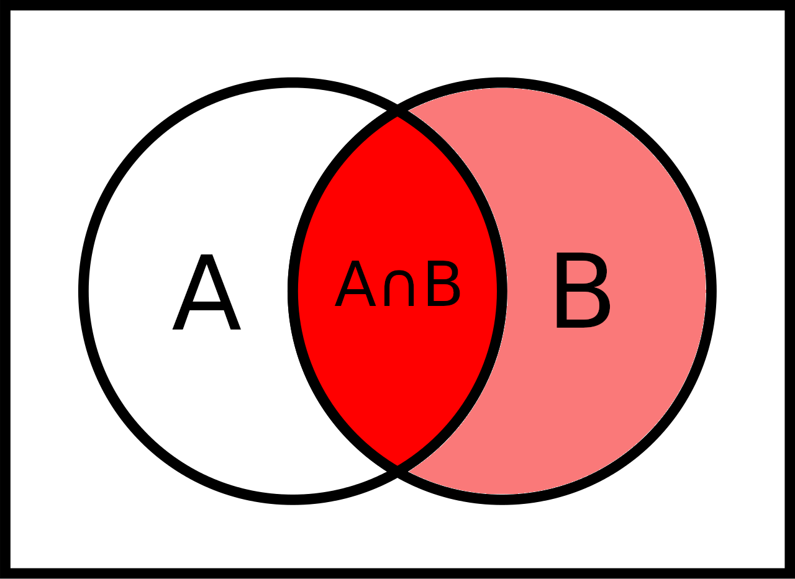
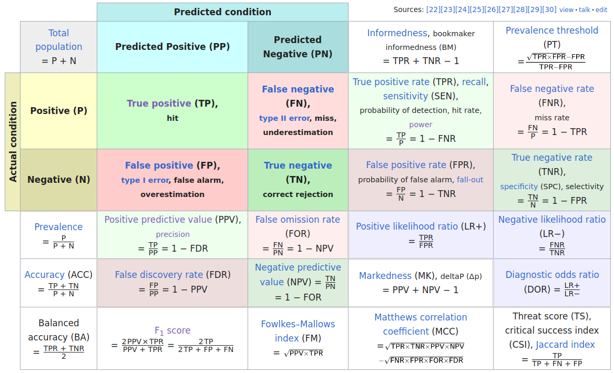
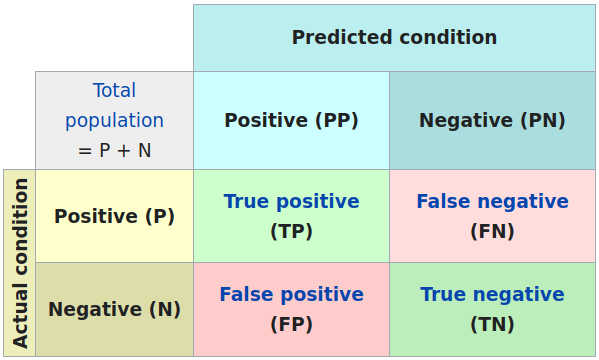

## Preliminary

```{r}
#| echo: true
library(tidyverse)
library(readxl)
library(tidymodels)
library(patchwork)
library(palmerpenguins)
library(openintro)
```

Today we draw some links to mathematical concepts that are relevant for data science:

- Statistics (Hypothesis testing)
- Linear Algebra (Matrices)
- Probability (Basics for Data Science)
  - Random Variables (Probabilistic way to interprete variables in data)
  - Distribution functions (an their relations to calculus)

. . . 

[Learning goal: Get some anchors to fundamental concepts and showcase the hands-on learning approach.]{.green}

# Hypothesis testing
Large part of the content adapted from <http://datasciencebox.org>.

## Inference in statistics

- **Inference** is the process of using data to make generalizations about a larger population.
- Two main types of statistical inference: **Estimation** and **Hypothesis testing**.
  - **Estimation:** Estimate a population parameter based on a sample statistic. Example: Estimate the average height of all students at CU based on a sample of 50 students.
    - We can quantify the uncertainty of our estimate using **confidence intervals**.
    - We can use **bootstrapping** to create confidence intervals.
  - [**Hypothesis testing:**]{.red} Test a claim about a population parameter using sample data. Examples:
    - Test if a new teaching method improves student performance compared to the traditional method.
    - Test if a new drug is more effective than a placebo in treating a disease.


## Example: Organ donors

::: {.columns}
::: {.column width='60%'}
**Background:** 

- Liver donors may seek help of "medical consultants" assisting in all aspects around the surgery to reduce the possibility of complications. 
- Patients might choose a consultant based on the historical complication rate of the consultant's clients. 

**Case:** A consultant advertises:  

- The average complication rate for liver donor surgeries in the US is 10%, but her clients have only had 3 complications in the 62 liver donor surgeries. So, she has just 4.8% complications!

:::
::: {.column width='40%' .fragment}
[**Is this evidence for a better track record?**]{.red}

Let us create the data frame for the consultant's patients: 

```{r}
#| echo: true
organ_donor <- tibble(
  outcome = c(rep("complication", 3), rep("no complication", 59))
)
organ_donor |> count(outcome)
```

:::
::: 


## Formalizing: Parameter vs. statistic

- A **parameter** for a hypothesis test is the "true" value of interest. 
- We *estimate* the parameter using a **sample statistic**, here a so called **point estimate** (just one number).

[**Parameter:**]{.red} $q$ true rate of complication: 10% complication rate in US  
[**Statistic:**]{.red} $\hat{q}$ rate of complication in the sample: $\frac{3}{62}$ = `r 100*round(3/62, 3)`% (point estimate)

::: {.incremental}
- The consultant claims that her clients have a lower complication rate than the US average [**because**]{.red} of here competence. This is a causal claim. Can we assess it with these data? [No. The data is observational.]{.fragement}
For example, maybe patients who can afford a medical consultant can afford better medical care, which can also lead to a lower complication rate.
- What could be a randomized controlled trial (RCT, gold standard for causal analysis)?
- But we can ask [**Could the low complication rate $\hat{q} = 4.8\%$ be due to chance?**]{.green}
:::


## Formalizing: Hypothesis testing

- [**Null hypothesis $H_0$:**]{.green} "There is nothing going on"   
Here: The complication rate for this consultant is no different than the US average of 10%. The 3 out of 62 complications is just due to chance. 

- [**Alternative hypothesis $H_1$:**]{.green} "There is something going on"  
The complication rate for this consultant is **lower** than the US average of 10%.

. . . 

Idea: [**Understand hypothesis testing as a court trial**]{.red}

1. Formulate $H_0$: Defendant is innocent
2. Formulate $H_A$: Defendant is guilty
3. **Present the evidence:** Collect data
4. **Judge the evidence:** "Could these data plausibly have happened by chance if the null hypothesis were true?"   
  Yes: **Fail to reject $H_0$**; No: **Reject $H_0$**


## Simulating the null distribution

We want simulate several outcomes of 62 patients where the probability of complication for each patient is 0.10.
(Null hypothesis $H_0: q = 0.10$.) 

These several outcomes is called the [**null distribution**]{.green}.

. . . 

**Think abstract of this using a bag of chips:**

- How many chips? [For example 10 which makes 10% choices possible]{.fragment .red}
- How many colors? [2]{.fragment .red}
- What should colors represent? ["complication", "no complication"]{.fragment .red}
- How many draws?  [62 as the data]{.fragment .red}
- With replacement or without replacement? [With replacement]{.fragment .red}


## Simulation!

```{r}
#| echo: true
set.seed(1234) # The seed is set for the sake of stable presentation outcomes.
outcomes <- c("complication", "no complication")
sim1 <- sample(outcomes, size = 62, prob = c(0.1, 0.9), replace = TRUE)
sim1
sum(sim1 == "complication") / 62
```

Oh OK, this was exactly the consultant's rate. Maybe it was a rare event? Let us repeat it. 

## More simulation!

```{r}
#| echo: true
sum(
  sample(outcomes, size = 62, prob = c(0.1, 0.9), replace = TRUE) ==
    "complication"
) /
  62
```

```{webr-r}
outcomes <- c("complication", "no complication")
sum(
  sample(outcomes, size = 62, prob = c(0.1, 0.9), replace = TRUE) ==
    "complication"
) /
  62
```


## Automating with `tidymodels`

```{r}
#| echo: true
#| output-location: column
null_dist <- organ_donor |>
  specify(response = outcome, success = "complication") |>
  hypothesize(
    null = "point", # It is about a point estimate
    p = c("complication" = 0.10, "no complication" = 0.90)
  ) |>
  generate(reps = 100, type = "draw") |>
  calculate(stat = "prop")
null_dist
```

This creates a sample of 100 from the null distribution. Each row is one simulated outcome of 62 patients with a complication rate under the null hypothesis of 10%.


## Visualizing the null distribution

```{webr-r}
#| fig-height: 3
organ_donor <- tibble(
  outcome = c(rep("complication", 3), rep("no complication", 59))
)
null_dist <- organ_donor |>
  specify(response = outcome, success = "complication") |>
  hypothesize(
    null = "point", # It is about a point estimate
    p = c("complication" = 0.10, "no complication" = 0.90)
  ) |>
  generate(reps = 100, type = "draw") |>
  calculate(stat = "prop")
ggplot(data = null_dist, mapping = aes(x = stat)) +
  geom_bar(width = 0.005) +
  labs(title = "Null distribution")
```


## p-value

Hypothesis testing procedure:

- Start with a null hypothesis, $H_0$, that represents the status quo
- Set an alternative hypothesis, $H_A$, that represents the research question, i.e. what we are testing for
- Conduct a hypothesis test under the assumption that the null hypothesis is true and calculate a **p-value**.

. . . 

**Definition p-value:**   
*Probability of observed or more extreme outcome given that the null hypothesis is true.*

## p-value visualized

How often was the simulated sample proportion at least as extreme as the observed sample proportion?*^[This a one-sided hypothesis test because we are looking for lower rates not also higher rates. We do one-sided test if we know the direction of interest, here "low" and "lower" rates.]

```{r}
#| echo: true
#| output-location: column
#| fig-height: 4
ggplot(data = null_dist, mapping = aes(x = stat)) +
  geom_bar(width = 0.005) +
  labs(title = "Null distribution with observed value") +
  geom_vline(xintercept = 3 / 62, color = "red") +
  theme_minimal(base_size = 24)
```

. . .

```{r}
#| echo: true
#| output-location: column
null_dist |>
  summarise(p_value = sum(stat <= 3 / 62) / n())
```

This is the fraction of simulations where complications was equal or below `r 3/62`. 


## Significance level 

:::{.incremental}
- A **significance level** $\alpha$ is a threshold we make up to make our judgment about the plausibility of the null hypothesis being true given the observed data. 
- We often use $\alpha = 0.05 = 5\%$ as the cutoff for whether the p-value is low enough that the data are unlikely to have come from the null model. 
- If p-value < $\alpha$, reject $H_0$ in favor of $H_A$: The data provide convincing evidence for the alternative hypothesis.
- If p-value > $\alpha$, fail to reject $H_0$ in favor of $H_A$: The data do not provide convincing evidence for the alternative hypothesis.
:::

. . . 

**What is the conclusion of the hypothesis test?**

- Since the p-value `r null_dist |> summarise(p_value = sum(stat <= 3 / 62) / n()) |> pull(p_value)` is greater than the significance level 0.05, we fail to reject the null hypothesis. 
- This data does not provide convincing evidence that this consultant incurs a lower complication rate than the 10% overall US complication rate.

## 100 simulations are not sufficient!

Simulate 15,000 times to get an accurate distribution.

```{r}
#| echo: true
#| output-location: column
null_dist <- organ_donor |>
  specify(response = outcome, success = "complication") |>
  hypothesize(
    null = "point",
    p = c("complication" = 0.10, "no complication" = 0.90)
  ) |>
  generate(reps = 15000, type = "simulate") |>
  calculate(stat = "prop")
ggplot(data = null_dist, mapping = aes(x = stat)) +
  geom_bar(width = 0.005) +
  geom_vline(xintercept = 3 / 62, color = "red") +
  theme_minimal(base_size = 24)
```

. . . 

```{r}
#| echo: true
#| output-location: column
null_dist |>
  filter(stat <= 3 / 62) |>
  summarise(p_value = n() / nrow(null_dist))
```

This is a more robust p-value from simulation.

## p-value in model outputs

Model output for a linear model with palmer penguins.

```{r}
#| echo: true
#| output-location: column
linear_reg() |>
  set_engine("lm") |>
  fit(bill_length_mm ~ bill_depth_mm, data = penguins) |>
  tidy()
```

Model output for a logistic regression model with email from [openintro](https://www.openintro.org/data/index.php?data=email)

```{r}
#| echo: true
#| output-location: column
logistic_reg() |>
  set_engine("glm") |>
  fit(spam ~ from + cc, data = email, family = "binomial") |>
  tidy()
```

What do the p-values mean? What is the null hypothesis?

. . .

**Null-Hypothesis:** There is no relationship between the predictor variable and the response variable, that means that the coefficient is equal to zero. 

**Smaller p-value** $\to$ more evidence for rejecting the hypothesis that there is no effect. 

## xkcd on p-values

::: {.columns}

::: {.column width='60%'}
[{height="500px"}](https://xkcd.com/1478/)
[{height="500px"}](https://xkcd.com/882/)
:::

::: {.column width='40%'}
:::{.fragment}
- Significance levels are fairly arbitrary. Sometimes they are used (wrongly) as definitive judgments
- They can even be used to do *p-hacking*: Searching for "significant" effects in observational data
- In parts of science it has become a "gamed" performance metric.
- The p-value says nothing about effect size!
:::
:::

:::

## p-value misinterpretation

p-values do not measure^[From the American Statistical Association (ASA) 2016]

::: {.incremental}
- the probability that the studied hypothesis is true
- the probability that the data were produced by random chance alone
- the size of an effect
- the "importance of a result" or "evidence regarding a model or hypothesis" (it is only against the null hypothesis).
:::

. . .

Correct:   
*The p-value is the probability of obtaining test results at least as extreme as the result actually observed, under the assumption that the null hypothesis is correct.*

p-values and significance tests, when properly applied and interpreted, increase the rigor of the conclusions drawn from data.^[From the American Statistical Association (ASA) 2019]


# Matrices for Data Science

Linear Algebra: A toolbox for Algorithms used in Data Science.

## What is a matrix? 

::: {.columns}

::: {.column width='50%'}
- A **matrix** is a 2-dimensional array of numbers with rows and columns.
- The numbers in it are called its **elements**.

[Isn't that a data frame?]{.fragment} [No.]{.fragment}

::: {.fragment}
- In a matrix, every element has the same basic data type! In a dataframe every column can be of different data type. 
- In R, a matrix is an atomic vector plus specification of the matrix **dimensions**.
- In matrices, columns often do not have names.
:::
:::

::: {.column width='50%'}
```{r}
#| echo: true
#| output-location: fragment
matrix(data = 1:6, nrow = 2)
```

```{r}
#| echo: true
#| output-location: fragment
matrix(data = 1:6, ncol = 2)
```

```{r}
#| echo: true
#| output-location: fragment
matrix(data = 1:6, nrow = 3)
```

```{r}
#| echo: true
#| output-location: fragment
matrix(data = 1:6, nrow = 3, byrow = TRUE)
```

:::

:::

::: {.fragment}
Note: A matrix can also be of characters or logicals, it can also have row- and column-names.
:::

## Matrices in Data Science?

::: {.columns}

::: {.column width='65%'}
- **Matrices** are the basic data structure for many algorithms in data science. For examples
  - *Principal Compontent Analysis* (PCA)
  - Ordinary Least Squares (OLS) regression to estimate coefficients in a *linear model*
- The mathematical field dealing with matrices is called **Linear algebra**.
  - A linear function $f: \mathbb{R}^n \to \mathbb{R}^m$ can be represented by an $m$-by-$n$ matrix.
:::

::: {.column width='35%'}
  
[xkcd.com/1838](https://xkcd.com/1838/)
:::

:::

## Matrices and Vectors {background-color="aquamarine"}

::: {.columns}

::: {.column width='50%'}

The elements of an $m$-by-$n$ matrix $A$


::: {.fragment}
A matrix can be interpreted 

- as $n$ column vectors of length $m$ and  
$\downarrow\dots\downarrow$ 
- as $m$ row vectors of length $n$. $\begin{array}{c}\rightarrow \\[-5mm] \vdots \\[-5mm]\rightarrow\end{array}$
:::
:::

::: {.column width='50%'}
::: {.fragment}
In R and python, a vector is not specified as row or columns. In matrix terminology a

- **column vector** is a $m$-by-1 matrix $\left[\begin{array}{c} a_{1} \\ \vdots \\ a_{m}\end{array}\right]$

- **row vector** is a 1-by-$n$ matrix $\left[\begin{array}{c} a_{1}\ \cdots\ a_{n}\end{array}\right]$

Convention: If a vector is not specified as row or column it is usually treated as columns if that is relevant.    
Convention: Capital letters for matrices ($A$), small letters for their elements ($a_{ij}$)
:::
:::

:::

## Square and Diagonal Matrices {background-color="aquamarine"}

::: {.columns}

::: {.column width='50%'}

- A **square matrix** has the same number of rows and columns, $n$-by-$n$
- A **diagonal matrix** is a matrix where all elements outside the main diagonal are zero.  
$\left[\begin{array}{ccc}
a_{11} &  & 0 \\
  & \ddots &  \\
0 &  & a_{nn} \\
\end{array}\right]$ 
- The **identity matrix**  
$\left[\begin{array}{ccc}
1 & 0 & 0 & 0 \\
0 & 1 & 0 & 0 \\
0 & 0 & 1 & 0 \\
0 & 0 & 0 & 1 
\end{array}\right]$
:::

::: {.column width='50%'}
`diag` works two ways

```{r}
#| echo: true

diag(c(1, 2, 3))
```

```{r}
#| echo: true
D <- matrix(1:9, nrow = 3)
D
diag(D)
```

```{r}
#| echo: true
D <- matrix(1:9, nrow = 3)
D
diag(D)
```

:::

:::

## Transposition of Matrices {background-color="aquamarine"}

::: {.columns}

::: {.column width='50%'}

- **Transposition** of a matrix is done by flipping the matrix over its diagonal.
- In math the **transpose** of $A$ being $m$-by-$n$ is written $A^T$ and is $n$-by-$m$ 
- In base R the function `t()` transposes

::: {.fragment}

```{r}
#| echo: true

A <- matrix(1:12, nrow = 3)
A
t(A)
```

:::
:::

::: {.column width='50%'}
::: {.fragment}
- Transposes of vectors make rows to columns and vice versa
  - When $x$ is a row then $x^T$ is a column vector
  - [**For Data Frames:** Transposition makes every case a variables and every variable a case.]{style='color:blue;'}
- Interesting behavior in R
:::

::: {.fragment}
```{webr-r}
x <- 1:4
x
t(x)
t(t(x))
```
:::

:::

:::

## Matrix and Vector manipulation {background-color="aquamarine"}

- Matrices of equal dimension and vectors of equal length are **added** ($A+B$, $x+y$) and **subtracted** element-wise
  - We do it a lot in data science. For example: Create a new column as the sum of two existing ones
- Matrices and vectors can be **scaled** by single numbers ($\alpha A$, $\alpha x$) (*Scalar product*)
  - We do it a lot in data science. 
  
[**Think vectorized!**]{style='color:blue;'}


## Matrix Multiplication {background-color="aquamarine"}

- **Matrix multiplication** $A\cdot B$ is a bit more complicated than addition and scalar multiplication.
  - Matrix multiplication is different from multiplying numbers because $A\cdot B \neq B\cdot A$
- You have to think row-wise on $A$ and column-wise on $B$


## Matrix Multiplication in R

```{r}
#| echo: true
A <- matrix(1:6, nrow = 2)
B <- matrix(7:12, nrow = 3)
A
B
A %*% B
B %*% A
```


## Length and Inner Product of Vectors  {background-color="aquamarine"}

::: {.columns}

::: {.column width='50%'}
- The **inner product** of two vectors $x$ and $y$ is $x^Ty = \sum_{i=1}^n x_i y_i$.  
  - In $A\cdot B$ each element of the new matrix is an inner product of a row of $A$ and a column of $B$. 
- The **length** of a vector $x$ is $\|x\| = \sqrt{x^Tx} = \sqrt{\sum_{i=1}^n x_i^2}$. 
  - The length of a vector is the square root of the inner product of the vector with itself.
    - This is the Euclidean distance (derived from *Pythagorean theorem*)
:::

::: {.column width='50%'}
- Think of an inner product as relating the length of the vectors and their angle like this


(In the graphic $x\cdot y$ stands for $x^Ty$)
:::

:::


## Orthogonality of Vectors  {background-color="aquamarine"}

::: {.columns}

::: {.column width='65%'}
- Two vectors are **orthogonal** if their inner product is zero $x^Ty = 0$.
- This term can also be used for data!


Think of palmer penguins dummy variables

- Which rows are orthogonal and what does it mean?
- Which columns are orthogonal and what does it mean? 

:::

::: {.column width='35%'}
ID |sex male | species Chinstrap | species Gentoo 
--:|:-------:|:-----------------:|:-------------:
 1 |0        | 1                 | 0 
 2 |0        | 1                 | 0 
 3 |0        | 0                 | 1 
 4 |1        | 0                 | 1 
 5 |1        | 0                 | 0 
 6 |1        | 0                 | 0 
 7 |1        | 1                 | 0 
:::

:::


## Linear Models in Matrix Language{.scrollable}

This is the equation of a model: 

average `flipper_length_mm` $= \beta_0 + \beta_1\cdot$ `body_mass_g` $+ \beta_2\cdot$ `bill_length_mm` $ + \beta_3\cdot$ `bill_length_mm` 

More mathy renamed: $Y = \beta_0 + \beta_1X_1+ \beta_2X_2 + \beta_3X_3+ \varepsilon$  
We also add $\varepsilon$ as the unknown error the model cannot capture. (So, we do not need to write "average" $Y$)

. . .

For matrix description we join $X_1$, $X_2$, and $X_3$ as columns in the matrix $X$ and put a matrix of ones as $X_0$ for the intercept as another column, and the intercept $\beta_0$ and the coefficients $\beta_1$, $\beta_2$, and $\beta_3$ into a vector $\beta$.

[**The matrix form:**]{.red} $Y = X\cdot\beta + \varepsilon$ 

Let's extract these vectors and matrices and test the matrix multiplication.

. . .

```{r}
#| echo: true
penguins <- na.omit(penguins)

peng_fit <- linear_reg() |> 
 set_engine("lm") |> 
 fit(flipper_length_mm ~ body_mass_g + bill_length_mm + bill_depth_mm, data = penguins) 

beta <- peng_fit$fit$coefficients
beta
X <- penguins |> 
 select(body_mass_g, bill_length_mm, bill_depth_mm) |> 
 mutate(intercept = 1) |> # We add a column of ones for the intercept
 select(intercept, everything()) |> 
 as.matrix()
Y <- matrix(penguins$flipper_length_mm, ncol = 1)

# These are our predictions in computed in matrix language
X %*% beta

# They are the same as the fitted values
peng_fit$fit$fitted.values
```


## Estimation of parameters {.scrollable}

We do not derive it here, but as a pointer to study more relations between data manipulation and matrix thinking:

The coefficients-vector $\beta$ has the following relation

$X^TX \cdot \beta = X^T\cdot Y$

This is the classical form of a systems of linear equations where we want to know $x$ in an equation $Ax = b$.

We can solve this in R and can compare it to the coefficients

```{r}
#| echo: true

t(X) %*% X
t(X) %*% Y
solve(t(X) %*% X, t(X) %*% Y)

# Our original coefficients
beta
```

## Summary Matrices in Data Science 

- Knowledge in linear algebra can be gained by practice with our computational tools.
- Studying linear algebra helps to understand the mathematical background of data science methods.

. . .

Three fundamental matrix operations in data science:

::: {.incremental}
- Solving **Linear Systems** of the type $Ax = b$ is a fundamental matrix operation, e.g. for fitting linear models.
- Solving the **Eigenvalue Problem** $Ax = \lambda x$ ($\lambda$ is one number) is another fundamental one that appears in PCA. PCA is the eigen-decomposition of the correlation matrix. 
- Finally, every matrix can be decomposed via the **Singular Value Decomposition** (SVD) $A = U\Sigma V^T$ where $U$ and $V$ are orthogonal matrices and $\Sigma$ is a diagonal matrix with singular values on the diagonal. SVD is used in recommender systems or for dimensionality reduction.
:::


# Probability for Data Science {background-color="aquamarine"}

## Probability Topics for Data Science { background-color="aquamarine"}

:::{.incremental}
  * The concept of probability and the relation to statistics and data
      * Probability: [Given a probabilistic model, what data will we see?  
        *What footprints does the animal leave?*]{.fragment}  
      * Statistics: [Given data, what probabilistic model could produce it?  
        *What animal could have left these footprints?*]{.fragment}
  * Probabilistic simulations 
      * Resampling: [Bootstrapping (p-values, confidence intervals), cross-validation]{.fragment}
  * The confusion matrix: Conditional probabilities and Bayes' theorem
      * [Sensitivity, specificity, positive and negative predictive value]{.fragment}
  * Random variables: A probabilistic view on variables in a data frame
      * Modeling distributions of variables: The concepts of discrete and continuous probability distributions.
  * The central limit theorem or why the normal distribution is so important.
:::

## Sample space, atomic events, events {background-color="aquamarine"}

Speaking precisely about probability you need to know **sample space** and **events**. The **sample space** $S$ is a set of **atomic events**. 

Examples for sample spaces:

:::{.incremental}
  * [Coin toss]{style='color:blue;'}: Atomic events $H$ (HEADS) and $T$ (TAILS), sample space $S = \{H,T\}$.  
  * [Two successive coin tosses]{style='color:blue;'}: Atomic events $HH$, $HT$, $TH$, $TT$; sample space  $S = \{HH,HT, TH, TT\}$. **Important:** Atomic events are *not* just $H$ and $T$. 
  * Selection [person from a group]{style='color:blue;'} of $N$ individuals labeled $1,\dots,N$, sample space $S = \{1,\dots,N\}$. 
  * [COVID-19 Rapid Test + PCR Test for confirmation]{style='color:blue;'}: Atomic events *true positive* $TP$ (positive test confirmed), *false positive* $FP$ (positive test not confirmed), *false negative* $FN$ (negative test not confirmed), *true negative* $TN$ (negative test confirmed), sample space $S = \{TP, FP, FN, TN\}$.
:::

. . . 

An [**event**]{.red} $A$ is a *subset* of the sample space $A \subset S$.   


## Example events {background-color="aquamarine"}

[Coin Toss]{style='color:blue;'} $S = \{H,T\}$: The 4 events are the two atomic events, the whole sample space and the empty set $\{\} = \emptyset \subset \{H,T\}$. Interpretation: 

  - $\{H,T\}$ = "The coin comes up HEAD *or* TAIL." (*Sure event* $\to$ Will have prob. 1)
  - Event $\{\}$ = "The coin comes up *neither* HEADS *nor* TAILS." (*Impossible event* $\to$ Will have prob. 0)

. . .

[Two Successive Coin Tosses]{style='color:blue;'} $S = \{HH, HT, TH, TT\}$: 

- Event $\{HH, TH\}$ = "The first toss comes up HEAD or TAIL and the second is HEADS."   
- Event $\{HT, TH, HH\}$ = "We have HEAD once or twice no matter which coin(s)." 
- The event $\{TT, HH\}$ = "Both coins show the same side."

## Example Events {background-color="aquamarine"}

[Selection Person from a Group]{style='color:blue;'}: 

Event $\{2,5,6\}$ = ["The selected person is *either* 2, 5, or 6." (Not all three people which is a different random variable!)]{.fragment}

. . .

[COVID-19 Rapid Test + PCR Test for confirmation]{style='color:blue;'}:

- Event $\{TP, FP\}$ = ["The test is positive."]{.fragment}
- Event $\{TN, FP\}$ = ["The person does not have COVID-19."]{.fragment}
- Event $\{TP, TN\}$ = ["The rapid test delivers the correct result."]{.fragment}


## The probability function  { background-color="aquamarine"}

- The [**set of all events**]{.red} is the set of all subsets of a sample space $S$. 
- A sample space with $n$ atomic events implies a set of all events with $2^n$ elements! This is HUGE. 

For a set of all events a function   
$\text{Pr}: \text{Set of all subsets of $S$} \to \mathbb{R}$   
is a [**probability function**]{.red} when 

  (i) The probability of any event is between 0 and 1.
  (ii) The probability of the the sure event $S$ is 1. $\text{Pr}(S) = 1$. 
  (iii) For events $A_1, A_2, \dots, A_n$ which are *pairwise disjoint* we can sum up their probabilities: 
$\text{Pr}(A_1 \cup A_2\cup\dots\cup A_n) = \text{Pr}(A_1) + \text{Pr}(A_2) + \dots + \text{Pr}(A_n)$

[This captures the essence of how we think about probabilities mathematically. Most important: We can only easily add probabilities when they do not share atomic events.]{style='color:blue;'}


## Example Probability Function { background-color="aquamarine"}

**Example [coin tosses]{style='color:blue;'}:** We can define a probability function $\text{Pr}$ by assigning the same probability to each atomic event.

- $\text{Pr}(\{H\}) = \text{Pr}(\{T\}) = 1/2$
- $\text{Pr}(\{HH\}) = \text{Pr}(\{HT\}) = \text{Pr}(\{TH\}) = \text{Pr}(\{TT\}) = 1/4$

. . . 

The probability of one or zero HEADs is $\text{Pr}(\{HT, TH, TT\}) = \text{Pr}(\{HT\}) + \text{Pr}(\{TH\}) + \text{Pr}(\{TT\}) = \frac{3}{4}$.


## Basic probability rules {  background-color="aquamarine"}

::: {.columns}

::: {.column width='80%'}

  * The probability of an event is the sum the probabilities of its atomic events.   
  * $\text{Pr}(\emptyset) = 0$

::: {.fragment}
  * For any events $A,B \subset S$ it holds
    * $\text{Pr}(A \cup B) = \text{Pr}(A) + \text{Pr}(B) - \text{Pr}(A \cap B)$
    * $\text{Pr}(A \cap B) = \text{Pr}(A) + \text{Pr}(B) - \text{Pr}(A \cup B)$
    * $\text{Pr}(A^c) = 1 - \text{Pr}(A)$
:::
:::

::: {.column width='20%' .fragment}
{height="100px"}
{height="100px"}

{height="100px"}
:::

:::
  
## Conditional probability { background-color="aquamarine"}  


::: {.columns}

::: {.column width='75%'}
**Definition:** The **conditional probability** of an event $A$ *given* an event $B$ (write "$A | B$") is defined as

$$\text{Pr}(A|B) = \frac{\text{Pr}(A \cap B)}{\text{Pr}(B)}$$
:::

::: {.column width='25%'}
{height="150px"}
:::

:::

We want to know the probability of $A$ *given* that we know that $B$ has happened (or is happening for sure).

. . . 

[**Two coin flips:**]{style='color:blue;'} $A$ = "first coin is HEAD", $B$ = "one or zero HEADS in total". 

What is $\text{Pr}(A|B)$?

. . .

Solution: $A = \{HH, HT\}$, $B = \{TT, HT, TH\}$ $\Rightarrow$ $A \cap B = \{HT\}$    
$\Rightarrow$ $\text{Pr}(A\cap B) = \frac{1}{4}$, $\text{Pr}(B) = \frac{3}{4}$             
$\Rightarrow$ $\text{Pr}(A|B) = \frac{1/4}{3/4} = \frac{1}{3}$


## More examples of conditional probability { background-color="aquamarine"}

**COVID-19 Example:** What is the probability that a random person in the tested sample has COVID-19 (event $P$ "positive") *given* that she has a positive test result (event $PP$ "predicted positive")?

$$\text{Pr}(P|PP) = \frac{\text{Pr}(P \cap PP)}{\text{Pr}(PP)}$$

. . .

**Definition p-value:** Probability of observed or more extreme outcome *given that* the null hypothesis ($H_0$) is true.

$$\text{p-value} = \text{Pr}(\text{observed or more extreme outcome for test-statistic} | H_0)$$


## Confusion Matrix { background-color="aquamarine"}

[**Confusion matrix**](https://en.wikipedia.org/wiki/Confusion_matrix)
of statistical classification, large version: 
 



## 4 probabilities in confusion matrix { background-color="aquamarine"}

::: {.columns}

::: {.column width='35%'}

:::

::: {.column width='65%'}
[**Sensitivity and Specificity**]{style='color:blue;'}

[$\to \atop \ $]{style="border-width:1px; border-style:solid;"} **Sensitivity** is the *true positive rate*: TP / (TP + FN)  
[$\ \atop \to$]{style="border-width:1px; border-style:solid;"} **Specificity** is the *true negative rate*: TN / (TN + FP)

[**Positive/negative predictive value**]{style='color:blue;'}

[$\scriptsize\downarrow \ $]{style="border-width:1px; border-style:solid;padding-left:2px;padding-right:2px;"} **Positive predictive value**: TP / (TP + FP)  
[$\scriptsize\ \downarrow$]{style="border-width:1px; border-style:solid;padding-left:2px;padding-right:2px;"} **Negative predictive value**: TN / (TN + FN)
:::

:::

. . . 

**Sensitivity**: $\text{Pr}(PP|P)$ positive test *given* the person has condition      
**Specificity**: $\text{Pr}(PN|N)$ negative test *given* the person does not have condition 

. . .

**Positive predictive value**: $\text{Pr}(P|PP)$ having the condition *given* the test is positive    
**Negative predictive value**: $\text{Pr}(N|PN)$ not having the condition *given* the test is negative


## Prevalence { background-color="aquamarine"}

- The rate (or probability) of the positive conditions in the population is also called **Prevalence**:

$$\text{Pr}(P) = \frac{P}{N} = \frac{TP + FN}{N}$$ 

- Sensitivity and Specificity are properties of the test (or classifier) and are independent of the prevalence of the condition in the population of interest.

- The Positive/Negative Predictive Values are not!


## How the positive predictive value (PPV) depends on prevalence { background-color="aquamarine"}

PPV answers the question: *Given my test is positive, what is the probability that I have it?*

. . .

We assume a test with sensitivity 0.9 and specificity 0.99. $N = 1000$ people were tested. 

::: {.columns}

::: {.column width='33%'}

&nbsp; | PP  | PN  |
-------|-----|-----|
**P**  | TP  | FN  |
**N**  | FP  | TN  |


Sensitivity = TP / P  
Specificity = TN / N  
PPV = TP / PP  
Prevalence = P / N  
:::

::: {.column width='33%'}
:::{.fragment}
**Prevalence = 0.1** 

$P$ = 100
$N$ = 900

&nbsp; | PP  | PN  |
-------|-----|-----|
**P**  | 90  | 10  |
**N**  | 9   | 891 |

PPV = 90 / (90 + 9) = 0.909

From the positive tests 90.9% have COVID-19.
:::
:::

::: {.column width='33%'}
:::{.fragment}
**Prevalence = 0.01** 

$P$ = 10
$N$ = 990

&nbsp; | PP  | PN  |
-------|-----|-----|
**P**  | 9  | 1        |
**N**  | 9.9  | 980.1  |

PPV = 9 / (9 + 9.9) = 0.476

From the positive tests only 47.6% have COVID-19!
:::
:::

:::


# Random variables { background-color="aquamarine"}

## How to think about random variables {  background-color="aquamarine"}

In [**statistics**]{style='color:blue;'} (that means, in **data**):   
A theoretical assumption about a *numerical variable* in a data frame.

. . .

In [**probability**]{style='color:blue;'} (that means, in **theory**):   
A mapping of events (subsets of a sample space of atomic events) to *numerical values*. 

. . . 

[**Why?**]{style='color:blue;'}  
For random variables we can:   

- Conceptualize meaningful values to random events like payoffs, costs, or grades
- Compute probabilities of these numerical values
- Compute the *expected value* of a numerical variable
- Theorize about their distribution and their distribution and density functions (e.g. binomial, normal, lognormal, etc.)

## Random variable mathematically { background-color="aquamarine"}

A [**random variable**]{style='color:blue;'} is

- a function $X: S \to \mathbb{R}$ from a sample space $S$ to the real numbers $\mathbb{R}$, 
- which assigns a value to each atomic event in the sample space. 

Together with a probability function $\text{Pr}: \mathcal{F}(S)\to [0,1]$ probabilities can be assigned to values of the random variable (see the *probability mass function* in explained later).

::: aside
**Fun fact:** The *random variable* is neither *random* nor a *variable* but a function. 
:::

## Examples of random variables {  background-color="aquamarine"}

3 random processes spaces and an example of a random variable $X$:

**Two coin tosses:**  
Sample space: $\{HH, HT, TH, TT\}$   
We define $X$ as the **number of HEADS**.   
Values of $X$: $HH \to 2$, $HT \to 1$, $TH \to 1$, and $TT \to 0$.

. . .

**62 randomly selected organ donations:**  
Sample space: All possibilities to select 62 organ donations    
We define $X$ to be **the number of complications** (compare Hypothesis Testing material).   
Values of $X$: 0, 1, 2,..., 61, 62

. . .

**Select a random palmer penguin:**     
We define $X$ as its flipper length.    
Sample space: All penguins in dataset   
Values of $X$: `flipper_length_mm`

. . . 

**Summary:** A random variable is a way to look at a numerical aspect of a sample space. It often *simplfies* because more atomic events may be mapped to the same number.

## Discrete vs. continuous  {  background-color="aquamarine"}

A random variable $X$ can be either

[**Discrete**]{style='color:blue;'}: $X$ can take only a finite number of possible numeric values. Or:

[**Continuous**]{style='color:blue;'}: $X$ can take values from an infinite set of real numbers (for example an interval or all positive real numbers)

. . . 

**Are these random variables discrete or continuous?**

1. Number of HEADs of two coin tosses: [**Discrete**]{.fragment}
2. Number of complications in 62 organ donations: [**Discrete**]{.fragment}
3. Flipper length of a random row in palmer penguins data frame: [**Discrete**]{.fragment}
4. Flipper length of a random penguin in the world: [**Continuous**]{.fragment}

. . . 

[**For working with data:**]{style='color:blue;'} Every data frame is finite, so every random variable built on data variable dataset is technically discrete. However, it can make sense to assume it as continuous because of its *continuous nature*. (In variables of continuous nature, many or all values are unique.)


## Probability mass function (pmf) {  background-color="aquamarine"}

For 

- a *discrete random variable* $X$ and 
- a *probability function* $\text{Pr}$ 

the [**probability mass function**]{style='color:blue;'} $f_X: \mathbb{R} \to [0,1]$ is defined as

$$f_X(x) = \text{Pr}(X=x),$$ 

where $\text{Pr}(X=x)$ is an abbreviation for $\text{Pr}(\{a\in S\text{ for which } X(a) = x\})$. 

## Example: Roll two dice 🎲 🎲{  background-color="aquamarine"}

**Random variable:** The sum of both dice. 

. . .

**Events:** All 36 combinations of rolls 1+1, 1+2, 1+3, 1+4, 1+5, 1+6, 2+1, 2+2, 2+3, 2+4, 2+5, 2+6, 3+1, 3+2, 3+3, 3+4, 3+5, 3+6, 4+1, 4+2, 4+3, 4+4, 4+5, 4+6, 5+1, 5+2, 5+3, 5+4, 5+5, 5+6, 6+1, 6+2, 6+3, 6+4, 6+5, 6+6     

. . . 

**Possible values of the random variable: **
2, 3, 4, 5, 6, 7, 8, 9, 10, 11, 12 (These are numbers.)

. . .

**Probability mass function:**
(Assuming each number has probability of $\frac{1}{6}$ for each die.)

::: {.columns}

::: {.column width='40%'}
$\text{Pr}(2) = \text{Pr}(12) = \frac{1}{36}$  
$\text{Pr}(3) = \text{Pr}(11) = \frac{2}{36}$  
$\text{Pr}(4) = \text{Pr}(10) = \frac{3}{36}$  
$\text{Pr}(5) = \text{Pr}(9) = \frac{4}{36}$  
$\text{Pr}(6) = \text{Pr}(8) = \frac{5}{36}$  
$\text{Pr}(7) = \frac{6}{36}$  
:::

::: {.column width='60%'}

```{r}
#| echo: true
#| fig-height: 2.5
tibble(Value = 0:15, 
       pmf=c(0,0,1,2,3,4,5,6,5,4,3,2,1,0,0,0)/36) |> 
 ggplot(aes(Value,pmf)) + geom_line() + geom_point() +
 theme_minimal(base_size = 20)
```

:::

:::

## Expected value {  background-color="aquamarine"}

- For a discrete random variable $X$, there is only a finite set of number $X$ can take:  $\{x_1,\dots,x_k\}$.   
- So, the probability mass function has maximally $k$ positive probabilities: $p_1,\dots,p_k$
- Recall $p_i = f_X(x_i) = \text{Pr}(X=x_i) = \text{Pr}(\{a \in S \text{ for which } X(a) = x_i \})$.   

The [**expected value**]{style='color:blue;'} of $X$ is defined as $E(X) = \sum_{i=1}^k p_i x_i = p_1x_1 + \dots + p_kx_k.$

*Think of $E(X)$ as the probability weighted arithmetic mean of all possible values of $X$.*

. . . 

**Examples:** $X$ one roll of a die 🎲.    
[$E(X) = 1\cdot\frac{1}{6} + 2\cdot\frac{1}{6} + 3\cdot\frac{1}{6} + 4\cdot\frac{1}{6} + 5\cdot\frac{1}{6} + 6\cdot\frac{1}{6} = \frac{21}{6} = 3.5$]{.fragment}    

$X$ sum of two die rolls 🎲🎲.    
[$E(X) = 2\cdot\frac{1}{36} + 3\cdot\frac{2}{36} + 4\cdot\frac{3}{36} + 5\cdot\frac{4}{36} + \dots + 10\cdot\frac{3}{36} + 11\cdot\frac{2}{36} + 12\cdot\frac{1}{36} = 7$]{.fragment}

$X$ flipper length in `penguins` from Palmer penguins: [$E(X) = `r mean(penguins$flipper_length_mm, na.rm = TRUE)`$  
`mean(penguins$flipper_length_mm, na.rm = TRUE)`]{.fragment}


## Distributions of Random Variables {  background-color="aquamarine"}

- The **distribution** of a random variable $X$ is a *table*, *graph*, or *formula* that gives the probabilities of all its possible values.

Type of Random Variable | Table | Graph | Formula |
---:|:---:|:---:|:---:|
Discrete | &check; | &check; | &check; |
Continuous | &cross; | &check; | &check; |

- The **probability mass function** $f_X$ defines the distribution of a random variable $X$ that is discrete.

- The **probability density function** $f_X$ defines the distribution of a random variable $X$ that is continuous. (Details later)

- For a column in a data frame the distribution is typically visualized by 
    - a bar plot of counts or frequencies for discrete variables
    - a histogram for continuous variables (note, depending on the binwidth this gives a more or less detailed impression of the distribution)
 
## Examples of data distributions {  background-color="aquamarine"}

::: {.columns}

::: {.column width='33%'}
**Discrete**

```{r}
#| echo: true
#| fig-height: 3
penguins |> 
 ggplot(aes(island)) + 
 geom_bar() + 
 theme_minimal(base_size = 30)
```

Technically `island` is cannot be interpreted as a random variable because its values are not numbers, but we also speak about the *distribution* of the variables.
:::

::: {.column width='33%'}
::: {.fragment}
**Continuous** in nature   
(technically still discrete)
```{r}
#| echo: true
#| fig-height: 3.5
penguins |> 
 ggplot(aes(flipper_length_mm)) + 
 geom_histogram() + theme_minimal(base_size = 30)
``` 


Larger bin width
```{r}
#| echo: true
#| fig-height: 3.5
penguins |> 
 ggplot(aes(flipper_length_mm)) + 
 geom_histogram(binwidth = 10) + theme_minimal(base_size = 30)
```
:::
:::

::: {.column width='33%'}
::: {.fragment}
Smallest bin width
```{r}
#| echo: true
#| fig-height: 3.5
penguins |> 
 ggplot(aes(flipper_length_mm)) + 
 geom_histogram(binwidth = 1) + theme_minimal(base_size = 20)
```

**Density** plot
```{r}
#| echo: true
#| fig-height: 3.5
penguins |> 
 ggplot(aes(flipper_length_mm)) + 
 geom_density() + theme_minimal(base_size = 30)
```
:::
:::

:::


## Binomial distribution {  background-color="aquamarine"}

The *number of HEADS in several coin tosses* and the *number of complications in randomly selected organ donations* are examples of random variable which have a *binomial distribution*. 

. . .

**Definition:**   
The [**binomial distribution**]{style='color:blue;'} 
with *parameters* $n$ and $p$ is   
the *number of successes* in a sequence of $n$ independent *Bernoulli trials*    
which each delivers a *success* with probability $p$ and a *failure* with probability $(1-p)$. 

Probability mass function:

$$f(k,n,p) = \Pr(k;n,p) = \Pr(X = k) = \binom{n}{k}p^k(1-p)^{n-k}$$

where $k$ is the number of successes, $n$ is the number of Bernoulli trials, and $p$ the success probability. 


## Organ donation example

Probability to have *exactly* 3 complications in 62 randomly selected organ donations with complication probability $p=0.1$ is

```{r}
#| echo: true
# x represents k, and size represents n
dbinom(x = 3, size = 62, prob = 0.1)
```

The probability to have 3 complications *or less* can be computed as

```{r}
#| echo: true
dbinom(3, 62, 0.1) + dbinom(2, 62, 0.1) + dbinom(1, 62, 0.1) + dbinom(0, 62, 0.1)
```

[This is the theoretical computation of the p-value we computed with simulation for the hypothesis testing example.]{style='color:blue;'} 


## Expected value binomial distribution 

For $X \sim \text{Binom}(n,p)$ (read "$X$ has a binomial distribution with samplesize $n$ and success probability $p$")

The expected value of $X$ is by definition

$$E(X) = \underbrace{\sum_{k = 0}^n k}_{\text{sum over number of successes}} \cdot \underbrace{\binom{n}{k}p^k(1-p)^{n-k}}_{\text{probability of successes}}$$

Computation shows that $E(X) = p\cdot n$.

**Example:** For $n = 62$ organ donations with complication probability $p=0.1$, the expected number of complications is $E(X) = 6.2$. 


## Distribution functions are vectorized! 

Compute the p-value:

```{r}
#| echo: true
dbinom(0:3, 62, 0.1) 
dbinom(0:3, 62, 0.1) |> sum()
```

Plotting the probability mass function

```{r}
#| echo: true
#| fig-height: 4.5
#| output-location: column
tibble(k = 0:62) |> 
 mutate(probability = dbinom(k, 
                             size = 62, 
                             prob = 0.1)) |> 
 ggplot(aes(k, probability)) + 
 geom_col() + 
 theme_minimal(base_size = 24) + 
 scale_x_continuous(breaks = seq(0, 62, 5))
```

See that the highest probability is achieved for $k=6$ which is close to the expected value of successes $E(X) = 6.2$ for $X \sim \text{Binom}(62,0.1)$.


# Distribution Functions

## General systematic of functions for distributions in R {}

In R we usually have 4 function for each distribution: The `d`, `p`, `q`, and `r` version. For the binomial distribution: 

- `dbinom` the density function (more on the name later)

- `pbinom` distribution function 

- `qbinom` the quantile function, and 

- `rbinom` random number generator.


## Probability mass function `d`... {}

- The **mass function** (`d` stands for *density function*) `dbinom`

```{r}
#| echo: true
#| fig-height: 3.5
#| output-location: column
k <- 0:10
tibble(k, 
       probability = dbinom(k, 
                            size = 10, 
                            prob = 0.5)) |> 
 ggplot(aes(k, probability)) + geom_col() + theme_minimal(base_size = 24)
```

[Gives the probability for the number $x$: $\text{Pr}(X = x)$ or $f_X(x)$.]{style='color:blue;'}


## Distribution function `p`... {}

- The **distribution function**, or cumulative probability function `pbinom`

```{r}
#| echo: true
#| fig-height: 3.5
#| output-location: column
k <- 0:10
tibble(k, 
       probability = pbinom(k, 
                            size = 10, 
                            prob = 0.5))  |> 
 ggplot(aes(k, probability)) + 
 geom_col() + 
 theme_minimal(base_size = 24)
```

[Gives the probability that the random variable is less or equal to $x$:  
$\text{Pr}(X \leq x)$.]{style='color:blue;'}


## Quantile function `q`... {}

- The **quantile function**, `qbinom` with argument $p$ representing the fraction of lowest values of $X$ among all values for which we want the $k$ value for. 

```{r}
#| echo: true
#| fig-height: 3.5
#| output-location: column
probs <- seq(0, 1, by = 0.01)
tibble(p = probs) |> 
 mutate(k = qbinom(p, size = 10, prob = 0.5)) |> 
 ggplot(aes(p, k)) + 
 geom_line() + 
 scale_y_continuous(breaks = seq(0, 10, 2)) +
 theme_minimal(base_size = 24)
```

[A point $(p,k)$ means: When we want a $p$-fraction of the probability mass, we need all events with values lower or equal to $k$.]{style='color:blue;'}


## Calculus relations: Derviatives

- Quantile, distribution and mass function all carry the *full information* about the distribution of a random variable $X$. 

- The *mass function* is the **derivative** of the *distribution function*.   
(The *distribution function* is the anti-derivative of the *mass function*.)

```{r}
#| echo: true
#| output-location: column
pbinom(0:5, size = 5, prob = 0.5) 
```

```{r}
#| echo: true
#| output-location: column
# Next comes its derivative (add 0 before)
diff(c(0, pbinom(0:5, size = 5, prob = 0.5)))
```

. . .

```{r}
#| echo: true
#| output-location: column
dbinom(0:5, size = 5, prob = 0.5)
```


```{r}
#| echo: true
#| output-location: column

# Next comes its antiderivative 
cumsum(dbinom(0:5, size = 5, prob = 0.5)) 
```

## Calculus relations: Inverse functions

- The quantile function is the inverse of the distribution function.
- We plot the inverse function by interchanging the `x` and `y` aesthetic.

```{r}
#| echo: true
#| output-location: column
#| fig-height: 8
probs <- seq(0, 1, by = 0.01)
k <- 0:10
q <- tibble(p = probs) |> mutate(k = qbinom(p, size = 10, prob = 0.5)) 
p <- tibble(k) |> mutate(p = pbinom(k, size = 10, prob = 0.5)) 
q_plot <- q |> ggplot(aes(p, k)) + geom_line() + theme_minimal(base_size = 24) + scale_y_continuous(breaks = seq(0, 10, 2)) + ggtitle("qbinom")
qinv_plot <- q |> ggplot(aes(k, p)) + geom_line() + theme_minimal(base_size = 24) + scale_x_continuous(breaks = seq(0, 10, 2)) + ggtitle("qbinom inverse")
p_plot <- p |> ggplot(aes(k, p)) + geom_col() + theme_minimal(base_size = 24) + scale_x_continuous(breaks = seq(0, 10, 2)) + ggtitle("pbinom")
pinv_plot <- p |> ggplot(aes(p, k)) + geom_col(orientation = "y") + theme_minimal(base_size = 24) + scale_y_continuous(breaks = seq(0, 10, 2)) + ggtitle("pbinom inverse")
library(patchwork)
(q_plot | p_plot) / (pinv_plot | qinv_plot)
```


## Random number generator `r`...

- Random binomial numbers are drawn with `rbinom`

```{r}
#| echo: true
# 10 random binomial numbers for 62 trials with success probability 0.1
rbinom(10, size = 62, prob = 0.1)
```

- We can reproduce the null distribution from hypothesis testing with 62 organ donations and 10% complication probability this way.
  - Produce 100,000 random consultants
  - Compute the fraction of  which have 3 or less complications (= p-value)

```{r}
#| echo: true
set.seed(2022)
s <- rbinom(100000, size = 62, prob = 0.1)
sum(s<=3)/100000
# Two other samples
sum(rbinom(100000, size = 62, prob = 0.1)<=3)/100000
sum(rbinom(100000, size = 62, prob = 0.1)<=3)/100000
```

## Empirical distributions {}

```{r}
ess_raw <- read_csv("ESS-Data-Wizard-subset-2022-09-17.csv",
                col_types = cols(
                 name = col_character(),
                 essround = col_double(),
                 edition = col_double(),
                 proddate = col_character(),
                 idno = col_double(),
                 cntry = col_character(),
                 dweight = col_double(),
                 pspwght = col_double(),
                 pweight = col_double(),
                 euftf = col_double(),
                 gincdif = col_double(),
                 lrscale = col_double(),
                 polintr = col_double(),
                 stflife = col_double(),
                 trstplc = col_double(),
                 vote = col_double(),
                 imueclt = col_double(),
                 atchctr = col_double(),
                 atcherp = col_double(),
                 crmvct = col_double(),
                 pray = col_double(),
                 rlgdgr = col_double(),
                 gndr = col_double(),
                 age = col_double()
                ))
ess <- ess_raw |> filter(essround == 9) |>
 mutate(atchctr = atchctr |> na_if(77) |> na_if(88) |> na_if(99),
        atcherp = atcherp |> na_if(77) |> na_if(88) |> na_if(99),
        euftf = euftf |> na_if(77) |> na_if(88) |> na_if(99),
        lrscale = lrscale |> na_if(77) |> na_if(88) |> na_if(99),
        imueclt = imueclt |> na_if(77) |> na_if(88) |> na_if(99))
```

- $X$: select a random person from Europe (in 2018, willing to answer survey) and ask its attitude towards the European union from 0 to 10


::: {.columns}

::: {.column width='40%'}
- What is the distribution of the answer?

```{r}
#| echo: true
#| fig-height: 2
eu <- ess |> select(euftf) |> drop_na() |> 
 count(euftf) |> mutate(prob = n/sum(n)) 
eu
```
:::

::: {.column width='60%'}

Mass function and distribution function

```{r}
#| echo: true
#| fig-height: 4
eu_mass <- eu |> ggplot(aes(euftf, prob)) + geom_col() + theme_minimal(base_size = 24) + scale_x_continuous(breaks = seq(0, 10, 2))
eu_distr <- eu |> mutate(cumprob = cumsum(prob)) |> 
 ggplot(aes(euftf, cumprob)) + geom_col() + theme_minimal(base_size = 24) + scale_x_continuous(breaks = seq(0, 10, 2))
eu_mass | eu_distr
```

:::

:::


##  Theoretical examples {}

```{r}
library(tidymodels)
library(readxl)
galton <- read_csv("galton.csv") |> mutate(true_value = 1198)
viertelfest <- read_csv("Viertelfest.csv") |> mutate(true_value = 10788)
owid <- read_csv("owid-covid-data.csv")
owid_inds <- owid |> 
 # Filter for one day and remove rows where continent is NA
 # These are rows with data for continents or world regions
 filter(date == "2022-10-01", !is.na(continent)) |> 
 # These are the "Other" variables
 select(iso_code, continent, location, 
        population:human_development_index) |>
 # We remove the ones with many NA's
 select(-handwashing_facilities, -male_smokers, 
        - female_smokers, -extreme_poverty) |> 
 drop_na()
ess_raw <- read_csv("ESS-Data-Wizard-subset-2022-09-17.csv",
                col_types = cols(
                 name = col_character(),
                 essround = col_double(),
                 edition = col_double(),
                 proddate = col_character(),
                 idno = col_double(),
                 cntry = col_character(),
                 dweight = col_double(),
                 pspwght = col_double(),
                 pweight = col_double(),
                 euftf = col_double(),
                 gincdif = col_double(),
                 lrscale = col_double(),
                 polintr = col_double(),
                 stflife = col_double(),
                 trstplc = col_double(),
                 vote = col_double(),
                 imueclt = col_double(),
                 atchctr = col_double(),
                 atcherp = col_double(),
                 crmvct = col_double(),
                 pray = col_double(),
                 rlgdgr = col_double(),
                 gndr = col_double(),
                 age = col_double()
                ))
ess <- ess_raw |> filter(essround == 9) |>
 mutate(atchctr = atchctr |> na_if(77) |> na_if(88) |> na_if(99),
        atcherp = atcherp |> na_if(77) |> na_if(88) |> na_if(99),
        euftf = euftf |> na_if(77) |> na_if(88) |> na_if(99),
        lrscale = lrscale |> na_if(77) |> na_if(88) |> na_if(99),
        imueclt = imueclt |> na_if(77) |> na_if(88) |> na_if(99))
```


::: {.columns}

::: {.column width='48%'}
**Discrete random variable**

*Atomic event:* 20 (unfair) coin flips with HEADS probability 40%.   
*Random Variable:* Number of HEADS. 

[**Binomial** distribution function]{style='color:blue;'}

```{r}
#| echo: true
#| fig-height: 2.5
ggplot() + 
 geom_function(fun = pbinom, args = list(size = 20, prob = 0.4)) + 
 xlim(c(0,20)) + theme_minimal(base_size = 24)
```

:::

::: {.column width='48%'}
**Continuous random variable**

*Atomic event:* Point on a ruler of 1 meter length. Each point is equally likely.   
*Random Variable:* The marking on the ruler in meters (number from 0 to 1). 

[*Uniform* distribution function]{style='color:blue;'}

```{r}
#| echo: true
#| fig-height: 2.5
ggplot() + 
 geom_function(fun = punif) + 
 xlim(c(-0.5,1.5)) + theme_minimal(base_size = 24)
```

:::

:::

Interpret a point of these graphs: $y$-value is the probability of the event $X \leq x$.


## Theoretical examples {}

Corresponding mass/density functions (derivative of distribution function):

::: {.columns}

::: {.column width='48%'}
**Discrete random variable**

*Atomic event:* 20 (unfair) coin flips with HEADS probability 40%.   
*Random Variable:* Number of HEADS. 

[**Binomial** density function]{style='color:blue;'}

```{r}
#| echo: true
#| fig-height: 2.5
ggplot() + 
 geom_function(fun = dbinom, args = list(size = 20, prob = 0.4)) + 
 xlim(c(0,20)) + theme_minimal(base_size = 24)
```
:::

::: {.column width='48%'}
**Continuous random variable**

*Atomic event:* Point on a ruler of 1 meter length. Each point is equally likely.   
*Random Variable:* The marking on the ruler in meters (number from 0 to 1). 

[*Uniform* density function]{style='color:blue;'}

```{r}
#| echo: true
#| fig-height: 2.5
ggplot() + 
 geom_function(fun = dunif) + 
 xlim(c(-0.5,1.5)) + theme_minimal(base_size = 24)
```
:::

:::

Note: A more formal treatment of density functions on later slides!


## Distributions based on empirical data {}

[Empirical data is always finite, so why bother with theoretical continuous distributions?]{style='color:blue;'}

. . .

- Each new data point would usually create a new discrete value. 
- A discrete view is conceptually (theoretically) unfavorable. 
- We assume that there is a continuous distribution underlying. 


## Probability mass function (pmf) {}

For discrete random variables the *probability mass function* gives us the probabilities for each number. Mathematically it is 

$f_X(x) = \text{Pr}(X = x)$ while $F_X(x) = \text{Pr}(X \leq x)$

Assume the discrete values with positive probability are $x_1 < x_2 < \dots < x_n$.

Then it is easy to see the *probability mass function* is the **diff**-function of the *distribution function*. 

$f_X(x_i) = F_X(x_i) - F_X(x_{i-1})$


## Uniform distribution theoretical vs. samples {}

The distribution function of a sample of 50 random numbers from a uniform distribution.

::: {.columns}

::: {.column width='48%'}

Empirical and theoretical distribution function

```{r}
#| echo: true
unif <- runif(50) 
unif_cdf <- tibble(x = unif) %>% 
  arrange(x) %>% # We sort the data by size
  mutate(cdf = (1:length(unif))/length(unif)) # cumulative probabilities
unif_cdf |> ggplot(aes(x, y = cdf)) + geom_step() +
 geom_function(fun = punif, color = "red") + theme_minimal(base_size = 24)
```
:::

::: {.column width='48%'}
Empirical pmf approached with a histogram with small binwidth.  

```{r}
#| echo: true
#| fig-height: 3.5
unif_cdf|> 
 ggplot(aes(x)) + 
 geom_histogram(binwidth = 0.005) + theme_minimal(base_size = 24)
```

:::

:::


## Normal distribution theoretical vs. samples {}

The distribution function of a sample of 50 random numbers from a normal distribution.

::: {.columns}

::: {.column width='48%'}

Empirical and theoretical distribution function

```{r}
#| echo: true
normal <- rnorm(50) 
normal_cdf <- tibble(x = normal) %>% 
  arrange(x) %>% # We sort the data by size
  mutate(cdf = (1:length(normal))/length(normal)) # cumulative probabilities
normal_cdf |> ggplot(aes(x, y = cdf)) + geom_step() +
 geom_function(fun = pnorm, color = "red") + xlim(c(-3,3)) + theme_minimal(base_size = 24)
```
:::

::: {.column width='48%'}
Empirical pmf approached with a histogram with small binwidth.  

```{r}
#| echo: true
#| fig-height: 3.5
normal_cdf |> 
 ggplot(aes(x)) + 
 geom_histogram(binwidth = 0.005)  + theme_minimal(base_size = 24)
```

[This type of pmf does not show the characteristics of the distribution well.]{style='color:red;'}
:::

:::


## Larger sample

. . . 

::: {.columns}

::: {.column width='48%'}

```{r}
#| echo: true
normal <- rnorm(5000) 
normal_cdf <- tibble(x = normal) %>% 
  arrange(x) %>% # We sort the data by size
  mutate(cdf = (1:length(normal))/length(normal)) # cumulative probabilities
normal_cdf |> ggplot(aes(x, y = cdf)) + geom_step() +
 geom_function(fun = pnorm, color = "red") + xlim(c(-4,4)) + theme_minimal(base_size = 24)
```
:::

::: {.column width='48%'}
```{r}
#| echo: true
normal_cdf |> 
 ggplot(aes(x)) + 
 geom_histogram(binwidth = 0.01) + theme_minimal(base_size = 24)
```
:::

:::


<!-- ## Solution: Probability density function { backround-color="aquamarine"}

- When we have a functional form, the *derivative* of the *distribution function* is the [**probability density function**]{style='color:blue;'} (pdf) $f_X(x) = \frac{d}{dx}F_X(x)$. 
- Consequently, $F_X(x) = \int_{-\infty}^x f_X(\xi)d\xi$. 
- $\int_a^bf(x)dx$ is the probability that a value from the random variable $X$ lies between $a$ and $b$: $\text{Pr}(X \geq a \ \&\ X \leq b)$ or $\text{Pr}(X \in [a,b])$

. . . 

**The *pdf* is the analog of the *pmf* for continuous random variables.**

Instead of the probability that $X$ takes a specific value $a$, we are interested in the probability that $X$ takes a value in an interval $[a,b]$.
 -->


## Distribution Functions in R

Identifiers for distributions:  
`unif` uniform distribution    
`norm` normal distribution   
`lnorm` lognormal distribution  
`binom` binomial distribution   
...

. . . 

There are many more!

##  Normal distribution in R {}

```{r}
#| echo: true
#| fig-height: 4
tibble(x = rnorm(1000)) |> 
 ggplot(aes(x)) + 
 geom_histogram(aes(y =..density..), binwidth = 0.1) + 
 geom_density() + 
 geom_function(fun = dnorm, color = "red") +
 xlim(c(-5,5)) 
```


## Lognormal distribution {}

```{r}
#| echo: true
#| fig-height: 4
tibble(x = rlnorm(1000)) |> 
  ggplot(aes(x)) + geom_histogram(aes(y =..density..), binwidth = 0.1) + geom_density() +
  geom_function(fun = dlnorm, color = "red") +
  xlim(c(-1,10)) 
```


## Distribution parameters {}

As empirical samples of numbers also theoretical distributions have an **expected value** or **mean** and a **variance** (and a **standard deviation**). In theoretical distributions they often become (related to) parameters of the distribution.

The normal distribution has the parameters `mean` and `sd`
```{r}
#| echo: true
#| fig-width: 20 
ggplot() + 
  geom_function(fun = function(x) dnorm(x, mean = 2, sd = 1)) +
  geom_function(fun = function(x) dnorm(x, mean = -3, sd = 3), color = "red") +
  geom_function(fun = function(x) dnorm(x, mean = 7, sd = 0.5), color = "blue") +
  geom_function(fun = function(x) dnorm(x, mean = -1, sd = 6), color = "green") +
  xlim(-15,15) + theme_minimal(base_size = 24)
```

## Galtons data

```{r}
#| echo: true
#| fig-height: 4
#| fig-width: 10
gal_mean <- mean(galton$Estimate)
gal_sd <- sd(galton$Estimate)
galton |> ggplot(aes(Estimate)) + 
 geom_histogram(aes(y =..density..), binwidth = 5) + 
 geom_density(color = "blue") +
 geom_function(fun = dnorm, args = list(mean = gal_mean, sd = gal_sd), color = "red") + theme_minimal(base_size = 24)
```

A normal distribution fits OK. 


## The zoo of distributions {}

There are many probability distributions (implemented in R or not):  
<https://en.wikipedia.org/wiki/List_of_probability_distributions>

. . . 

With interesting relations: (

{width=60%}

Source: <https://en.wikipedia.org/wiki/Relationships_among_probability_distributions>)


## The zoo of distributions {}

- More important than knowing many distribution is to learn how to extract the idea of the **underlying probabilistic model**.
  - Examples: 
      - *Binomial distribution* as the number of successes in repeated Bernoulli trials.
      - *Poisson distribution* as the number of events in a given time interval.
      - *Normal distribution* as the sum of many independent random variables.
      - *Lognormal distribution* as the product of many independent random variables.

. . . 

[The normal distribution as a result of the **central limit theorem**]{style='color:blue;'}

Averaging many independent random variables results in a normal distribution, regardless of what the distribution of the rrandom variables are. 

<!-- # Central Limit Theorem {}

- Why is the normal distribution so central in theory? 
- Because of the central limit theorem, which is a great mathematical insights. 

**Central Limit Theorem** (colloquial version) The sum of many independent random variables (which can have various distributions) approaches the normal distribution (for ever larger sums and proper normalization).

. . . 

$Y = X_1 + X_2 + \dots + X_n \to \text{Normal distribution}$ for large $n$

- This holds for $X_i$ with any distributions (except with fat tails)!
- The mean of the evolving normal distribution of $Y$ is the sum of the expected values of the $X_i$
- The same holds for the variance

## Test with sum of uniform samples {}

```{r}
#| echo: true
n <- 10000
tibble(X1 = runif(n),X2 = runif(n),X3 = runif(n),X4 = runif(n),X5 = runif(n),
       X6 = runif(n),X7 = runif(n),X8 = runif(n),X9 = runif(n)) %>% 
 mutate(S2 = X1 + X2,
        S5 = X1 + X2 + X3 + X4 + X5,
        S9 = X1 + X2 + X3 + X4 + X5 + X6 + X7 + X8 + X9 ) %>% 
 ggplot() +
 geom_histogram(aes(x = X1, y =..density..), binwidth = 0.1, alpha = 0.5) +
 geom_histogram(aes(x = S2, y =..density..), binwidth = 0.1, fill = "green", alpha = 0.5) + 
 geom_histogram(aes(x = S5, y =..density..), binwidth = 0.1, fill = "red", alpha = 0.5) + 
 geom_histogram(aes(x = S9, y =..density..), binwidth = 0.1, fill = "blue", alpha = 0.5) +   xlim(c(-0.5,9)) 
```

## Sums of random variables important? {}

Why are sums of random variables important?

- Sums of random variables are the theoretical foundation of linear models  $Y = \beta_0 + \beta_1X_1 + \dots + \beta_nX_n$
- They appear also in generalized linear models as for the logistic regression. 


## Products of Random Variables? {}

What when $Y$ is the product of many positive-valued random variable?

$Y = X_1 \cdot X_2 \cdot \dots \cdot X_n$

. . . 

Then

$\log(Y) = \log(X_1) + \log(X_2) + \dots + \log(X_n) \to \text{Normal distribution}$ for large $n$ (central limit theorem)

So, $\log(Y)$ tends to become normally distributed. 

$Y$ is called to have a [**lognormal distribution**]{style='color:blue;'}.

## Test with product of uniform samples {}

```{r}
#| echo: true
n <- 10000
g <- tibble(X1 = 2*runif(n),X2 = 2*runif(n),X3 = 2*runif(n),X4 = 2*runif(n),X5 = 2*runif(n),
            X6 = 2*runif(n),X7 = 2*runif(n),X8 = 2*runif(n),X9 = 2*runif(n)) %>% 
 mutate(S2 = X1 * X2,
        S5 = X1 * X2 * X3 * X4 * X5,
        S9 = X1 * X2 * X3 * X4 * X5 * X6 * X7 * X8 * X9 ) %>% 
 ggplot() +
 geom_histogram(aes(x = X1, y =..density..), binwidth = 0.1, alpha = 0.5) +
 geom_histogram(aes(x = S2, y =..density..), binwidth = 0.1, fill = "green", alpha = 0.5) + 
 geom_histogram(aes(x = S5, y =..density..), binwidth = 0.1, fill = "red", alpha = 0.5) + 
 geom_histogram(aes(x = S9, y =..density..), binwidth = 0.1, fill = "blue", alpha = 0.5) +   xlim(c(-0.5,9)) 
g
```

## Different distributions {}

Distributions "live" on different domains. This determines which values for random numbers are theoretically possible.

- What is the domain of *Binomially distributed* random numbers? [$\{0, ..., n\}$]{.fragment}
- What is the domain of *Normally distributed* random numbers? [$(-\infty, +\infty$)]{.fragment}
- What is the domain of *Lognormally distributed* random numbers? [$(0, +\infty$)]{.fragment}
- What is the domain of *Uniformly distributed* random numbers? [$[0, 1]$]{.fragment}

**Take away:**  
For many variables there are better or worse candidates for a theoretical distribution to assume. 

- Look at the empirical range and empircal distrbution of the variable
- Think about the data generating process and how it may fit to a probability model -->